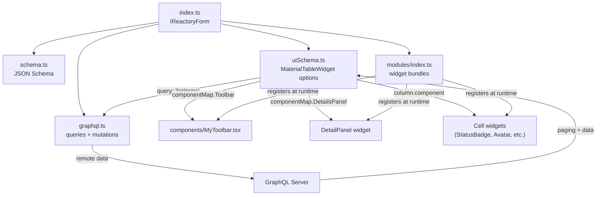

# Building Quality Admin Grid Interfaces

This guide teaches how to build production-quality admin grid interfaces using the Reactory form system and the `MaterialTableWidget`. It is written for both human developers and AI agents working in the codebase.

Two canonical reference implementations demonstrate every pattern described here:

| Reference | Path | Domain |
|-----------|------|--------|
| **WorkflowRegistryManagement** | `forms/Workflow/WorkflowRegistryManagement/` | Workflow lifecycle management |
| **SupportTickets** | `forms/Support/SupportTickets/` | Ticket triage and resolution |

For the full widget API, see the MaterialTableWidget documentation suite:

- `reactory-pwa-client/src/components/reactory/ux/mui/widgets/MaterialTableWidget/docs/README.md`
- `reactory-pwa-client/src/components/reactory/ux/mui/widgets/MaterialTableWidget/docs/API_REFERENCE.md`
- `reactory-pwa-client/src/components/reactory/ux/mui/widgets/MaterialTableWidget/docs/USAGE_EXAMPLES.md`
- `reactory-pwa-client/src/components/reactory/ux/mui/widgets/MaterialTableWidget/docs/ARCHITECTURE.md`

---

## Table of Contents

1. [When to Use a Grid Interface](#1-when-to-use-a-grid-interface)
2. [Anatomy of an Admin Grid Form](#2-anatomy-of-an-admin-grid-form)
3. [The Form Definition -- index.ts](#3-the-form-definition----indexts)
4. [Schema Design -- schema.ts](#4-schema-design----schemats)
5. [GraphQL Integration -- graphql.ts](#5-graphql-integration----graphqlts)
6. [UI Schema -- The Heart of the Grid](#6-ui-schema----the-heart-of-the-grid)
7. [Custom Toolbar Components](#7-custom-toolbar-components)
8. [Detail Panel Components](#8-detail-panel-components)
9. [Module Registration -- modules/index.ts](#9-module-registration----modulesindexts)
10. [Rich Column Patterns](#10-rich-column-patterns)
11. [Row Actions and Confirmations](#11-row-actions-and-confirmations)
12. [Checklist for Building a New Admin Grid](#12-checklist-for-building-a-new-admin-grid)
13. [Further Reading](#13-further-reading)

---

## 1. When to Use a Grid Interface

Use `MaterialTableWidget` when the interface needs:

- Paginated or remote-data tabular display
- Row selection, bulk actions, and CRUD operations
- Rich per-cell rendering (status badges, avatars, relative times)
- Filtering (quick filters, advanced filter drawers), search, grouping, and export
- Expandable detail panels for row-level drill-down

Use `MaterialListWidget` as an alternative when you want an infinite-scroll list view with simpler presentation. Both examples provide **dual uiSchemas** so the user can toggle between a paginated grid and an infinite list.

---

## 2. Anatomy of an Admin Grid Form

Every quality admin grid form follows this directory structure:

```
MyAdminForm/
  index.ts              # IReactoryForm definition -- the entry point
  version.ts            # Exports a semver string (e.g. '1.0.0')
  schema.ts             # JSON Schema + async schema resolver
  uiSchema.ts           # Grid and List UI schemas with MaterialTableWidget options
  graphql.ts            # IFormGraphDefinition -- queries and mutations
  modules/
    index.ts            # IReactoryFormModule[] -- runtime widget bundles
  components/
    MyToolbar.tsx        # Custom toolbar component
```

### Data Flow



Each file has a single responsibility:

| File | Responsibility |
|------|---------------|
| `index.ts` | Assembles everything into an `IReactoryForm` object |
| `version.ts` | Single source of truth for the form version |
| `schema.ts` | Defines the data shape and provides an async resolver |
| `uiSchema.ts` | Configures how data is displayed, including all table options |
| `graphql.ts` | Declares the GraphQL operations the widget will execute |
| `modules/index.ts` | Bundles custom TSX/TS components for runtime compilation |
| `components/` | Houses the source code for toolbars, detail panels, etc. |

---

## 3. The Form Definition -- `index.ts`

The form definition implements `Reactory.Forms.IReactoryForm`. Its key job is to wire together schema, UI schemas, GraphQL, modules, and access control.

```typescript
import Reactory from '@reactorynet/reactory-core';
import version from './version';
import schema from './schema';
import { GridUISchema, ListUiSchema } from './uiSchema';
import graphql from './graphql';
import modules from './modules';
import { safeCDNUrl } from '@reactory/server-core/utils/url/safeUrl';

const name = "MyAdminForm";
const nameSpace = "core";

const MyAdminForm: Reactory.Forms.IReactoryForm = {
  id: `${nameSpace}.${name}@${version}`,
  nameSpace,
  name,
  version,
  schema,
  uiSchema: GridUISchema,               // Default view
  uiSchemas: [
    {
      id: 'default',
      description: 'Grid Schema',
      icon: 'table',
      key: 'default',
      title: 'Paginated Table',
      uiSchema: GridUISchema
    },
    {
      id: 'list',
      description: 'List',
      icon: 'list',
      key: 'list',
      title: 'Infinite List',
      uiSchema: ListUiSchema
    }
  ],
  uiFramework: 'material',
  avatar: safeCDNUrl(`themes/reactory/images/forms/${nameSpace}_${name}_${version}.png`.toLowerCase()),
  registerAsComponent: true,
  title: 'My Admin Form',
  description: 'Manages items in a paginated grid',
  backButton: true,
  uiSupport: ['material'],
  modules,
  graphql,
  roles: ['ADMIN']
};

export default MyAdminForm;
```

Key patterns:

- **`uiSchema`** is the default view (always the grid).
- **`uiSchemas`** provides selectable alternatives. The form chrome renders a selector when `showSchemaSelectorInToolbar: true` is set in the BaseUISchema.
- **`modules`** ships compiled widget bundles so the PWA client can register toolbar, detail panel, and cell components at runtime.
- **`roles`** restricts which users see this form.

---

## 4. Schema Design -- `schema.ts`

The schema defines the data contract. For admin grids, the pattern is always a top-level `object` with a primary `array` property.

```typescript
import Reactory from '@reactorynet/reactory-core';

const schema: Reactory.Schema.ISchema = {
  type: 'object',
  properties: {
    items: {
      type: 'array',
      title: 'Items',
      items: {
        type: 'object',
        properties: {
          id: { type: 'string' },
          name: { type: 'string' },
          status: {
            type: 'string',
            enum: ['active', 'inactive', 'pending']
          },
          createdBy: {
            type: 'object',
            properties: {
              id: { type: 'string' },
              firstName: { type: 'string' },
              lastName: { type: 'string' },
              email: { type: 'string' },
              avatar: { type: 'string' }
            }
          },
          createdAt: { type: 'string' },
          updatedAt: { type: 'string' },
          tags: {
            type: 'array',
            items: { type: 'string' }
          }
        }
      }
    }
  }
};

const MySchemaResolver = async (
  form: Reactory.Forms.IReactoryForm,
  args: any,
  context: Reactory.Server.IReactoryContext,
  info: any
): Promise<Reactory.Schema.AnySchema> => {
  // Can customize schema per user/locale here
  return schema;
};

export default MySchemaResolver;
```

Guidelines:

- Include **every field** the grid columns, detail panel, and toolbar will reference. The schema is the single source of truth for what data the form works with.
- Use explicit `enum` values for status-like fields so that column widgets like `StatusBadgeWidget` can map values to colors and icons.
- Nest objects for related entities (users, statistics) rather than flattening.
- The async resolver pattern allows future per-user or per-locale schema customization, even if the initial implementation returns the static schema.

---

## 5. GraphQL Integration -- `graphql.ts`

The `IFormGraphDefinition` declares all GraphQL operations the form can execute. The `MaterialTableWidget` resolves queries by name.

```typescript
import Reactory from '@reactorynet/reactory-core';

const graphql: Reactory.Forms.IFormGraphDefinition = {
  queries: {
    listItems: {                              // <-- This key is referenced by uiSchema query option
      name: 'MyItems',                        // GraphQL operation name
      text: `query MyItems($filter: MyFilterInput, $paging: PagingRequest) {
        myItems(filter: $filter, paging: $paging) {
          paging {
            page
            pageSize
            hasNext
            total
          }
          items {
            id
            name
            status
            createdAt
            updatedAt
            createdBy {
              id
              firstName
              lastName
              avatar
              email
            }
            tags
          }
        }
      }`,
      resultType: 'object',
      resultMap: {                            // Maps GQL response fields to widget expectations
        'paging': 'paging',                   //   response.paging -> widget paging
        'items': 'data'                       //   response.items  -> widget data array
      },
      variables: {                            // Maps widget query state to GQL variables
        'query.search': 'filter.searchString',
        'query.page': 'paging.page',
        'query.pageSize': 'paging.pageSize',
      }
    }
  },
  mutation: {
    deleteItem: {
      name: 'DeleteMyItem',
      text: `mutation DeleteMyItem($id: String!) {
        deleteMyItem(id: $id) {
          success
          message
        }
      }`,
      variables: {
        'formData.id': 'id'
      },
      resultMap: {
        'success': 'success',
        'message': 'message'
      }
    }
  }
};

export default graphql;
```

### The Variables / ResultMap Contract

The `variables` map translates the widget's internal query state into GraphQL variable paths:

| Widget provides | Maps to GQL variable | Meaning |
|-----------------|---------------------|---------|
| `query.search` | `filter.searchString` | Search text from the toolbar |
| `query.page` | `paging.page` | Current page number |
| `query.pageSize` | `paging.pageSize` | Rows per page |

The `resultMap` translates the GraphQL response back into what the widget expects:

| GQL response field | Maps to widget key | Meaning |
|-------------------|-------------------|---------|
| `paging` | `paging` | Paging metadata |
| `items` | `data` | The data array to render |

The widget expects `data` for the row array and `paging` for pagination metadata. These keys are fixed by convention.

### Multiple Queries

A form can declare multiple queries. For example, `SupportTickets` declares both `openTickets` (the main list) and `users` (for the assignee picker column). Each query is referenced by its key name wherever it is needed.

---

## 6. UI Schema -- The Heart of the Grid

The `uiSchema.ts` file is where the grid behavior is fully configured. It has three main parts: the **BaseUISchema** (form chrome), the **MaterialTableWidget options** (grid behavior), and an optional **list alternative**.

### 6.1 BaseUISchema

The base schema configures the form shell that wraps the grid:

```typescript
const BaseUISchema: Reactory.Schema.IFormUISchema = {
  'ui:form': {
    componentType: "div",
    showSubmit: false,           // No submit button -- data is managed via actions
    showRefresh: false,          // Table handles its own refresh
    toolbarPosition: "top",
    toolbarStyle: {
      display: 'flex',
      justifyContent: 'flex-end'
    },
    showSchemaSelectorInToolbar: true,   // Enables grid/list toggle
    schemaSelector: {
      variant: 'icon-button',
    }
  },
  'ui:field': 'GridLayout',
  'ui:grid-layout': [
    {
      items: { xs: 12, sm: 12, md: 12, lg: 12, xl: 12 }  // Full width
    }
  ],
};
```

Key choices:

- `showSubmit: false` and `showRefresh: false` -- admin grids manage their own data lifecycle through actions and remote queries, not form submission.
- `showSchemaSelectorInToolbar: true` -- renders a toggle so users can switch between the grid and list views defined in `uiSchemas`.
- `GridLayout` with a single full-width column hosts the table widget.

### 6.2 MaterialTableWidget Options

The grid is configured as a single array field with `'ui:widget': 'MaterialTableWidget'`:

```typescript
export const GridUISchema: Reactory.Schema.IFormUISchema = {
  ...BaseUISchema,
  items: {
    'ui:title': null,                           // Hide the array title
    'ui:widget': 'MaterialTableWidget',
    'ui:options': MaterialTableUIOptions
  }
};
```

The `MaterialTableUIOptions` object (`IMaterialTableWidgetOptions`) is where all the power lives. Below is a comprehensive annotated example drawn from both reference implementations.

#### Remote Data Wiring

```typescript
const MaterialTableUIOptions: Reactory.Client.Components.IMaterialTableWidgetOptions = {
  remoteData: true,
  query: 'listItems',           // Must match a key in graphql.queries
  variables: {                  // Widget query state -> GQL variables
    'query.search': 'filter.searchString',
    'query.page': 'paging.page',
    'query.pageSize': 'paging.pageSize',
  },
  resultMap: {                  // GQL response -> widget data
    'paging.page': 'paging.page',
    'paging.total': 'paging.total',
    'paging.pageSize': 'paging.pageSize',
    'items': 'data'
  },
  // ...
};
```

#### Column Definitions

Each column can use a plain field or a rich FQN component renderer. See [Section 10](#10-rich-column-patterns) for the full catalog.

```typescript
  columns: [
    {
      title: 'Reference',
      field: 'reference',
      width: 120,
      component: 'core.LabelComponent@1.0.0',
      props: {
        uiSchema: {
          'ui:options': {
            variant: 'body2',
            format: '${rowData.reference}',
            copyToClipboard: true,
            style: { fontFamily: 'monospace', fontWeight: 600, color: '#1976d2' }
          }
        }
      },
    },
    {
      title: 'Status',
      field: 'status',
      width: 150,
      component: 'StatusBadgeWidget',
      propsMap: { 'rowData.status': 'value' },
      props: {
        uiSchema: {
          'ui:options': {
            variant: 'filled',
            size: 'small',
            colorMap: {
              'active': '#4caf50',
              'inactive': '#757575',
              'pending': '#ff9800',
            },
            iconMap: {
              'active': 'check_circle',
              'inactive': 'cancel',
              'pending': 'schedule',
            }
          }
        }
      }
    },
    {
      title: 'Created',
      field: 'createdAt',
      width: 150,
      component: 'RelativeTimeWidget',
      propsMap: { 'rowData.createdAt': 'date' },
      props: {
        uiSchema: {
          'ui:options': {
            format: 'relative',
            tooltip: true,
            tooltipFormat: 'YYYY-MM-DD HH:mm:ss'
          }
        }
      },
      type: 'datetime',
      breakpoint: 'md',          // Hidden on screens smaller than md
    },
  ],
```

#### Row Styling

```typescript
  rowStyle: {},
  altRowStyle: { backgroundColor: '#fafafa' },
  selectedRowStyle: { backgroundColor: '#e3f2fd' },
  conditionalRowStyling: [
    {
      field: 'priority',
      condition: 'critical',             // String match
      style: {
        backgroundColor: '#ffebee',
        borderLeft: '4px solid #d32f2f'
      }
    },
    {
      field: 'isOverdue',
      condition: 'true',                 // Boolean-as-string match
      style: {
        backgroundColor: '#fce4ec',
        borderLeft: '4px solid #e91e63'
      }
    },
    {
      field: 'statistics.failedExecutions',
      condition: '(rowData) => rowData?.statistics?.failedExecutions > 0',   // Function match
      style: { borderLeft: '4px solid #f57c00' }
    }
  ],
```

Conditional row styling accepts three condition formats:
1. **String match** -- value is compared directly to the field value
2. **Boolean-as-string** -- `'true'` or `'false'` for boolean fields
3. **Function expression** -- a string that evaluates to a function receiving `rowData`

#### Table Options

```typescript
  options: {
    selection: true,              // Checkbox selection for bulk actions
    search: true,                 // Built-in search (disable if using custom toolbar search)
    grouping: true,               // Column grouping support
    filtering: true,              // Column-level filtering
    exportButton: true,           // CSV/PDF export
    exportAllData: true,
    columnsButton: true,          // Show/hide columns picker
    pageSize: 25,
    pageSizeOptions: [10, 25, 50, 100],
    emptyRowsWhenPaging: false,
    debounceInterval: 500,
    detailPanelType: 'single',    // Only one row expanded at a time
    showDetailPanelIcon: true,
    detailPanelColumnAlignment: 'left',
  },
```

#### Custom Component Map

```typescript
  componentMap: {
    Toolbar: 'core.MyToolbar@1.0.0',
    DetailsPanel: 'core.MyDetailPanel@1.0.0',
  },
  detailPanelProps: { useCase: 'grid' },
  detailPanelPropsMap: {
    'props.rowData': 'item',      // Pass the row data as 'item' prop to the detail panel
  },
```

#### Refresh Events

```typescript
  refreshEvents: [
    { name: "core.ItemCreatedEvent" },
    { name: "core.ItemUpdatedEvent" },
    { name: "core.ItemDeletedEvent" },
  ],
```

When any part of the application emits one of these events via `reactory.emit(eventName)`, the table automatically refetches its data.

### 6.3 List View Alternative

Provide an `IMaterialListWidgetOptions` for the infinite-scroll alternative:

```typescript
const ListUIOptions: Reactory.Client.Components.IMaterialListWidgetOptions = {
  primaryText: '${item.reference}',
  secondaryText: '${item.request}',
  showAvatar: false,
  showTitle: true,
  showLabel: false,
  allowAdd: false,
  secondaryAction: {
    action: 'mount',
    componentFqn: 'core.MyStatusComponent@1.0.0',
    propsMap: { 'item.status': 'status', 'item': 'data' },
    props: { useCase: 'list' },
  },
  remoteData: true,
  query: 'listItems',
  resultMap: {
    'paging.page': 'paging.page',
    'paging.total': 'paging.totalCount',
    'paging.pageSize': 'paging.pageSize',
    'items': 'data'
  },
  variables: {
    'search': 'filter.searchString',
    'paging.page': 'paging.page',
    'paging.pageSize': 'paging.pageSize',
  },
  title: 'Items',
};

export const ListUiSchema: Reactory.Schema.IUISchema = {
  ...BaseUISchema,
  items: {
    'ui:widget': 'MaterialListWidget',
    'ui:title': null,
    'ui:options': ListUIOptions as Reactory.Schema.IUISchemaOptions,
  },
};
```

---

## 7. Custom Toolbar Components

Custom toolbars replace the default table toolbar with rich filtering, search, and bulk-action capabilities. Both reference implementations follow the same structure.

### 7.1 Toolbar Component Contract

The `MaterialTableWidget` passes these props to toolbar components:

| Prop | Type | Purpose |
|------|------|---------|
| `reactory` | `IReactoryApi` | Reactory API for component resolution, i18n, GraphQL |
| `data` | `{ data, paging, selected }` | Current table data, pagination state, selected rows |
| `onDataChange` | `(filteredData) => void` | Replace the displayed data (client-side filtering) |
| `onSearchChange` | `(text) => void` | Update the search text |
| `onQueryChange` | `(queryName, variables) => void` | Trigger a remote query with new variables (server-side filtering) |
| `searchText` | `string` | Current search text |

### 7.2 Dependency Loading

Toolbars load their dependencies from the Reactory component registry, not via `import`:

```typescript
const MyToolbar = (props: MyToolbarProps) => {
  const { reactory, data, onDataChange, onSearchChange } = props;

  const {
    React,
    Material,
    QuickFilters,
    SearchBar,
    AdvancedFilterPanel,
    BulkDeleteAction,
    ExportAction,
  } = reactory.getComponents<MyToolbarDependencies>([
    'react.React',
    'material-ui.Material',
    'core.QuickFilters',
    'core.SearchBar',
    'core.AdvancedFilterPanel',
    'core.BulkDeleteAction',
    'core.ExportAction',
  ]);

  // Guard for async component loading
  if (!QuickFilters || !SearchBar || !AdvancedFilterPanel) {
    return <Toolbar><Box>Loading filters...</Box></Toolbar>;
  }

  // ... toolbar rendering
};
```

Always guard against `null` components. The registry resolves components asynchronously, so they may not be available on the first render.

### 7.3 Quick Filters

Quick filters are predefined, single-click filter buttons with optional badge counts:

```typescript
const quickFilters: QuickFilterDefinition[] = [
  {
    id: 'active',
    label: 'Active',
    icon: 'check_circle',
    color: 'success',
    filter: {
      field: 'status',
      value: 'active',
      operator: 'eq',
    },
    badge: counts.active,      // Computed from data
  },
  {
    id: 'urgent',
    label: 'Urgent',
    icon: 'priority_high',
    color: 'error',
    filter: {
      field: 'priority',
      value: ['critical', 'high'],
      operator: 'in',
    },
    badge: counts.urgent,
  },
];
```

The `QuickFilters` component renders these as buttons or chips. When a filter is toggled, the toolbar applies it either client-side (via `onDataChange`) or server-side (via `onQueryChange`).

### 7.4 Advanced Filter Panel

For complex multi-field filtering, use an `AdvancedFilterPanel` drawer:

```typescript
const advancedFilterFields: AdvancedFilterField[] = [
  {
    id: 'status',
    label: 'Status',
    field: 'status',
    type: 'multi-select',
    options: [
      { label: 'Active', value: 'active' },
      { label: 'Inactive', value: 'inactive' },
    ],
  },
  {
    id: 'search',
    label: 'Search in Title',
    field: 'name',
    type: 'text',
    placeholder: 'Type to search...',
  },
  {
    id: 'overdue',
    label: 'Show Overdue Only',
    field: 'isOverdue',
    type: 'boolean',
  },
];
```

### 7.5 Bulk Actions

When rows are selected, the toolbar shows a bulk-action bar:

```typescript
{hasSelection && (
  <>
    <Divider />
    <Box sx={{ display: 'flex', alignItems: 'center', gap: 2 }}>
      <Badge badgeContent={selectedItems.length} color="primary" max={999}>
        <Icon>check_box</Icon>
      </Badge>
      <Box sx={{ fontSize: '0.875rem', color: 'text.secondary' }}>
        {selectedItems.length} item{selectedItems.length > 1 ? 's' : ''} selected
      </Box>
      <Divider orientation="vertical" flexItem sx={{ mx: 1 }} />
      <ButtonGroup variant="outlined" size="small">
        <Button startIcon={<Icon>edit</Icon>}
          onClick={() => setActiveBulkAction('status')}>Status</Button>
        <Button startIcon={<Icon>delete</Icon>}
          onClick={() => setActiveBulkAction('delete')} color="error">Delete</Button>
      </ButtonGroup>
    </Box>
  </>
)}
```

Each bulk action opens a modal component that receives `reactory`, the selected items, and `onComplete`/`onCancel` callbacks.

### 7.6 Toolbar Registration

Every toolbar component must register itself with the Reactory plugin system:

```typescript
const Definition: any = {
  name: 'MyToolbar',
  nameSpace: 'core',
  version: '1.0.0',
  component: MyToolbar,
  roles: ['ADMIN']
};

//@ts-ignore
if (window?.reactory?.api) {
  //@ts-ignore
  window.reactory.api.registerComponent(
    Definition.nameSpace,
    Definition.name,
    Definition.version,
    MyToolbar,
    ['Admin', 'Toolbar'],
    Definition.roles,
    true,
    [],
    'widget'
  );
  //@ts-ignore
  window.reactory.api.amq.raiseReactoryPluginEvent('loaded', {
    componentFqn: `${Definition.nameSpace}.${Definition.name}@${Definition.version}`,
    component: MyToolbar
  });
}

export default MyToolbar;
```

This pattern ensures the component is available in the registry when the `MaterialTableWidget` resolves `componentMap.Toolbar`.

---

## 8. Detail Panel Components

Detail panels render inline below a row when the user expands it. They provide drill-down information without leaving the grid context.

### Wiring

In the `MaterialTableUIOptions`:

```typescript
componentMap: {
  DetailsPanel: 'core.MyDetailPanel@1.0.0',
},
detailPanelProps: {
  useCase: 'grid'                   // Static props passed to every detail panel instance
},
detailPanelPropsMap: {
  'props.rowData': 'item',          // Maps the row data into an 'item' prop
},
```

In `options`:

```typescript
options: {
  detailPanelType: 'single',       // Only one row expanded at a time
  showDetailPanelIcon: true,
  detailPanelColumnAlignment: 'left',
}
```

### Detail Panel Props

The detail panel component receives:

| Prop | Source | Description |
|------|--------|-------------|
| `rowData` | Table row | The full data object for the expanded row |
| `rid` | Table | Row index |
| `state` | Table | `IRowState` (selected, expanded, etc.) |
| `formContext` | Form | The form context with GraphQL definitions |
| `tableRef` | Table | Reference to the table component |
| Any custom prop | `detailPanelPropsMap` | Mapped from row data |

### Panel Types

- `'single'` -- only one row can be expanded at a time (recommended for admin grids)
- `'multiple'` -- multiple rows can be expanded simultaneously

---

## 9. Module Registration -- `modules/index.ts`

Custom components (toolbar, detail panel, bulk actions, cell widgets) must be bundled and registered so the PWA client can compile them at runtime.

```typescript
import Reactory from '@reactorynet/reactory-core';
import { fileAsString } from '@reactory/server-core/utils/io';
import path from 'path';

const modules: Reactory.Forms.IReactoryFormModule[] = [
  {
    compilerOptions: {},
    id: 'core.MyToolbar@1.0.0',
    src: fileAsString(path.resolve(__dirname, '../components/MyToolbar.tsx')),
    compiler: 'rollup',
    fileType: 'tsx'
  },
  {
    compilerOptions: {},
    id: 'core.MyDetailPanel@1.0.0',
    src: fileAsString(path.resolve(__dirname, '../../Widgets/core.MyDetailPanel.tsx')),
    compiler: 'rollup',
    fileType: 'tsx'
  },
  {
    compilerOptions: {},
    id: 'core.BulkDeleteAction@1.0.0',
    src: fileAsString(path.resolve(__dirname, '../../Widgets/core.BulkDeleteAction.tsx')),
    compiler: 'rollup',
    fileType: 'tsx'
  },
  {
    compilerOptions: {},
    id: 'core.ExportAction@1.0.0',
    src: fileAsString(path.resolve(__dirname, '../../Widgets/core.ExportAction.tsx')),
    compiler: 'rollup',
    fileType: 'tsx'
  },
];

export default modules;
```

Key points:

- Every FQN referenced in `componentMap`, `actions[].event.component`, or toolbar `getComponents()` must have a corresponding module entry.
- `fileAsString()` reads the source file as a string for the Rollup compiler.
- `path.resolve(__dirname, ...)` ensures paths work regardless of the server's working directory.
- Use `compiler: 'rollup'` and the appropriate `fileType` (`tsx` for React components, `ts` for pure logic).

---

## 10. Rich Column Patterns

Both reference implementations demonstrate a rich set of column renderers. Here is the catalog.

### LabelComponent

Renders formatted text with optional clipboard copy. Use for IDs, reference numbers, and computed display strings.

```typescript
{
  title: 'Workflow ID',
  field: 'id',
  component: 'core.LabelComponent@1.0.0',
  props: {
    uiSchema: {
      'ui:options': {
        variant: 'body2',
        format: '${rowData.nameSpace}.${rowData.name}@${rowData.version}',
        copyToClipboard: true,
        style: { fontFamily: 'monospace', fontWeight: 600, color: '#1976d2' }
      }
    }
  }
}
```

### StatusBadgeWidget

Renders a colored chip with icon for enum/status fields. Supports `colorMap`, `iconMap`, and `valueMap`.

```typescript
{
  title: 'Status',
  field: 'status',
  component: 'StatusBadgeWidget',
  propsMap: { 'rowData.status': 'value' },
  props: {
    uiSchema: {
      'ui:options': {
        variant: 'filled',       // or 'outlined'
        size: 'small',
        colorMap: {
          'active': '#4caf50',
          'inactive': '#757575',
        },
        iconMap: {
          'active': 'check_circle',
          'inactive': 'cancel',
        }
      }
    }
  }
}
```

### UserAvatarWidget

Renders a user avatar chip. Supports inline assignee editing via a dialog.

```typescript
{
  title: 'Assigned To',
  field: 'assignedTo',
  component: 'UserAvatarWidget',
  propsMap: { 'rowData.assignedTo': 'user' },
  props: {
    uiSchema: {
      'ui:options': {
        variant: 'chip',
        size: 'small',
        showEmail: true,
        unassignedText: 'Unassigned',
        unassignedIcon: 'person_add_disabled',
        editable: true,
        dialogTitle: 'Assign To',
        userListQuery: 'users',       // References graphql.queries.users
      }
    }
  }
}
```

### RelativeTimeWidget

Renders timestamps as relative time (e.g., "3 hours ago") with a tooltip showing the full date.

```typescript
{
  title: 'Created',
  field: 'createdAt',
  component: 'RelativeTimeWidget',
  propsMap: { 'rowData.createdAt': 'date' },
  props: {
    uiSchema: {
      'ui:options': {
        format: 'relative',
        tooltip: true,
        tooltipFormat: 'YYYY-MM-DD HH:mm:ss',
        autoRefresh: true,           // Optional: periodically update
        refreshInterval: 60000       // Every 60 seconds
      }
    }
  },
  type: 'datetime',
}
```

### ChipArrayWidget

Renders an array of strings as MUI chips. Use for tags.

```typescript
{
  title: 'Tags',
  field: 'tags',
  component: 'ChipArrayWidget',
  propsMap: { 'rowData.tags': 'values' },
  props: {
    uiSchema: {
      'ui:options': {
        size: 'small',
        variant: 'outlined',
        color: 'primary',
        maxDisplay: 3               // Show max 3, then "+N more"
      }
    }
  }
}
```

### CountBadgeWidget

Renders an icon with a count badge. Use for comments, attachments, or other countable items.

```typescript
{
  title: 'Comments',
  field: 'comments',
  align: 'center',
  component: 'CountBadgeWidget',
  propsMap: { 'rowData.comments': 'formData' },
  props: {
    uiSchema: {
      'ui:options': {
        icon: 'comment',
        showZero: true,
        color: 'primary',
        singularLabel: 'comment',
        pluralLabel: 'comments'
      }
    }
  }
}
```

### PercentageWidget

Renders a percentage with an optional progress bar and color thresholds.

```typescript
{
  title: 'Success Rate',
  field: 'statistics.successRate',
  component: 'PercentageWidget',
  propsMap: { 'rowData.statistics': 'statistics' },
  props: {
    uiSchema: {
      'ui:options': {
        calculateFrom: {
          numerator: 'successfulExecutions',
          denominator: 'totalExecutions'
        },
        showProgressBar: true,
        colorThresholds: {
          danger: 50,
          warning: 75,
          success: 90
        }
      }
    }
  }
}
```

### The `propsMap` Pattern

`propsMap` is the bridge between row data and component props. It uses dot-notation paths:

```typescript
propsMap: {
  'rowData.status': 'value',           // row.status -> component.props.value
  'rowData.assignedTo': 'user',        // row.assignedTo -> component.props.user
  'rowData.statistics': 'statistics',  // row.statistics -> component.props.statistics
}
```

### Responsive Columns with `breakpoint`

Hide columns on smaller screens using MUI breakpoint names:

```typescript
{
  title: 'Success Rate',
  field: 'statistics.successRate',
  breakpoint: 'md',        // Hidden when screen width < md breakpoint
}
```

---

## 11. Row Actions and Confirmations

Actions appear as icon buttons on each row or as bulk-action buttons in the toolbar.

### Row-Level Actions

```typescript
actions: [
  {
    key: 'view',
    icon: 'visibility',
    title: 'View Details',
    tooltip: 'View full details',
    event: {
      name: 'viewDetails',
      via: 'component',
      component: 'core.MyDetailViewer@1.0.0',
      paramsMap: { 'rowData': 'item' }
    }
  },
  {
    key: 'delete',
    icon: 'delete',
    title: 'Delete',
    confirmation: {
      key: 'confirm',
      title: 'Delete ${rowData.reference}?',
      content: 'Are you sure you want to delete ${rowData.reference}?',
      acceptTitle: 'DELETE',
      cancelTitle: 'CANCEL',
    },
    event: {
      name: 'deleteItem',
      via: 'component',
      component: 'core.MyWorkflow@1.0.0',
      paramsMap: { 'rowData': 'items[0]' }
    }
  },
]
```

### Bulk (Free) Actions

Free actions appear in the toolbar and operate on the selection:

```typescript
{
  key: 'deleteSelected',
  icon: 'delete',
  title: 'Delete ${selected.length} items',
  isFreeAction: true,
  confirmation: {
    key: 'confirm',
    title: 'Delete ${selected.length} items?',
    content: 'This action cannot be undone.',
    acceptTitle: 'DELETE ${selected.length} ITEMS',
    cancelTitle: 'CANCEL',
  },
  event: {
    name: 'deleteItems',
    via: 'component',
    component: 'core.MyWorkflow@1.0.0',
    paramsMap: { 'selected': 'items' }
  }
}
```

### Template Interpolation

Action titles, confirmation titles, and confirmation content support `${...}` template expressions:

- `${rowData.reference}` -- access any row data field
- `${selected.length}` -- number of selected rows
- `${reactory.i18n.t("forms:confirm.delete")}` -- i18n translations

### Event Dispatch Channels

| `via` | Behavior |
|-------|----------|
| `'component'` | Mounts or calls a method on the named FQN component |
| `'form'` | Calls a handler on the form |
| `'api'` | Emits an event on the Reactory API event bus |

---

## 12. Checklist for Building a New Admin Grid

Use this checklist when creating a new admin grid interface:

### Setup

- [ ] Create the form directory under the appropriate feature folder (e.g., `forms/MyFeature/MyAdminGrid/`)
- [ ] Create `version.ts` exporting a semver string
- [ ] Create `schema.ts` with a top-level object containing an array property, plus an async resolver

### Data Layer

- [ ] Create `graphql.ts` with at least one list query
- [ ] Verify `variables` mapping covers search, page, and pageSize
- [ ] Verify `resultMap` maps the response array to `'data'` and pagination to `'paging'`
- [ ] Add mutations for any CRUD or bulk operations

### Grid Configuration

- [ ] Create `uiSchema.ts` with `BaseUISchema`, `MaterialTableUIOptions`, and `GridUISchema`
- [ ] Configure columns with appropriate cell components and `propsMap`
- [ ] Set up `conditionalRowStyling` for visually important states (overdue, critical, inactive)
- [ ] Configure `componentMap` with custom `Toolbar` and `DetailsPanel` FQNs
- [ ] Add `refreshEvents` so the grid reacts to domain events
- [ ] Add `actions` for row-level and bulk operations with confirmations

### Custom Components

- [ ] Create the toolbar component in `components/` with search, quick filters, and bulk actions
- [ ] Create the detail panel component (or reference a shared widget)
- [ ] Ensure all components include the `Definition` + `window.reactory.api.registerComponent()` registration block

### Module Registration

- [ ] Create `modules/index.ts` with entries for every custom component FQN
- [ ] Verify every FQN in `componentMap`, `actions[].event.component`, and toolbar deps has a module entry

### Form Assembly

- [ ] Create `index.ts` implementing `IReactoryForm` with proper id, roles, and all imports
- [ ] Provide both `GridUISchema` (default) and `ListUiSchema` in `uiSchemas`
- [ ] Export the form and register it in the parent `forms/index.ts`

### Common Pitfalls

- **`resultMap` key mismatch** -- the response field name in `resultMap` must exactly match the GraphQL response structure. A typo here silently produces an empty grid.
- **Missing module registration** -- if a component FQN is referenced in `componentMap` or `actions` but not in `modules/index.ts`, the widget will render a loading state or blank area.
- **Forgetting `refreshEvents`** -- without these, CRUD operations performed via actions or bulk operations will not automatically update the grid.
- **`query` key mismatch** -- the `query` value in `MaterialTableUIOptions` must match a key in `graphql.queries`, not the GraphQL operation name.
- **`variables` path errors** -- the left side of `variables` uses the widget's query state shape (`query.search`, `query.page`), the right side uses GraphQL variable paths. Mixing these up silently produces missing or incorrect filters.

---

## 13. Further Reading

### MaterialTableWidget Documentation

- [README](<REACTORY_HOME>/reactory-pwa-client/src/components/reactory/ux/mui/widgets/MaterialTableWidget/docs/README.md) -- Overview, features, quick start
- [API Reference](<REACTORY_HOME>/reactory-pwa-client/src/components/reactory/ux/mui/widgets/MaterialTableWidget/docs/API_REFERENCE.md) -- Complete options, types, hooks
- [Usage Examples](<REACTORY_HOME>/reactory-pwa-client/src/components/reactory/ux/mui/widgets/MaterialTableWidget/docs/USAGE_EXAMPLES.md) -- Remote data, filtering, custom renderers, actions
- [Architecture](<REACTORY_HOME>/reactory-pwa-client/src/components/reactory/ux/mui/widgets/MaterialTableWidget/docs/ARCHITECTURE.md) -- Component hierarchy, state management
- [Testing](<REACTORY_HOME>/reactory-pwa-client/src/components/reactory/ux/mui/widgets/MaterialTableWidget/docs/TESTING.md) -- TDD practices

### Reference Implementations

- [WorkflowRegistryManagement](./Workflow/WorkflowRegistryManagement/) -- Workflow lifecycle with execution stats, toggle activate, bulk actions
- [SupportTickets](./Support/SupportTickets/) -- Ticket triage with priority/SLA styling, assignee pickers, comments, attachments

### Other Resources

- [WIDGET_INDEX.yaml](<REACTORY_HOME>/reactory-pwa-client/src/components/reactory/ux/mui/widgets/WIDGET_INDEX.yaml) -- Registry of all available widgets
