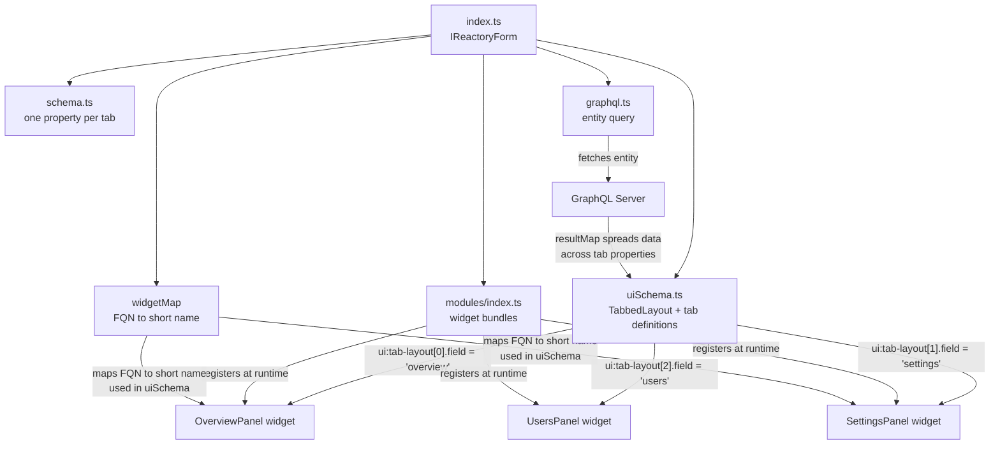

# Building Quality Tabbed Interfaces

This guide teaches how to build production-quality tabbed page interfaces using the Reactory form system and the `TabbedLayout` field. It is written for both human developers and AI agents working in the codebase.

The canonical reference implementation is:

| Reference | Path | Domain |
|-----------|------|--------|
| **Application** | `src/modules/reactory-core/forms/Application/` | Application dashboard with 10 tabbed panels |

The `TabbedLayout` field is implemented in the PWA client at:

- `reactory-pwa-client/src/components/reactory/ux/mui/fields/MaterialTabbedField.tsx`

TypeScript types for tab configuration live in:

- `reactory-core/src/types/schema/index.d.ts` -- `Reactory.Schema.ITabLayout` and `Reactory.Schema.ITabOptions`

---

## Table of Contents

1. [When to Use a Tabbed Interface](#1-when-to-use-a-tabbed-interface)
2. [Anatomy of a Tabbed Form](#2-anatomy-of-a-tabbed-form)
3. [The Form Definition -- index.ts](#3-the-form-definition----indexts)
4. [Schema Design -- schema.ts](#4-schema-design----schemats)
5. [UI Schema -- The Tab Configuration](#5-ui-schema----the-tab-configuration)
6. [GraphQL Integration -- graphql.ts](#6-graphql-integration----graphqlts)
7. [Tab Panel Widgets](#7-tab-panel-widgets)
8. [Module Registration -- modules/index.ts](#8-module-registration----modulesindexts)
9. [Using Dynamic Forms as Tab Content](#9-using-dynamic-forms-as-tab-content)
10. [Tab Panel Patterns and Recipes](#10-tab-panel-patterns-and-recipes)
11. [Checklist for Building a New Tabbed Interface](#11-checklist-for-building-a-new-tabbed-interface)
12. [Further Reading](#12-further-reading)

---

## 1. When to Use a Tabbed Interface

Use `TabbedLayout` when the interface needs to:

- Present a **single entity** (e.g., an application, a user profile, a project) with multiple aspects or concerns
- Organize complex data into **logically distinct sections** that the user accesses one at a time
- Provide **deep-link navigation** to specific sections via URL query parameters or route params
- Keep each section's UI independently managed (its own widget, its own data slice, potentially its own sub-form)

Tabbed interfaces differ from grid interfaces in their orientation: grids show **many items** in a list; tabs show **one item** from multiple angles.

### Comparison with Other Layouts

| Layout | Use Case | Field Name |
|--------|----------|------------|
| `TabbedLayout` | Multi-section entity dashboard | `"ui:field": "TabbedLayout"` |
| `GridLayout` | Multi-column single-page form | `"ui:field": "GridLayout"` |
| `AccordionLayout` | Collapsible sections on one page | `"ui:field": "AccordionLayout"` |
| `SteppedLayout` | Wizard/step-by-step flow | `"ui:field": "SteppedLayout"` |

Note: `AccordionLayout`, `SteppedLayout`, and `ListLayout` currently share the same underlying `MaterialTabbedField` implementation. They render identically as tabs -- distinct rendering behavior for these layouts would require future enhancement.

---

## 2. Anatomy of a Tabbed Form

A quality tabbed form follows this directory structure:

```
MyTabbedForm/
  index.ts              # IReactoryForm definition -- the entry point
  schema.ts             # JSON Schema with one property per tab
  uiSchema.ts           # TabbedLayout configuration + per-tab widget mapping
  graphql.ts            # IFormGraphDefinition -- the main entity query
  modules/
    index.ts            # IReactoryFormModule[] -- runtime widget bundles
  widgets/
    OverviewPanel.tsx    # Tab content widget
    SettingsPanel.tsx    # Tab content widget
    UsersPanel.tsx       # Tab content widget (or delegates to a sub-form)
    ...
```

### Data Flow



The key architectural difference from grids: each tab property in the schema gets its own slice of the GraphQL response via `resultMap`, and each tab renders its own independent widget.

| File | Responsibility |
|------|---------------|
| `index.ts` | Assembles form definition, declares `widgetMap` for FQN-to-short-name mapping |
| `schema.ts` | One top-level property per tab, each an `object` with that tab's data shape |
| `uiSchema.ts` | Declares `TabbedLayout` field, tab ordering/icons, per-tab widget + props mapping |
| `graphql.ts` | Single entity query with `resultMap` distributing response across tab properties |
| `modules/index.ts` | Bundles all tab panel widgets for runtime compilation |
| `widgets/` | Houses tab panel component source files |

---

## 3. The Form Definition -- `index.ts`

The form definition implements `Reactory.Forms.IReactoryForm`. For tabbed forms, the distinctive features are `widgetMap` and `argsSchema`.

```typescript
import schema from './schema';
import uiSchema from './uiSchema';
import graphql from './graphql';
import modules from './modules';

const Application: Reactory.Forms.IReactoryForm = {
  id: 'reactory-application',
  nameSpace: 'reactory',
  name: 'Application',
  uiFramework: "material",
  uiSupport: ["material"],
  title: "Application Dashboard",
  registerAsComponent: true,
  version: "1.0.0",
  roles: ['USER', 'ADMIN'],
  description: 'A comprehensive dashboard for viewing and managing a Reactory application.',

  // Declares what props the form requires from the caller
  argsSchema: {
    type: 'object',
    properties: {
      applicationId: {
        type: 'string',
        title: 'Application ID',
        description: 'The ID of the application to load.',
      },
    },
    required: ['applicationId'],
  },

  // Maps FQN component names to short widget names used in uiSchema
  widgetMap: [
    {
      componentFqn: 'reactory.ApplicationOverviewPanel@1.0.0',
      widget: 'ApplicationOverviewPanel',
    },
    {
      componentFqn: 'reactory.ApplicationSettingsPanel@1.0.0',
      widget: 'ApplicationSettingsPanel',
    },
    {
      componentFqn: 'reactory.ApplicationUsersPanel@1.0.0',
      widget: 'ApplicationUsersPanel',
    },
    // ... one entry per tab panel widget
  ],

  schema,
  uiSchema,
  graphql,
  modules,
};

export default Application;
```

### Key Properties

**`argsSchema`** declares the input props the form requires. For tabbed dashboards, this is typically an entity ID that drives the GraphQL query. The caller provides this via `props`:

```typescript
<ReactoryForm
  formDef={{ nameSpace: 'reactory', name: 'Application', version: '1.0.0' }}
  props={{ applicationId: '123' }}
/>
```

**`widgetMap`** maps fully-qualified component names (FQNs) to short widget names. This allows the `uiSchema` to reference widgets by short name (e.g., `"ui:widget": "ApplicationOverviewPanel"`) while the form system resolves them to the full FQN at runtime.

Unlike grid forms, tabbed forms typically have **one uiSchema** (no grid/list toggle) since the tabbed layout itself is the primary interaction model.

---

## 4. Schema Design -- `schema.ts`

For tabbed interfaces, the schema defines **one top-level property per tab**. Each property is an `object` containing that tab's data.

```typescript
const schema: Reactory.Schema.IObjectSchema = {
  type: "object",
  title: "Application Dashboard",
  properties: {
    overview: {
      type: "object",
      properties: {
        id: { type: "string", title: "Application ID" },
        name: { type: "string", title: "Application Name" },
        description: { type: "string", title: "Description" },
        version: { type: "string", title: "Version" },
        createdAt: { type: "string", format: "date-time", title: "Created At" },
        updatedAt: { type: "string", format: "date-time", title: "Updated At" },
      }
    },
    settings: {
      type: "object",
      properties: {
        settings: {
          type: "object",
          title: "Application Settings",
          properties: { /* ... */ },
          additionalProperties: true,
        },
      }
    },
    users: {
      type: "object",
      properties: {
        totalUsers: { type: "number", title: "Total Users" },
        users: {
          type: "array",
          title: "Users",
          items: userSchema
        }
      }
    },
    statistics: {
      type: "object",
      properties: {
        activeUsers: { type: "number", title: "Active Users" },
        totalSessions: { type: "number", title: "Total Sessions" },
      }
    },
    // ... one property per tab
  }
};

export default schema;
```

### Schema Design Guidelines

1. **One property per tab.** The property name must match the `field` value in `ui:tab-layout`. If `ui:tab-layout` references `field: "overview"`, the schema must have `properties.overview`.

2. **Each tab property is an object.** Even if a tab shows a single array (like users), wrap it in an object so the tab has room for metadata (e.g., `totalUsers`, `paging`).

3. **Shared sub-schemas.** Extract reusable shapes (like `userSchema`, `organizationSchema`) into constants and reference them in multiple tab properties.

4. **Include all data the tab widget needs.** The widget receives its tab's slice of `formData` directly -- it cannot easily access sibling tab data (though it can via `formContext.formData`).

---

## 5. UI Schema -- The Tab Configuration

The `uiSchema.ts` is where the tabbed layout, tab definitions, routing, and per-tab widget mappings are configured.

### 5.1 Full Structure

```typescript
import Reactory from "@reactorynet/reactory-core";

const uiSchema: Reactory.Schema.IFormUISchema = {
  // Form chrome
  "ui:form": {
    showSubmit: false,
    showHelp: false,
    showRefresh: true,
  },

  // Activate TabbedLayout field
  "ui:field": "TabbedLayout",

  // Tab definitions (order matters -- first tab is the default)
  "ui:tab-layout": [
    { field: "overview",     icon: "dashboard",            title: "Overview" },
    { field: "settings",     icon: "settings",             title: "Settings" },
    { field: "users",        icon: "people",               title: "Users" },
    { field: "organizations",icon: "business",             title: "Organizations" },
    { field: "roles",        icon: "admin_panel_settings", title: "Roles" },
    { field: "themes",       icon: "palette",              title: "Themes" },
    { field: "statistics",   icon: "bar_chart",            title: "Statistics" },
    { field: "routes",       icon: "route",                title: "Routes" },
    { field: "menus",        icon: "menu",                 title: "Menus" },
    { field: "featureFlags", icon: "flag",                 title: "Feature Flags" },
  ],

  // Tab-level options: active tab source and URL key
  "ui:options": {
    activeTab: "query",          // Read initial tab from URL query parameter
    activeTabKey: "tab",         // The query parameter name (?tab=overview)
  },

  // Router integration for tab navigation
  "ui:tab-options": {
    useRouter: true,
    path: "/applications/${formContext.props.applicationId}?tab=${tab_id}",
  },

  // Per-tab widget configuration
  overview: {
    "ui:widget": "ApplicationOverviewPanel",
    "ui:props-map": {
      'formContext.props.applicationId': 'applicationId',
      'formContext.props.mode': 'mode',
    },
  },
  settings: {
    "ui:widget": "ApplicationSettingsPanel",
    "ui:props-map": {
      'formContext.props.applicationId': 'applicationId',
      'formContext.props.mode': 'mode',
    },
  },
  users: {
    "ui:widget": "ApplicationUsersPanel",
    "ui:props-map": {
      'formContext.props.applicationId': 'applicationId',
      'formContext.props.mode': 'mode',
    },
  },
  // ... one entry per tab
};

export default uiSchema;
```

### 5.2 Tab Layout Definition (`ui:tab-layout`)

Each entry in the `ui:tab-layout` array defines one tab:

```typescript
interface ITabLayout {
  field: string;        // Must match a key in schema.properties
  icon?: string;        // Material icon name (rendered via MUI <Icon>)
  title?: string;       // Display label (falls back to schema property title, then field name)
}
```

The **order** of entries determines the tab order in the UI. The first entry is the default active tab (unless overridden by URL).

### 5.3 Active Tab from URL (`ui:options`)

The `ui:options` on the tabbed field control how the initial active tab is determined:

| Property | Value | Behavior |
|----------|-------|----------|
| `activeTab` | `"query"` | Read from URL query parameter (e.g., `?tab=users`) |
| `activeTab` | `"params"` | Read from route parameters (e.g., `/app/:tab`) |
| `activeTabKey` | `string` | The name of the query param or route param to read |

When `activeTab` is not set or the URL has no matching parameter, the first tab in `ui:tab-layout` is selected.

### 5.4 Router Integration (`ui:tab-options`)

```typescript
interface ITabOptions {
  useRouter?: boolean;       // If true, tab changes navigate via React Router
  path?: string;             // URL template for navigation
  tabsProps?: {              // Passed to MUI <Tabs> component
    variant?: "fullWidth" | "scrollable";
    indicatorColor?: "primary" | "secondary";
    // ... any MUI Tabs prop
  };
}
```

When `useRouter: true`, clicking a tab calls `navigate(path)` using the template string. The template has access to all form props plus `tab_id` (the `field` name of the selected tab).

Common path patterns:

```typescript
// Query parameter approach (recommended for dashboards)
path: "/applications/${formContext.props.applicationId}?tab=${tab_id}"
// Produces: /applications/123?tab=settings

// Route parameter approach
path: "/applications/${formContext.props.applicationId}/${tab_id}"
// Produces: /applications/123/settings
```

When `useRouter: false` (or not set), tab state is managed locally via React state without URL updates.

### 5.5 Per-Tab Widget Configuration

Each tab's uiSchema entry configures what renders inside that tab:

```typescript
overview: {
  "ui:widget": "ApplicationOverviewPanel",   // Short name from widgetMap
  "ui:props-map": {
    'formContext.props.applicationId': 'applicationId',  // Map form props to widget props
    'formContext.props.mode': 'mode',
  },
},
```

**`ui:widget`** references the short widget name declared in `widgetMap` on the form definition. The form system resolves this to the full FQN.

**`ui:props-map`** maps values from the form context into the widget's props. The left side is a dot-notation path into the form context; the right side is the prop name the widget receives.

Common mappings:

| Source Path | Target Prop | Purpose |
|-------------|------------|---------|
| `formContext.props.applicationId` | `applicationId` | Pass the entity ID to tab widgets |
| `formContext.props.mode` | `mode` | Pass view/edit mode |
| `formContext.formData.featureFlags.featureFlags` | `availableFeatureFlags` | Pass data from one tab section to another |

The last example shows **cross-tab data sharing**: the menus tab can access feature flags data from the featureFlags tab section via `formContext.formData`.

---

## 6. GraphQL Integration -- `graphql.ts`

Tabbed forms typically load a **single entity** with all data needed across tabs in one query. The `resultMap` distributes the response across the tab properties.

```typescript
import Reactory from '@reactorynet/reactory-core';

const graphql: Reactory.Forms.IFormGraphDefinition = {
  query: {
    name: 'ReactoryClientWithId',
    text: `
      query ReactoryClientWithId($id: String!) {
        ReactoryClientWithId(id: $id) {
          id
          name
          clientKey
          avatar
          siteUrl
          version
          settings { name settingType title description componentFqn data }
          menus { id key name target roles enabled items { id label route icon roles } }
          themes { id nameSpace name version type }
          featureFlags { feature enabled value roles regions }
          routes { id key path title roles componentFqn }
          createdAt
          updatedAt
        }
      }`,
    variables: {
      'props.applicationId': 'id',           // Map form prop to GQL variable
    },
    resultType: 'object',
    resultMap: {
      // Distribute response fields across tab properties
      'id': 'overview.id',
      'name': 'overview.name',
      'clientKey': 'overview.key',
      'avatar': 'overview.avatar',
      'siteUrl': 'overview.siteUrl',
      'version': 'overview.version',
      'createdAt': 'overview.createdAt',
      'updatedAt': 'overview.updatedAt',
      'settings': 'settings.settings',
      'menus': 'menus.menus',
      'themes': 'themes.themes',
      'featureFlags': 'featureFlags.featureFlags',
      'routes': 'routes.routes',
    },
  },
};

export default graphql;
```

### The Result Map Pattern for Tabs

The `resultMap` is critical for tabbed forms. Each response field is mapped to a path of the form `<tabField>.<propertyWithinTab>`:

```
'name'          ->  'overview.name'        // response.name goes to formData.overview.name
'settings'      ->  'settings.settings'    // response.settings goes to formData.settings.settings
'routes'        ->  'routes.routes'        // response.routes goes to formData.routes.routes
```

This distribution ensures each tab widget receives exactly the data it needs through its `formData` prop.

### Variables from Props

Unlike grid forms (which map `query.*` from the widget), tabbed forms map from `props.*` -- the props passed to the form by the caller:

```typescript
variables: {
  'props.applicationId': 'id',    // formContext.props.applicationId -> $id in the GQL query
},
```

### Multiple Queries

If tabs need data from separate endpoints, you can declare additional queries:

```typescript
queries: {
  applicationDetails: { /* main entity */ },
  applicationUsers: { /* separate user list with pagination */ },
  applicationStats: { /* separate statistics endpoint */ },
}
```

Individual tab widgets can then execute these queries independently via `reactory.graphql()`.

---

## 7. Tab Panel Widgets

Tab panel widgets are the components that render inside each tab. They follow a consistent pattern.

### 7.1 Widget Structure

Every tab panel widget has four parts:

1. **Props interface** -- declares what the widget receives
2. **Component function** -- renders the tab content using `reactory.getComponents()` for dependencies
3. **Component definition** -- metadata for the registry
4. **Registration block** -- registers the component at runtime

```typescript
'use strict';

interface IComponentsImport {
  React: Reactory.React;
  Material: Reactory.Client.Web.IMaterialModule;
}

interface MyPanelProps {
  reactory: Reactory.Client.IReactoryApi;
  formData?: any;                    // The tab's slice of form data
  applicationId?: string;            // Passed via ui:props-map
  mode?: 'view' | 'edit';           // Passed via ui:props-map
}

const MyPanel = (props: MyPanelProps) => {
  const { reactory, formData, applicationId, mode = 'view' } = props;

  const { React, Material } = reactory.getComponents<IComponentsImport>([
    'react.React',
    'material-ui.Material',
  ]);

  const { Card, CardContent, CardHeader, Grid, Typography, Box } = Material.MaterialCore;

  const data = formData || {};

  return (
    <Box sx={{ p: 2 }}>
      <Grid container spacing={3}>
        <Grid item xs={12}>
          <Card>
            <CardHeader title="My Section" />
            <CardContent>
              <Typography variant="body1">{data.name || 'No data'}</Typography>
            </CardContent>
          </Card>
        </Grid>
      </Grid>
    </Box>
  );
};

// Registration metadata
const ComponentDefinition = {
  name: 'MyPanel',
  nameSpace: 'reactory',
  version: '1.0.0',
  component: MyPanel,
  roles: ['USER', 'ADMIN'],
  tags: ['application', 'panel'],
};

const FQN = `${ComponentDefinition.nameSpace}.${ComponentDefinition.name}@${ComponentDefinition.version}`;

//@ts-ignore
if (window && window.reactory) {
  //@ts-ignore
  window.reactory.api.registerComponent(
    ComponentDefinition.nameSpace,
    ComponentDefinition.name,
    ComponentDefinition.version,
    MyPanel,
    [''],
    ComponentDefinition.roles,
    true,
    [],
    'widget'
  );
  //@ts-ignore
  window.reactory.api.amq.raiseReactoryPluginEvent('loaded', {
    fqn: FQN,
    componentFqn: FQN,
    component: MyPanel,
  });
}
```

### 7.2 What the Widget Receives

| Prop | Source | Description |
|------|--------|-------------|
| `reactory` | Form system | The Reactory API for component resolution, GraphQL, i18n |
| `formData` | Schema property | The data slice for this tab (e.g., `formData.overview` for the overview tab) |
| `schema` | Schema property | The JSON schema for this tab's property |
| `formContext` | Form system | Full form context including `props`, `formData`, `graphql` |
| Custom props | `ui:props-map` | Any additional props mapped from the form context |

### 7.3 Lazy Tab Rendering

The `MaterialTabbedField` only mounts the **active tab's** widget. When the user switches tabs, the previous tab's component unmounts and the new one mounts. This means:

- Tab widgets should not assume they persist across tab switches
- Use the entity ID (via props) to refetch data if needed, rather than relying on component state across switches
- Keep expensive initialization behind `React.useEffect` with proper deps

---

## 8. Module Registration -- `modules/index.ts`

Every tab panel widget must be registered as a module so the PWA client can compile it at runtime.

```typescript
import Reactory from '@reactorynet/reactory-core';
import { fileAsString } from '@reactory/server-core/utils/io';
import path from 'path';

const modules: Reactory.Forms.IReactoryFormModule[] = [
  {
    compilerOptions: {},
    id: 'reactory.ApplicationOverviewPanel@1.0.0',
    src: fileAsString(path.resolve(__dirname, '../widgets/ApplicationOverviewPanel.tsx')),
    compiler: 'rollup',
    fileType: 'tsx'
  },
  {
    compilerOptions: {},
    id: 'reactory.ApplicationSettingsPanel@1.0.0',
    src: fileAsString(path.resolve(__dirname, '../widgets/ApplicationSettingsPanel.tsx')),
    compiler: 'rollup',
    fileType: 'tsx'
  },
  {
    compilerOptions: {},
    id: 'reactory.ApplicationUsersPanel@1.0.0',
    src: fileAsString(path.resolve(__dirname, '../widgets/ApplicationUsersPanel.tsx')),
    compiler: 'rollup',
    fileType: 'tsx'
  },
  // ... one entry per tab panel widget
];

export default modules;
```

The three-way alignment is critical:

| `modules/index.ts` id | `widgetMap` FQN | `uiSchema` widget name |
|----------------------|----------------|----------------------|
| `reactory.ApplicationOverviewPanel@1.0.0` | `reactory.ApplicationOverviewPanel@1.0.0` | `ApplicationOverviewPanel` |

If any of these three are misaligned, the tab will fail to render.

---

## 9. Using Dynamic Forms as Tab Content

Tab content does not have to be a custom widget. There are three strategies for implementing tab panels, from simplest to most powerful:

### Strategy 1: Custom Widget (Most Common)

The panel is a standalone TSX component registered as a module. This is what the Application form uses for most tabs.

```typescript
overview: {
  "ui:widget": "ApplicationOverviewPanel",
  "ui:props-map": {
    'formContext.props.applicationId': 'applicationId',
  },
},
```

**When to use:** When the tab content needs custom layout, complex interactions, or domain-specific visualizations (charts, cards, custom grids).

### Strategy 2: Delegating to Another Reactory Form

A tab widget can mount another complete `ReactoryForm` inside itself. This is what the Application form does for the Users tab:

```typescript
// widgets/ApplicationUsersPanel.tsx
const ApplicationUsersPanel = (props) => {
  const { reactory, applicationId, mode } = props;

  const { React, Material, ApplicationUsers } = reactory.getComponents([
    'react.React',
    'material-ui.Material',
    'core.ApplicationUsers@1.0.0',  // Another registered form/component
  ]);

  const { Box } = Material.MaterialCore;

  return (
    <Box sx={{ width: '100%', height: '100%' }}>
      <ApplicationUsers applicationId={applicationId} mode={mode} />
    </Box>
  );
};
```

The `ApplicationUsers` component here is a separate Reactory form (defined in `forms/Application/ApplicationUsers/`) that has its own schema, uiSchema (using `MaterialTableWidget`), and GraphQL definitions. This creates a **nested form** pattern where a tabbed dashboard contains a fully-featured admin grid as one of its tabs.

**When to use:** When a tab needs the full power of another form definition (its own schema, GraphQL, uiSchemas, modules). This is the preferred approach for complex tabs like user management or organization management that would benefit from being standalone forms.

### Strategy 3: Inline Schema Rendering (No Custom Widget)

If a tab's schema property has standard fields and you do not specify a `ui:widget`, the default `ObjectField` or `SchemaField` renders the property using standard form controls.

```typescript
// uiSchema.ts -- no ui:widget means default rendering
statistics: {
  // Default rendering of all properties in schema.properties.statistics
},
```

This approach is limited but useful for simple read-only displays or basic form inputs.

**When to use:** For tabs with simple data that can be adequately displayed with default form fields (text inputs, checkboxes, etc.).

---

## 10. Tab Panel Patterns and Recipes

### 10.1 Overview Panel with Cards

Display entity details in a card layout. Used for the primary information tab.

```typescript
const OverviewPanel = (props) => {
  const { reactory, formData } = props;
  const { React, Material } = reactory.getComponents([...]);
  const { Card, CardContent, CardHeader, Grid, Typography, Avatar, Chip, Box } = Material.MaterialCore;

  const data = formData || {};

  const InfoItem = ({ icon, label, value }) => (
    <Box sx={{ display: 'flex', alignItems: 'center', mb: 2 }}>
      <Box sx={{ mr: 2, color: 'action.active' }}>{icon}</Box>
      <Box>
        <Typography variant="caption" color="text.secondary">{label}</Typography>
        <Typography variant="body2">{value || 'Not set'}</Typography>
      </Box>
    </Box>
  );

  return (
    <Box sx={{ p: 2 }}>
      <Grid container spacing={3}>
        <Grid item xs={12}>
          <Card>
            <CardContent>
              <Box sx={{ display: 'flex', alignItems: 'center', mb: 2 }}>
                <Avatar src={data.avatar} sx={{ width: 80, height: 80, mr: 3 }} />
                <Box>
                  <Typography variant="h4">{data.name}</Typography>
                  <Typography variant="body1" color="text.secondary">{data.description}</Typography>
                  <Chip label={`Version ${data.version}`} size="small" sx={{ mt: 1 }} />
                </Box>
              </Box>
            </CardContent>
          </Card>
        </Grid>
        <Grid item xs={12} md={6}>
          <Card>
            <CardHeader title="Details" />
            <CardContent>
              <InfoItem label="Site URL" value={data.siteUrl} />
              <InfoItem label="Created" value={new Date(data.createdAt).toLocaleDateString()} />
            </CardContent>
          </Card>
        </Grid>
      </Grid>
    </Box>
  );
};
```

### 10.2 Settings Panel with Accordions

Display a list of settings, each expandable with its own editor. Supports three rendering strategies per setting: FQN component, formSchema-driven ReactoryForm, or raw JSON fallback.

```typescript
const SettingsPanel = (props) => {
  const { reactory, formData, mode } = props;
  const { React, Material } = reactory.getComponents([...]);
  const { Accordion, AccordionSummary, AccordionDetails, Box, Typography, Chip } = Material.MaterialCore;
  const { ExpandMore: ExpandMoreIcon } = Material.MaterialIcons;

  const [expanded, setExpanded] = React.useState(false);
  const settings = formData?.settings || [];

  return (
    <Box sx={{ p: 2 }}>
      {settings.map(setting => (
        <Accordion
          key={setting.name}
          expanded={expanded === setting.name}
          onChange={(_, isExpanded) => setExpanded(isExpanded ? setting.name : false)}
        >
          <AccordionSummary expandIcon={<ExpandMoreIcon />}>
            <Typography variant="subtitle2">{setting.title || setting.name}</Typography>
            {setting.settingType && <Chip label={setting.settingType} size="small" />}
          </AccordionSummary>
          <AccordionDetails>
            {/* Render setting editor based on available config */}
          </AccordionDetails>
        </Accordion>
      ))}
    </Box>
  );
};
```

### 10.3 Embedded Grid Tab (Form Delegation)

A tab that delegates to a full admin grid form. Combines the tabbed dashboard pattern with the admin grid pattern.

```typescript
const UsersPanel = (props) => {
  const { reactory, applicationId, mode } = props;
  const { React, Material, ApplicationUsers } = reactory.getComponents([
    'react.React',
    'material-ui.Material',
    'core.ApplicationUsers@1.0.0',
  ]);

  if (!applicationId) {
    return <WarningMessage text="No application ID provided." />;
  }

  return (
    <Box sx={{ width: '100%', height: '100%' }}>
      <ApplicationUsers applicationId={applicationId} mode={mode} />
    </Box>
  );
};
```

### 10.4 Cross-Tab Data Passing

When one tab needs data from another tab's section, use `ui:props-map` with `formContext.formData`:

```typescript
menus: {
  "ui:widget": "ApplicationMenusPanel",
  "ui:props-map": {
    'formContext.props.applicationId': 'applicationId',
    'formContext.props.mode': 'mode',
    'formContext.formData.featureFlags.featureFlags': 'availableFeatureFlags',
  },
},
```

This passes the feature flags data (from the featureFlags tab's data slice) as an `availableFeatureFlags` prop to the menus panel, enabling it to filter or decorate menu items based on active feature flags.

---

## 11. Checklist for Building a New Tabbed Interface

### Schema

- [ ] Create `schema.ts` with one top-level `object` property per tab
- [ ] Each tab property name matches its `field` value in `ui:tab-layout`
- [ ] Each tab property is typed as `object` containing that tab's data shape
- [ ] Extract shared sub-schemas (users, organizations) into reusable constants

### UI Schema

- [ ] Set `"ui:field": "TabbedLayout"` at the root
- [ ] Define `"ui:tab-layout"` array with `field`, `icon`, and `title` for each tab
- [ ] Configure `"ui:options"` with `activeTab` and `activeTabKey` for URL sync
- [ ] Configure `"ui:tab-options"` with `useRouter: true` and a `path` template
- [ ] Add per-tab entries with `"ui:widget"` and `"ui:props-map"`

### GraphQL

- [ ] Create `graphql.ts` with the entity query
- [ ] Map `variables` from `props.*` to GQL variables
- [ ] Map `resultMap` to distribute response fields across tab properties (`'fieldName': 'tabName.propertyName'`)
- [ ] Verify every tab's expected data is covered by the query and resultMap

### Form Definition

- [ ] Create `index.ts` with `IReactoryForm` including `argsSchema` for required input props
- [ ] Define `widgetMap` with one entry per tab panel widget
- [ ] Verify FQN in `widgetMap` matches the module `id` and the component's `ComponentDefinition`

### Tab Panel Widgets

- [ ] Create one widget per tab in the `widgets/` directory
- [ ] Each widget has: props interface, component function, `ComponentDefinition`, and registration block
- [ ] Widgets use `reactory.getComponents()` for React and MUI dependencies
- [ ] Widgets handle missing/empty `formData` gracefully

### Module Registration

- [ ] Create `modules/index.ts` with one entry per tab panel widget
- [ ] Each module `id` matches the FQN in `widgetMap`
- [ ] Use `fileAsString(path.resolve(__dirname, ...))` for source paths
- [ ] Set `compiler: 'rollup'` and appropriate `fileType`

### Common Pitfalls

- **Tab not rendering** -- the `field` in `ui:tab-layout` does not match any key in `schema.properties`. The TabbedLayout silently skips unmatched tabs.
- **Widget not found** -- the short widget name in `uiSchema` is not in `widgetMap`, or the FQN in `widgetMap` does not match the module `id`.
- **Missing registration block** -- the widget source file lacks the `window.reactory.api.registerComponent()` block at the bottom, so the component never enters the registry.
- **Empty tab content** -- the `resultMap` in `graphql.ts` does not map any response fields to this tab's property path. Check that result paths use the format `'tabField.propertyName'`.
- **Tab URL not updating** -- `useRouter: true` is not set in `ui:tab-options`, or the `path` template has incorrect variable references.
- **Cross-tab data not available** -- `ui:props-map` references `formContext.formData.someTab.someField` but the data has not loaded yet. Widgets should handle `undefined` gracefully.

---

## 12. Further Reading

### Reference Implementation

- [Application Dashboard](../src/modules/reactory-core/forms/Application/) -- 10-tab dashboard with overview, settings, users, organizations, roles, themes, statistics, routes, menus, and feature flags
- [Application README](../src/modules/reactory-core/forms/Application/README.md) -- Form structure, extending tabs, troubleshooting
- [Application Integration Guide](../src/modules/reactory-core/forms/Application/INTEGRATION.md) -- List-to-detail navigation, data flow, routing

### TabbedLayout Implementation

- [MaterialTabbedField.tsx](../../reactory-pwa-client/src/components/reactory/ux/mui/fields/MaterialTabbedField.tsx) -- The field component source code
- [reactory-core schema types](../../reactory-core/src/types/schema/index.d.ts) -- `ITabLayout` and `ITabOptions` interfaces

### Sub-Form Examples (Tabs That Embed Full Forms)

- [ApplicationUsers](../src/modules/reactory-core/forms/Application/ApplicationUsers/) -- Admin grid embedded as a tab (MaterialTableWidget with custom toolbar)
- [ApplicationOrganizations](../src/modules/reactory-core/forms/Application/ApplicationOrganizations/) -- Admin grid with detail panel and sub-tabs

### Related Guides

- [Admin Grid Interface Guide](./ADMIN_GRID_GUIDE.md) -- Building admin grid interfaces with MaterialTableWidget
- [Forms README](../src/modules/reactory-core/forms/readme.md) -- Overview of forms in the core module
