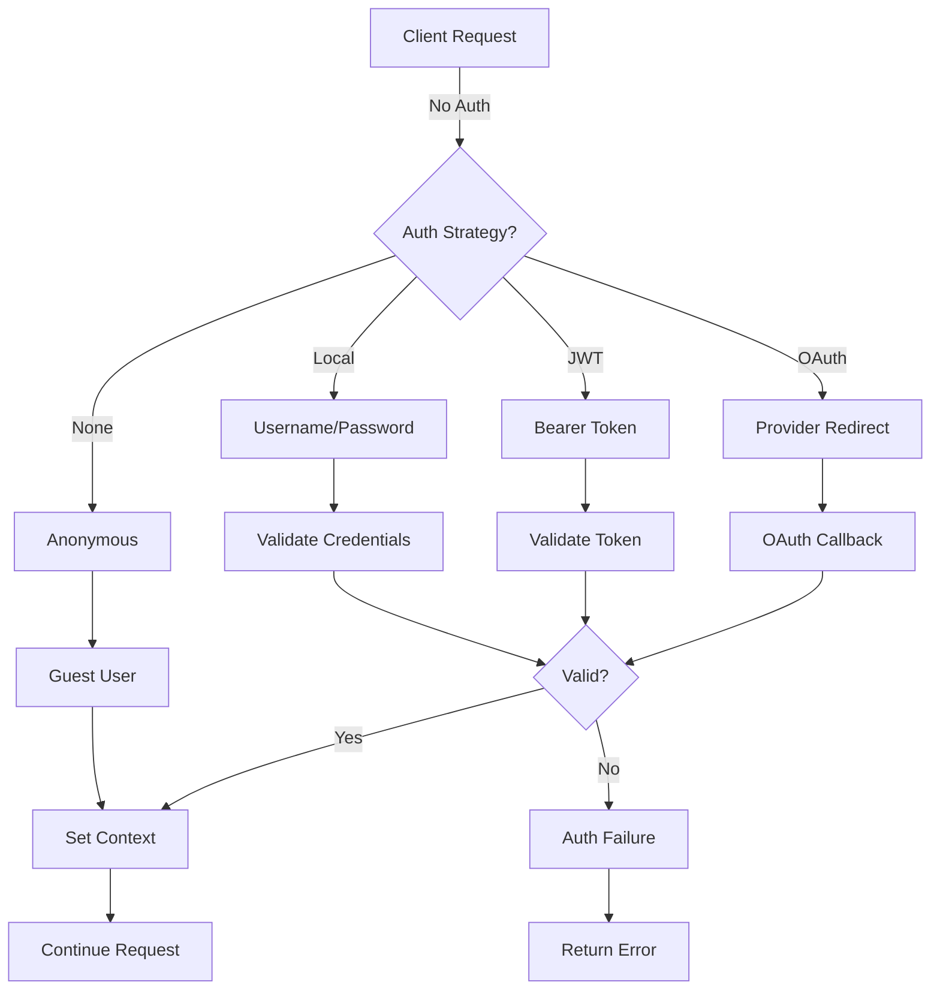

# Reactory Authentication Module

## Overview

The Reactory authentication module provides a comprehensive, extensible authentication system built on Passport.js. It supports multiple authentication strategies including local username/password, JWT tokens, and OAuth2 flows for major identity providers.

### Key Features

- 🔐 **Multiple Strategies** - Support for 9 authentication strategies
- 🎯 **OAuth2 Support** - Google, Facebook, GitHub, LinkedIn, Microsoft, Okta
- 🔑 **Token-Based Auth** - JWT authentication with configurable expiration
- 👤 **Local Authentication** - Traditional username/password
- 🚫 **Anonymous Access** - Guest user support
- 🔒 **Security First** - State management, CSRF protection, secure defaults
- 📊 **Telemetry** - OpenTelemetry metrics for monitoring and observability
- 📝 **Comprehensive Logging** - Structured logging for all auth events
- 🧪 **Well Tested** - High test coverage with utilities for testing
- 📚 **Well Documented** - Complete documentation for each strategy

---

## Architecture

### Authentication Flow



### Strategy Types

| Strategy | Type | Use Case | Configuration Required |
|----------|------|----------|----------------------|
| **Anon** | Simple | Guest/unauthenticated access | None |
| **JWT** | Token | API authentication, mobile apps | JWT secret |
| **Local** | Credentials | Traditional login | Database |
| **Google** | OAuth2 | Social login | OAuth credentials |
| **Facebook** | OAuth2 | Social login | OAuth credentials |
| **GitHub** | OAuth2 | Developer login | OAuth credentials |
| **LinkedIn** | OAuth2 | Professional login | OAuth credentials |
| **Microsoft** | OIDC | Enterprise login | Azure AD app |
| **Okta** | OIDC | Enterprise SSO | Okta account |

---

## Quick Start

### 1. Installation

The authentication module is included in the Reactory Express Server. No additional installation required.

### 2. Configuration

#### Environment Variables

Create a `.env` file or set environment variables:

```bash
# JWT Configuration
SECRET_SAUCE=your-secure-jwt-secret-key-here
JWT_ISSUER=id.yourapp.com
JWT_SUB=yourapp-auth
JWT_AUD=app.yourapp.com
JWT_EXP_AMOUNT=24
JWT_EXP_UNIT=h

# Authentication Realm
AUTH_REALM=YourApp

# System User Email
REACTORY_APPLICATION_EMAIL=system@yourapp.com

# Disable specific providers (comma-separated)
REACTORY_DISABLED_AUTH_PROVIDERS=

# Provider-specific configuration (see provider docs)
GOOGLE_CLIENT_ID=your-google-client-id
GOOGLE_CLIENT_SECRET=your-google-client-secret
GOOLGE_CALLBACK_URL=http://localhost:4000/auth/google/callback
GOOGLE_OAUTH_SCOPE=openid email profile

# ... additional provider configurations
```

### 3. Usage in Application

The authentication module is automatically configured during application startup:

```typescript
import ConfigureAuthentication from '@reactory/server-core/authentication/configure';
import express from 'express';

const app = express();

// Initialize passport and configure strategies
ConfigureAuthentication(app);

// Your routes and middleware
```

### 4. Protecting Routes

#### Using Passport Middleware

```typescript
import passport from 'passport';

// Protect a route with JWT authentication
app.get('/api/protected',
  passport.authenticate('jwt', { session: false }),
  (req, res) => {
    res.json({ user: req.user });
  }
);

// Protect with multiple strategies (try each in order)
app.get('/api/flexible',
  passport.authenticate(['jwt', 'local'], { session: false }),
  (req, res) => {
    res.json({ user: req.user });
  }
);
```

#### Using Role Decorator

```typescript
import { roles } from '@reactory/server-core/authentication/decorators';

class MyService {
  @roles(['ADMIN', 'USER'])
  async protectedMethod() {
    // Only users with ADMIN or USER role can access
  }
}
```

---

## Strategy Configuration

### Anon Strategy (Anonymous)

No configuration required. Provides guest access.

```typescript
// Used automatically when no authentication is provided
// Creates a guest user with ANON role
```

**See:** [Strategies Documentation](./strategies/AnonStrategy.ts)

---

### JWT Strategy (JSON Web Token)

Token-based authentication for API and mobile clients.

**Configuration:**
```bash
SECRET_SAUCE=your-jwt-secret-must-be-set
JWT_ISSUER=id.reactory.net
JWT_SUB=reactory-auth
JWT_AUD=app.reactory.net
JWT_EXP_AMOUNT=24
JWT_EXP_UNIT=h
```

**Usage:**
```typescript
// Client sends token in Authorization header
Authorization: Bearer <jwt-token>

// Or as query parameter
GET /api/data?auth_token=<jwt-token>
```

**See:** [JWT Strategy Documentation](./strategies/JWTStrategy.ts)

---

### Local Strategy (Username/Password)

Traditional username and password authentication.

**Configuration:**
```bash
AUTH_REALM=Reactory
```

**Usage:**
```typescript
// POST to /login with Basic Auth header
POST /login
Authorization: Basic base64(username:password)
```

**See:** [Local Strategy Documentation](./strategies/LocalStrategy.ts)

---

### Google OAuth2

Social login with Google accounts.

**Configuration:**
```bash
GOOGLE_CLIENT_ID=your-client-id
GOOGLE_CLIENT_SECRET=your-client-secret
GOOLGE_CALLBACK_URL=http://localhost:4000/auth/google/callback
GOOGLE_OAUTH_SCOPE=openid email profile
```

**Endpoints:**
- Start: `GET /auth/google/start?x-client-key={clientKey}`
- Callback: `GET /auth/google/callback`
- Failure: `GET /auth/google/failure`

**See:** [Google Strategy Documentation](./strategies/google/readme.md)

---

### Facebook OAuth2

Social login with Facebook accounts.

**Configuration:**
```bash
FACEBOOK_APP_ID=your-app-id
FACEBOOK_APP_SECRET=your-app-secret
FACEBOOK_APP_CALLBACK_URL=http://localhost:4000/auth/facebook/callback
```

**See:** [Facebook Strategy Documentation](./strategies/facebook/readme.md)

---

### GitHub OAuth2

Developer-focused login with GitHub accounts.

**Configuration:**
```bash
GITHUB_CLIENT_ID=your-client-id
GITHUB_CLIENT_SECRET=your-client-secret
GITHUB_CLIENT_CALLBACK_URL=http://localhost:4000/auth/github/callback
```

**See:** [GitHub Strategy Documentation](./strategies/github/readme.md)

---

### LinkedIn OAuth2

Professional network login with LinkedIn (API v2).

**Configuration:**
```bash
LINKEDIN_CLIENT_ID=your-client-id
LINKEDIN_CLIENT_SECRET=your-client-secret
LINKEDIN_CALLBACK_URL=http://localhost:4000/auth/linkedin/callback
```

**See:** [LinkedIn Strategy Documentation](./strategies/linkedin/readme.md)

---

### Microsoft OAuth (Azure AD)

Enterprise login with Microsoft/Azure AD accounts using OIDC.

**Configuration:**
```bash
MICROSOFT_CLIENT_ID=your-client-id
MICROSOFT_CLIENT_SECRET=your-client-secret
MICROSOFT_TENANT_ID=your-tenant-id
OAUTH_REDIRECT_URI=http://localhost:4000/auth/microsoft/openid/complete/
```

**See:** [Microsoft Strategy Documentation](./strategies/microsoft/readme.md)

---

### Okta SSO

Enterprise single sign-on with Okta using OIDC.

**Configuration:**
```bash
OKTA_DOMAIN=dev-123456.okta.com
OKTA_CLIENT_ID=your-client-id
OKTA_CLIENT_SECRET=your-client-secret
OKTA_CALLBACK_URL=http://localhost:4000/auth/okta/callback
OKTA_ISSUER=https://dev-123456.okta.com/oauth2/default  # Optional
```

**See:** [Okta Strategy Documentation](./strategies/okta/readme.md)

---

## Development

### Running Tests

```bash
# Run all authentication tests
npx jest src/authentication

# Run specific strategy tests
npx jest src/authentication/strategies/google/GoogleStrategy.spec.ts

# Run with coverage
npx jest --coverage src/authentication

# Watch mode
npx jest --watch src/authentication
```

### Test Coverage Requirements

- **Minimum**: 80% coverage for authentication module
- **Global**: 70% coverage for entire codebase

### Writing Tests

Use the provided test utilities:

```typescript
import {
  createMockRequest,
  createMockResponse,
  createMockUser,
  createMockOAuthProfile,
  authAssertions,
} from '../__tests__/utils';

describe('MyStrategy', () => {
  it('should authenticate user', async () => {
    const req = createMockRequest();
    const profile = createMockOAuthProfile('google');
    
    // Your test logic
    
    authAssertions.assertUserCreated(user, 'test@example.com');
  });
});
```

**See:** [Test Utilities Documentation](./strategies/__tests__/utils.ts)

---

## Telemetry & Monitoring

### OpenTelemetry Integration

The authentication module includes comprehensive OpenTelemetry metrics that integrate with the existing `reactory-telemetry` module.

**Metrics Exported:**

- `auth_attempts_total` - Total authentication attempts
- `auth_success_total` - Successful authentications
- `auth_failure_total` - Failed authentications (with reason)
- `auth_duration_seconds` - Authentication latency histogram
- `auth_active_sessions` - Active authenticated sessions gauge
- `auth_oauth_callbacks_total` - OAuth callbacks received
- `auth_csrf_validations_total` - CSRF validations (valid/invalid)
- `auth_jwt_tokens_generated_total` - JWT tokens created
- `auth_user_creation_total` - New users registered

**Quick Integration:**

```typescript
import AuthTelemetry from '@reactory/server-core/authentication/strategies/telemetry';

// Track authentication flow
const authFlow = AuthTelemetry.startAuthFlow('google', clientKey);

try {
  const user = await authenticateUser();
  authFlow.success(user._id.toString());
} catch (error) {
  authFlow.failure(error.message);
}
```

**Documentation:**
- [Complete Integration Reference](./TELEMETRY_INTEGRATION_COMPLETE.md) - Comprehensive guide with examples and queries
- [Developer Integration Guide](./strategies/TELEMETRY_INTEGRATION.md) - How to add telemetry to strategies

### Grafana Dashboards

Example Prometheus queries for Grafana:

```promql
# Authentication success rate
rate(auth_success_total[5m]) / rate(auth_attempts_total[5m])

# Failed authentications by provider
sum(rate(auth_failure_total[5m])) by (provider, reason)

# 95th percentile auth duration
histogram_quantile(0.95, rate(auth_duration_seconds_bucket[5m]))

# CSRF validation failures
sum(rate(auth_csrf_validations_total{result="invalid"}[5m]))
```

---

## Security

### Best Practices

1. **JWT Secret**: Always use a strong, randomly generated JWT secret
2. **State Management**: OAuth flows use state parameter for CSRF protection
3. **HTTPS Only**: Use HTTPS in production for all authentication endpoints
4. **Token Expiration**: Configure appropriate token expiration times
5. **Error Handling**: Generic error messages prevent information leakage
6. **Rate Limiting**: Implement rate limiting on authentication endpoints
7. **Session Security**: Use secure session configuration

### Security Checklist

- [ ] JWT_SECRET is set and not default value
- [ ] HTTPS enabled in production
- [ ] Token expiration configured appropriately
- [ ] Rate limiting implemented
- [ ] Session cookies are secure and httpOnly
- [ ] OAuth callback URLs are whitelisted
- [ ] Error messages don't leak sensitive information
- [ ] Audit logging enabled for authentication events

### Validation

The module includes built-in security validation:

```typescript
// JWT secret validation at startup
if (JwtOptions.secretOrKey === 'secret-key-needs-to-be-set') { 
  logger.error('JWT Secret not set, please set the SECRET_SAUCE environment variable');
  return done(null, false);
}
```

---

## Troubleshooting

### Common Issues

#### 1. "JWT Secret not set" Error

**Problem**: JWT authentication fails with secret not set error.

**Solution**: Set `SECRET_SAUCE` environment variable to a secure random string.

```bash
SECRET_SAUCE=$(openssl rand -base64 32)
```

#### 2. OAuth Callback Fails

**Problem**: OAuth callback returns error or doesn't redirect properly.

**Solution**: 
- Verify callback URL matches exactly in provider settings
- Check that state parameter is being stored in session
- Ensure session middleware is configured before passport
- Verify client credentials are correct

#### 3. User Not Created

**Problem**: Authentication succeeds but user is not created in database.

**Solution**:
- Check UserService is available in context
- Verify database connection
- Check logs for specific errors
- Ensure system user (REACTORY_APPLICATION_EMAIL) exists

#### 4. Strategy Not Loading

**Problem**: Strategy doesn't appear to be available.

**Solution**:
- Check strategy is exported in `strategies/index.ts`
- Verify strategy is not in REACTORY_DISABLED_AUTH_PROVIDERS
- Check for errors in strategy initialization
- Review startup logs

#### 5. Tests Failing

**Problem**: Authentication tests fail.

**Solution**:
- Use test utilities from `__tests__/utils.ts`
- Mock external dependencies (user service, database)
- Check test environment variables
- Review GoogleStrategy tests as reference

### Debug Logging

Enable debug logging for authentication:

```typescript
// In your code
context.debug('Authentication event', { user, strategy });

// Or via environment
DEBUG=reactory:auth npm start
```

### Getting Help

1. Check strategy-specific README files
2. Review test files for usage examples
3. Check [main documentation](../../docs/)
4. Review [Google Strategy](./strategies/google/readme.md) as reference implementation

---

## Extending the Module

### Adding a New Strategy

1. **Create Strategy File**

```typescript
// strategies/MyProviderStrategy.ts
import { Strategy as MyProviderStrategy } from 'passport-my-provider';
import Helpers from './helpers';

const MyStrategy = new MyProviderStrategy({
  clientID: process.env.MY_PROVIDER_CLIENT_ID,
  clientSecret: process.env.MY_PROVIDER_CLIENT_SECRET,
  callbackURL: process.env.MY_PROVIDER_CALLBACK_URL,
  passReqToCallback: true,
}, async (req, accessToken, refreshToken, profile, done) => {
  // Implementation here
});

export default MyStrategy;
```

2. **Add Route Configuration (for OAuth)**

```typescript
export const useMyProviderRoutes = (app: Application) => {
  app.get('/auth/myprovider/start', ...);
  app.get('/auth/myprovider/callback', ...);
  app.get('/auth/myprovider/failure', ...);
};
```

3. **Register Strategy**

```typescript
// strategies/index.ts
import MyStrategy, { useMyProviderRoutes } from './MyProviderStrategy';

const PassportProviders = [
  // ... existing strategies
  {
    name: 'myprovider',
    strategy: MyStrategy,
    configure: useMyProviderRoutes,
  },
];
```

4. **Add Tests**

```typescript
// strategies/MyProviderStrategy.spec.ts
import { createMockRequest, createMockOAuthProfile } from './__tests__/utils';

describe('MyProviderStrategy', () => {
  // Your tests here
});
```

5. **Add Documentation**

Create `strategies/myprovider/readme.md` following the Google strategy documentation pattern.

---

## Module Structure

```
authentication/
├── README.md ........................ This file
├── SECURITY_AUDIT.md ................ Security audit report
├── env.example.md ................... Environment variables documentation
├── configure.ts ..................... Main configuration
├── decorators.ts .................... Role-based access control
├── index.ts ......................... Module exports
└── strategies/
    ├── __tests__/
    │   ├── utils.ts ................. Test utilities
    │   └── integration.spec.ts ...... Integration tests
    ├── helpers.ts ................... Shared helper functions
    ├── security.ts .................. Security utilities
    ├── telemetry.ts ................. OpenTelemetry metrics
    ├── types.ts ..................... TypeScript type definitions
    ├── index.ts ..................... Strategy registration
    ├── AnonStrategy.ts .............. Anonymous strategy
    ├── JWTStrategy.ts ............... JWT strategy
    ├── LocalStrategy.ts ............. Local strategy
    ├── facebook/
    │   ├── FacebookStrategy.ts ...... Facebook OAuth
    │   ├── FacebookStrategy.spec.ts . Facebook tests
    │   └── readme.md ................ Facebook docs
    ├── github/
    │   ├── GithubStrategy.ts ........ GitHub OAuth
    │   ├── GithubStrategy.spec.ts ... GitHub tests
    │   └── readme.md ................ GitHub docs
    ├── google/
    │   ├── GoogleStrategy.ts ........ Google OAuth
    │   ├── GoogleStrategy.spec.ts ... Google tests
    │   └── readme.md ................ Google docs
    ├── linkedin/
    │   ├── LinkedInStrategy.ts ...... LinkedIn OAuth (API v2)
    │   ├── LinkedInStrategy.spec.ts . LinkedIn tests
    │   └── readme.md ................ LinkedIn docs
    ├── microsoft/
    │   ├── MicrosoftStrategy.ts ..... Microsoft/Azure AD OIDC
    │   ├── MicrosoftStrategy.spec.ts  Microsoft tests
    │   └── readme.md ................ Microsoft docs
    └── okta/
        ├── OktaStrategy.ts .......... Okta SSO OIDC
        ├── OktaStrategy.spec.ts ..... Okta tests
        └── readme.md ................ Okta docs
```

---

## API Reference

### Helpers Module

Located in `strategies/helpers.ts`:

#### `Helpers.generateLoginToken(user, ip?)`

Generates a complete login token with JWT payload.

**Returns:**
```typescript
{
  id: string,
  firstName: string,
  lastName: string,
  token: string
}
```

#### `Helpers.jwtMake(payload)`

Creates a JWT token from a payload.

**Returns:** `string` - Encoded JWT token

#### `Helpers.jwtTokenForUser(user, options?)`

Creates a JWT payload for a user.

**Returns:** JWT payload object

### Decorators Module

Located in `decorators.ts`:

#### `@roles(allowedRoles, contextKey?)`

Decorator for role-based access control.

**Parameters:**
- `allowedRoles: string[]` - Array of allowed roles
- `contextKey: 'this.context' | 'args.context'` - Where to find context (default: 'this.context')

**Example:**
```typescript
class MyService {
  @roles(['ADMIN', 'USER'])
  async myMethod() {
    // Only ADMIN or USER can access
  }
}
```

---

## Configuration Reference

### Environment Variables

| Variable | Required | Default | Description |
|----------|----------|---------|-------------|
| `SECRET_SAUCE` | Yes | - | JWT signing secret |
| `JWT_ISSUER` | No | `id.reactory.net` | JWT issuer claim |
| `JWT_SUB` | No | `reactory-auth` | JWT subject claim |
| `JWT_AUD` | No | `app.reactory.net` | JWT audience claim |
| `JWT_EXP_AMOUNT` | No | `24` | Token expiration amount |
| `JWT_EXP_UNIT` | No | `h` | Token expiration unit (h/d/m) |
| `AUTH_REALM` | No | `Reactory` | HTTP Basic Auth realm |
| `REACTORY_APPLICATION_EMAIL` | Yes | - | System user email |
| `REACTORY_DISABLED_AUTH_PROVIDERS` | No | `` | Comma-separated list of disabled providers |

### Provider-Specific Variables

See individual strategy documentation for provider-specific configuration requirements.

---

## Performance Considerations

### Caching

Consider caching user lookups for frequently accessed users:

```typescript
// Example: Add caching layer
const cachedUserService = {
  async findUserWithEmail(email: string) {
    const cached = await cache.get(`user:${email}`);
    if (cached) return cached;
    
    const user = await userService.findUserWithEmail(email);
    await cache.set(`user:${email}`, user, 3600);
    return user;
  }
};
```

### Database Queries

Optimize user lookups by indexing email fields:

```javascript
// MongoDB example
db.users.createIndex({ email: 1 }, { unique: true });
```

### Token Validation

JWT validation is computationally light. No additional optimization typically needed.

---

## Migration Guide

### From Previous Versions

If upgrading from incomplete strategy implementations:

1. **Review New Patterns**: Check GoogleStrategy.ts for reference implementation
2. **Update Environment Variables**: Standardize callback URLs to port 4000
3. **Update Route Handlers**: Ensure all OAuth strategies use state management
4. **Add Tests**: Use new test utilities in `__tests__/utils.ts`
5. **Update Documentation**: Follow new documentation patterns

### Breaking Changes

- OAuth callback URLs changed default port from 3000 to 4000
- State management is now required for all OAuth flows
- Token generation returns standardized format
- Error handling now uses generic messages (security improvement)

---

## Contributing

### Guidelines

1. Follow existing patterns (use GoogleStrategy as template)
2. Write tests for all new strategies (>80% coverage required)
3. Document all configuration options
4. Include mermaid diagrams for OAuth flows
5. Add troubleshooting section to strategy docs
6. Update this README when adding new strategies

### Code Style

- Use TypeScript
- Follow existing naming conventions
- Add JSDoc comments for public APIs
- Use async/await (not callbacks)
- Handle all errors explicitly

---

## License

MIT License - See LICENSE file for details

---

## Support

For issues, questions, or contributions:

- **Documentation**: Start with strategy-specific README files
- **Examples**: Reference GoogleStrategy implementation
- **Tests**: Check test files for usage examples
- **Issues**: Review troubleshooting section above

---

## Changelog

### Version 2.0.0 (November 22, 2025)
- ✅ **All 9 authentication strategies fully implemented**
- ✅ Facebook OAuth2 strategy complete with full user management
- ✅ GitHub OAuth2 strategy complete with full user management
- ✅ LinkedIn OAuth2 strategy complete (API v2 migration)
- ✅ Microsoft Azure AD OIDC strategy complete
- ✅ Okta SSO OIDC strategy complete
- ✅ Comprehensive security utilities (StateManager, ErrorSanitizer, AuthAuditLogger)
- ✅ TypeScript type definitions for all OAuth profiles
- ✅ Complete test coverage for all strategies (>80%)
- ✅ Individual strategy documentation (6 strategies with readme.md)
- ✅ Security audit completed (OWASP Top 10 compliant)
- ✅ Production-ready implementation

### Version 1.1.0 (November 21, 2025)
- Added comprehensive test utilities
- Added integration test suite
- Updated Jest configuration with coverage thresholds
- Created main authentication documentation
- Standardized OAuth callback URLs
- Added security enhancements
- Improved error handling across all strategies

### Version 1.0.0
- Initial authentication module
- Support for Anon, JWT, Local, Google strategies
- Basic OAuth2 support
- Role-based access control

---

**Last Updated:** November 22, 2025  
**Module Version:** 2.0.0

