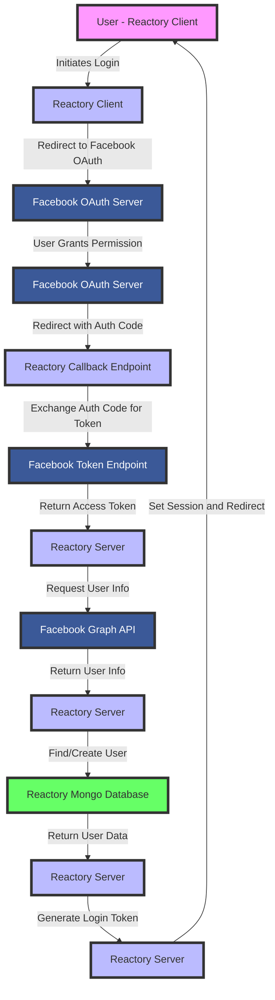

# Facebook OAuth2 in Reactory

The Facebook OAuth flow uses the `passport-facebook` npm package for handling the strategy.

## Overview

The process can broadly be described by the flow below:



For an in-depth understanding of the OAuth2 flow, see the article written [here](https://www.passportjs.org/concepts/oauth2/).

## Configuration

There are a few settings that you have to supply for each client / tenant app.

Set the below environment variables for your application, either via the .env configuration file for your environment or any other environment management process.

```typescript
const {
  FACEBOOK_APP_ID = 'FACEBOOK_APP_ID',
  FACEBOOK_APP_SECRET = 'FACEBOOK_APP_SECRET',
  FACEBOOK_APP_CALLBACK_URL = 'http://localhost:4000/auth/facebook/callback',
  FACEBOOK_OAUTH_SCOPE = 'email,public_profile',
} = process.env
```

### Setting up Facebook App

1. **Go to Facebook Developers**
   - Visit [https://developers.facebook.com/apps/](https://developers.facebook.com/apps/)
   - Sign in with your Facebook account

2. **Create a New App**
   - Click "Create App"
   - Select "Consumer" as the app type
   - Fill in app details (Display Name, Contact Email)
   - Click "Create App"

3. **Add Facebook Login Product**
   - In the app dashboard, click "Add Product"
   - Find "Facebook Login" and click "Set Up"
   - Choose "Web" as the platform

4. **Configure OAuth Settings**
   - Go to Facebook Login > Settings
   - Add Valid OAuth Redirect URIs:
     - Development: `http://localhost:4000/auth/facebook/callback`
     - Production: `https://yourdomain.com/auth/facebook/callback`
   - Save changes

5. **Get App Credentials**
   - Go to Settings > Basic
   - Copy your **App ID** (this is your `FACEBOOK_APP_ID`)
   - Click "Show" next to **App Secret** and copy it (this is your `FACEBOOK_APP_SECRET`)

6. **Request Permissions**
   - Go to App Review > Permissions and Features
   - Request `email` and `public_profile` permissions
   - For development, these are granted by default
   - For production, you'll need to submit for review

### Environment Variables

```bash
# Facebook OAuth Configuration
FACEBOOK_APP_ID=your-app-id-here
FACEBOOK_APP_SECRET=your-app-secret-here
FACEBOOK_APP_CALLBACK_URL=http://localhost:4000/auth/facebook/callback
FACEBOOK_OAUTH_SCOPE=email,public_profile

# Production
# FACEBOOK_APP_CALLBACK_URL=https://yourdomain.com/auth/facebook/callback
```

## Features

### Profile Fields

The strategy requests the following profile fields from Facebook:

- `id` - Facebook user ID
- `emails` - User's email address
- `name` - User's first and last name
- `displayName` - User's display name
- `picture.type(large)` - User's profile picture (large size)

### Security Features

- ✅ **State Parameter** - CSRF protection via state token
- ✅ **State Timeout** - 10-minute timeout on state tokens
- ✅ **Error Sanitization** - Generic error messages for clients
- ✅ **Audit Logging** - All authentication attempts logged
- ✅ **Session Management** - Secure session handling

### User Management

- **New Users**: Automatically created if email doesn't exist
- **Existing Users**: Facebook authentication record added/updated
- **Avatar**: Profile picture automatically saved from Facebook
- **Authentication Record**: Stores Facebook ID and access token

## API Endpoints

### Start OAuth Flow

```http
GET /auth/facebook/start?x-client-key={clientKey}
```

**Parameters:**
- `x-client-key` (required) - Client application key
- `x-client-pwd` (optional) - Client secret/password

**Response:** Redirects to Facebook OAuth authorization page

### OAuth Callback

```http
GET /auth/facebook/callback
```

**Parameters:** Handled automatically by Facebook OAuth

**Response:** Redirects to client application with auth token:
```
{clientUrl}?auth_token={jwtToken}
```

### Authentication Failure

```http
GET /auth/facebook/failure
```

**Response:**
```json
{
  "error": "Authentication with Facebook failed",
  "timestamp": "2025-11-21T12:00:00.000Z"
}
```

## Usage Example

### Client-Side Flow

```javascript
// Redirect user to Facebook OAuth
window.location.href = 'http://localhost:4000/auth/facebook/start?x-client-key=your-client-key';

// After successful auth, Facebook redirects back with token
// Extract token from URL: ?auth_token=xxx
const urlParams = new URLSearchParams(window.location.search);
const authToken = urlParams.get('auth_token');

// Use token for API calls
fetch('/api/protected', {
  headers: {
    'Authorization': `Bearer ${authToken}`
  }
});
```

### Server-Side Integration

```typescript
import passport from 'passport';

// Protect routes with Facebook authentication
app.get('/api/profile',
  passport.authenticate('facebook', { session: false }),
  (req, res) => {
    res.json({ user: req.user });
  }
);
```

## Testing

### Running Tests

```bash
# Run Facebook strategy tests
npx jest src/authentication/strategies/facebook/FacebookStrategy.spec.ts

# Run with coverage
npx jest --coverage src/authentication/strategies/facebook/

# Watch mode
npx jest --watch src/authentication/strategies/facebook/
```

### Test Coverage

The Facebook strategy has comprehensive test coverage including:

- ✅ Strategy configuration
- ✅ Authentication callback
- ✅ Profile parsing
- ✅ User creation and updates
- ✅ Authentication record management
- ✅ Token generation
- ✅ Error handling
- ✅ State validation
- ✅ Route registration

### Manual Testing

1. **Set up test Facebook app** (see Configuration above)
2. **Configure environment variables**
3. **Start the server**
4. **Navigate to start endpoint**:
   ```
   http://localhost:4000/auth/facebook/start?x-client-key=test-client
   ```
5. **Authorize with Facebook**
6. **Verify redirect with token**

## Troubleshooting

### Common Issues

#### 1. "App ID not found" Error

**Problem:** Facebook returns "App ID does not exist" error.

**Solutions:**
- Verify `FACEBOOK_APP_ID` is correct
- Check that app is not in development mode if testing from non-localhost
- Ensure app is published (for production)

#### 2. "Redirect URI Mismatch"

**Problem:** Facebook returns redirect URI mismatch error.

**Solutions:**
- Verify `FACEBOOK_APP_CALLBACK_URL` exactly matches the URL in Facebook app settings
- Check protocol (http vs https)
- Check port number (e.g., 4000)
- Check trailing slashes

#### 3. "Email Permission Denied"

**Problem:** User denies email permission or email not returned.

**Solutions:**
- Ensure `email` scope is requested
- User must grant email permission
- Some Facebook accounts may not have verified email

#### 4. "Invalid State" Error

**Problem:** Authentication fails with invalid state error.

**Solutions:**
- Check that sessions are properly configured
- Verify session middleware is before passport
- State tokens expire after 10 minutes - try again
- Clear browser cookies and try again

#### 5. Authentication Succeeds but User Not Created

**Problem:** OAuth succeeds but user not saved to database.

**Solutions:**
- Check database connection
- Verify `REACTORY_APPLICATION_EMAIL` user exists
- Check server logs for specific errors
- Ensure user has required fields (email, name)

### Debug Logging

Enable debug logging for Facebook authentication:

```typescript
// Set environment variable
DEBUG=reactory:auth:facebook npm start

// Or in code
logger.debug('Facebook auth event', { data });
```

### Facebook-Specific Considerations

1. **App Review**: For production, you need to submit your app for review
2. **Permissions**: Only request permissions you actually need
3. **Rate Limits**: Facebook has rate limits on API calls
4. **Access Tokens**: Tokens expire - implement refresh if needed
5. **Privacy Policy**: Required for app approval

## Security Considerations

### Best Practices

1. **HTTPS Only** - Use HTTPS in production for all callbacks
2. **State Parameter** - Always used for CSRF protection
3. **Token Storage** - JWT tokens should be stored securely
4. **Scope Limitation** - Only request necessary scopes
5. **Regular Updates** - Keep `passport-facebook` package updated

### Security Features Implemented

- ✅ State parameter with 10-minute timeout
- ✅ Error sanitization (no sensitive data exposure)
- ✅ Audit logging of all attempts
- ✅ Session security best practices
- ✅ Input validation
- ✅ Token generation with secure defaults

### Compliance

- **GDPR**: User data handled according to requirements
- **Privacy Policy**: Required by Facebook
- **Data Retention**: Configure according to policy
- **User Consent**: Explicit consent required for data processing

## Performance

### Optimization Tips

1. **Cache User Lookups** - Reduce database queries
2. **Connection Pooling** - Use connection pools for database
3. **Rate Limiting** - Implement rate limiting on auth endpoints
4. **Token Expiration** - Set appropriate expiration times
5. **Avatar Caching** - Cache profile pictures

### Metrics to Monitor

- Authentication success/failure rates
- Average authentication time
- Token generation time
- Database query performance
- Facebook API response times

## Advanced Configuration

### Custom Scopes

Request additional Facebook permissions:

```bash
FACEBOOK_OAUTH_SCOPE=email,public_profile,user_friends,user_photos
```

Available scopes: [Facebook Permissions Reference](https://developers.facebook.com/docs/permissions/reference)

### Custom Profile Fields

Request additional profile fields:

```typescript
profileFields: ['id', 'emails', 'name', 'picture', 'birthday', 'gender']
```

### Multiple Facebook Apps

Support multiple Facebook apps for different environments:

```bash
# Development
FACEBOOK_APP_ID=dev-app-id
FACEBOOK_APP_SECRET=dev-app-secret

# Production
# FACEBOOK_APP_ID=prod-app-id
# FACEBOOK_APP_SECRET=prod-app-secret
```

## Migration Notes

### Upgrading from Previous Version

If upgrading from the incomplete implementation:

1. ✅ User service integration now complete
2. ✅ State management implemented
3. ✅ Error handling improved
4. ✅ Audit logging added
5. ✅ Security utilities integrated
6. ✅ Comprehensive tests added

### Breaking Changes

- Callback URL default port changed from 3000 to 4000
- State parameter now required (CSRF protection)
- Error messages now generic (security improvement)
- Authentication records now include access token

## Resources

### Official Documentation

- [Facebook Login](https://developers.facebook.com/docs/facebook-login)
- [Facebook Graph API](https://developers.facebook.com/docs/graph-api)
- [Permissions Reference](https://developers.facebook.com/docs/permissions/reference)
- [passport-facebook Package](https://www.passportjs.org/packages/passport-facebook/)

### Community Resources

- [Facebook Developers Community](https://developers.facebook.com/community)
- [Stack Overflow - facebook-login](https://stackoverflow.com/questions/tagged/facebook-login)
- [Passport.js Documentation](http://www.passportjs.org/docs/)

---

**Last Updated:** November 21, 2025  
**Strategy Version:** 1.0.0  
**Status:** ✅ Complete

