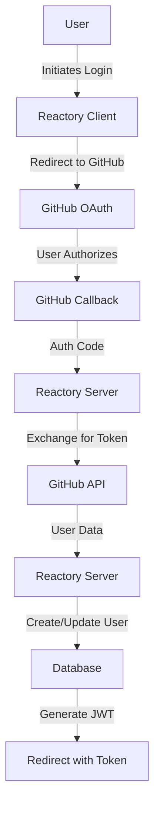

# GitHub OAuth2 in Reactory

GitHub authentication using `passport-github` for OAuth2 flow.

## Overview



## Configuration

### Environment Variables

```bash
GITHUB_CLIENT_ID=your-github-client-id
GITHUB_CLIENT_SECRET=your-github-client-secret
GITHUB_CLIENT_CALLBACK_URL=http://localhost:4000/auth/github/callback
GITHUB_OAUTH_SCOPE=user:email,read:user
```

### GitHub App Setup

1. Go to [GitHub Developer Settings](https://github.com/settings/developers)
2. Click "New OAuth App"
3. Fill in details:
   - Application name
   - Homepage URL: `http://localhost:4000`
   - Authorization callback URL: `http://localhost:4000/auth/github/callback`
4. Copy Client ID and Client Secret

## Features

- ✅ OAuth2 authentication
- ✅ User creation/update
- ✅ Avatar from GitHub profile
- ✅ Username storage
- ✅ CSRF protection via state
- ✅ Audit logging
- ✅ Error sanitization

## Endpoints

### Start OAuth
```
GET /auth/github/start?x-client-key={clientKey}
```

### Callback
```
GET /auth/github/callback
```

### Failure
```
GET /auth/github/failure
```

## Testing

```bash
npx jest src/authentication/strategies/github/
```

## Troubleshooting

### Email Not Available

GitHub users can keep their email private. Ensure:
- User makes email public, OR
- User grants email scope permission

### Callback URL Mismatch

Verify callback URL in GitHub app matches exactly:
- Protocol (http/https)
- Port number
- Path

## Resources

- [GitHub OAuth Apps](https://docs.github.com/en/developers/apps/building-oauth-apps)
- [GitHub Scopes](https://docs.github.com/en/developers/apps/building-oauth-apps/scopes-for-oauth-apps)

