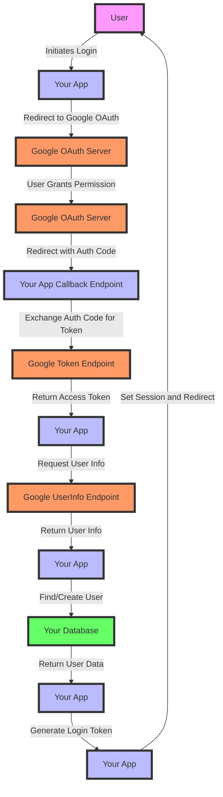

# Google OAUTH2 in Reactory

```mermaid
graph TD
    A[User] -->|Initiates Login| B[Your App]
    B -->|Redirect to Google OAuth| C[Google OAuth Server]
    C -->|User Grants Permission| D[Google OAuth Server]
    D -->|Redirect with Auth Code| E[Your App Callback Endpoint]
    E -->|Exchange Auth Code for Token| F[Google Token Endpoint]
    F -->|Return Access Token| G[Your App]
    G -->|Request User Info| H[Google UserInfo Endpoint]
    H -->|Return User Info| I[Your App]
    I -->|Find/Create User| J[Your Database]
    J -->|Return User Data| K[Your App]
    K -->|Generate Login Token| L[Your App]
    L -->|Set Session and Redirect| A[User]

    style A fill:#f9f,stroke:#333,stroke-width:4px
    style B fill:#bbf,stroke:#333,stroke-width:4px
    style C fill:#f96,stroke:#333,stroke-width:4px
    style D fill:#f96,stroke:#333,stroke-width:4px
    style E fill:#bbf,stroke:#333,stroke-width:4px
    style F fill:#f96,stroke:#333,stroke-width:4px
    style G fill:#bbf,stroke:#333,stroke-width:4px
    style H fill:#f96,stroke:#333,stroke-width:4px
    style I fill:#bbf,stroke:#333,stroke-width:4px
    style J fill:#6f6,stroke:#333,stroke-width:4px
    style K fill:#bbf,stroke:#333,stroke-width:4px
    style L fill:#bbf,stroke:#333,stroke-width:4px
```

