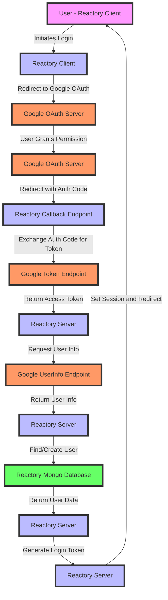

# Google OAUTH2 in Reactory
The google oauth flow uses the `passport-google-oauth20` npm package for handling the strategy.

## Overview
The process can broadly be described by the flow below.


For an in-depth understanding of the oauth2 flow, see the article written [here](https://www.passportjs.org/concepts/oauth2/).

## Configuration
There are a few setings that you have to supply for each client / tenant app.

Set the below environment variables for your application, either via the .env configuration file for your environment or any other environment management process.

```typescript
const { 
  GOOGLE_CLIENT_ID = 'GOOGLE_CLIENT_ID',
  GOOGLE_CLIENT_SECRET = 'GOOGLE_CLIENT_SECRET',
  GOOLGE_CALLBACK_URL = 'http://localhost:4000/auth/google/callback',
  GOOGLE_OAUTH_SCOPE = 'openid email profile https://www.googleapis.com/auth/userinfo.profile',
} = process.env

```

## Testing
Due to the nature of the oauth flow test, minimal unit tests are added to ensure reactory platform handles redirects correctly across state.

Tests can be executed with `bin/jest.sh reactory local GoogleStrategy`
