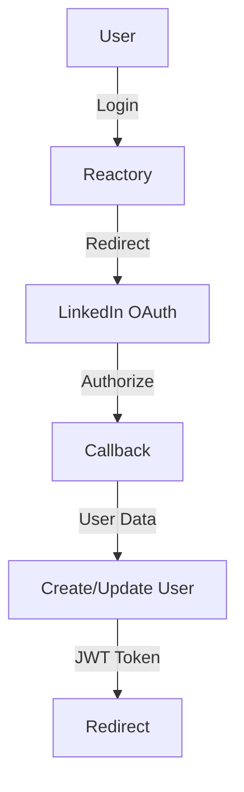

# LinkedIn OAuth2 in Reactory

LinkedIn professional network authentication using `passport-linkedin-oauth2` with API v2 support.

## Overview



## Configuration

### Environment Variables

```bash
LINKEDIN_CLIENT_ID=your-linkedin-client-id
LINKEDIN_CLIENT_SECRET=your-linkedin-client-secret
LINKEDIN_CALLBACK_URL=http://localhost:4000/auth/linkedin/callback
LINKEDIN_OAUTH_SCOPE=openid,profile,email
```

### LinkedIn App Setup

1. Go to [LinkedIn Developers](https://www.linkedin.com/developers/apps/new)
2. Create new app
3. Add "Sign In with LinkedIn" product
4. Configure OAuth 2.0 redirect URLs
5. Copy Client ID and Client Secret

## API v2 Migration

**IMPORTANT:** LinkedIn deprecated v1 API scopes.

### Old Scopes (Deprecated)
❌ `r_emailaddress`  
❌ `r_liteprofile`

### New Scopes (API v2)
✅ `openid`  
✅ `profile`  
✅ `email`

This strategy uses the updated v2 scopes.

## Features

- ✅ API v2 compliant
- ✅ OAuth2 authentication
- ✅ User creation/update
- ✅ CSRF protection
- ✅ Audit logging
- ✅ Error sanitization

## Endpoints

```
GET /auth/linkedin/start?x-client-key={clientKey}
GET /auth/linkedin/callback
GET /auth/linkedin/failure
```

## Testing

```bash
npx jest src/authentication/strategies/linkedin/
```

## Troubleshooting

### Scope Permission Denied

**Problem:** User denies permissions or old scopes used.

**Solution:** 
- Ensure using v2 scopes: `openid,profile,email`
- Update LinkedIn app to use v2 API
- Request user to re-authorize

### Callback URL Mismatch

Verify callback URL matches exactly in LinkedIn app settings (protocol, port, path).

## Resources

- [LinkedIn API v2](https://docs.microsoft.com/en-us/linkedin/shared/authentication/authentication)
- [Sign In with LinkedIn](https://docs.microsoft.com/en-us/linkedin/consumer/integrations/self-serve/sign-in-with-linkedin)

**Status:** ✅ Complete with API v2 support

