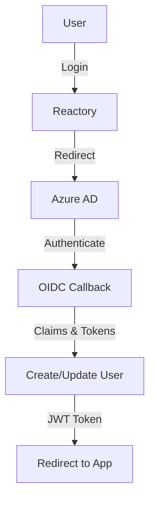

# Microsoft Azure AD in Reactory

Enterprise authentication using Azure AD OpenID Connect (OIDC).

## Overview



## Configuration

### Environment Variables

```bash
MICROSOFT_CLIENT_ID=your-azure-app-client-id
MICROSOFT_CLIENT_SECRET=your-client-secret
MICROSOFT_TENANT_ID=common  # or specific tenant ID
OAUTH_REDIRECT_URI=http://localhost:4000/auth/microsoft/openid/complete/
```

### Azure AD App Setup

1. Go to [Azure Portal](https://portal.azure.com)
2. Navigate to Azure Active Directory > App registrations
3. Click "New registration"
4. Configure:
   - Name: Your app name
   - Supported account types:
     - Single tenant: Your organization only
     - Multi-tenant: Any Azure AD directory
   - Redirect URI (Web): `http://localhost:4000/auth/microsoft/openid/complete/{clientKey}`
5. Create client secret in "Certificates & secrets"
6. Copy Application (client) ID and Directory (tenant) ID
7. Configure API permissions:
   - Microsoft Graph: `openid`, `profile`, `email`, `User.Read`

## Tenant Configuration

### Single-Tenant
```bash
MICROSOFT_TENANT_ID=your-tenant-guid
```
Only users from your specific Azure AD tenant can sign in.

### Multi-Tenant
```bash
MICROSOFT_TENANT_ID=common
```
Users from any Azure AD tenant can sign in.

### Organizations Only
```bash
MICROSOFT_TENANT_ID=organizations
```
Any Azure AD tenant, but not personal Microsoft accounts.

### Consumers Only
```bash
MICROSOFT_TENANT_ID=consumers
```
Personal Microsoft accounts only (not organizational).

## Features

- ✅ OIDC authentication
- ✅ Single & multi-tenant support
- ✅ User creation/update
- ✅ OID and tenant ID storage
- ✅ Audit logging
- ✅ Error sanitization
- ✅ JWT token generation

## Endpoints

```
GET /auth/microsoft/openid/start/:clientKey
POST /auth/microsoft/openid/complete/:clientKey
GET /auth/microsoft/openid/failure
```

## Testing

```bash
npx jest src/authentication/strategies/microsoft/
```

## Troubleshooting

### Redirect URI Mismatch

**Problem:** AADSTS50011 - Reply URL does not match.

**Solution:**
- Verify redirect URI in Azure portal matches exactly
- Include `{clientKey}` parameter in URI
- Check protocol (http/https)

### Tenant Not Found

**Problem:** AADSTS90002 - Tenant not found.

**Solution:**
- Verify `MICROSOFT_TENANT_ID` is correct
- Use `common` for multi-tenant
- Check tenant is active

### Invalid Client Secret

**Problem:** AADSTS7000215 - Invalid client secret.

**Solution:**
- Generate new client secret in Azure portal
- Update `MICROSOFT_CLIENT_SECRET`
- Secret may have expired

### Email Not in Claims

**Problem:** User profile missing email.

**Solution:**
- Verify `email` scope is requested
- Check API permissions include `User.Read`
- Some accounts may require admin consent

## Production Considerations

### Security
- ✅ Use HTTPS only (`allowHttpForRedirectUrl: false`)
- ✅ Set `validateIssuer: true` for single-tenant
- ✅ Enable certificate validation
- ✅ Use secure client secrets (Azure Key Vault)

### Multi-Tenant Best Practices
- Implement tenant allow/blocklist if needed
- Log tenant IDs for auditing
- Handle different tenant claim formats
- Consider tenant-specific customization

## Resources

- [Azure AD Documentation](https://docs.microsoft.com/en-us/azure/active-directory/)
- [OIDC with Azure AD](https://docs.microsoft.com/en-us/azure/active-directory/develop/v2-protocols-oidc)
- [passport-azure-ad](https://github.com/AzureAD/passport-azure-ad)

**Status:** ✅ Complete with OIDC support

