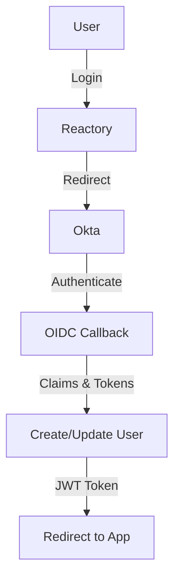

# Okta SSO in Reactory

Enterprise Single Sign-On using Okta OpenID Connect (OIDC).

## Overview



## Configuration

### Environment Variables

```bash
OKTA_CLIENT_ID=your-okta-client-id
OKTA_CLIENT_SECRET=your-client-secret
OKTA_DOMAIN=dev-123456.okta.com  # Your Okta domain
OKTA_ISSUER=https://dev-123456.okta.com/oauth2/default  # Optional
OKTA_CALLBACK_URL=http://localhost:4000/auth/okta/callback
```

### Okta Application Setup

1. **Sign up for Okta Developer Account**
   - Go to [https://developer.okta.com/signup/](https://developer.okta.com/signup/)
   - Complete registration to get your Okta domain (e.g., `dev-123456.okta.com`)

2. **Create an Application**
   - Log into your Okta Admin Console
   - Navigate to **Applications** > **Applications**
   - Click **Create App Integration**
   - Select:
     - Sign-in method: **OIDC - OpenID Connect**
     - Application type: **Web Application**
   - Click **Next**

3. **Configure Application Settings**
   - **App integration name**: Your app name (e.g., "Reactory")
   - **Grant type**: Authorization Code
   - **Sign-in redirect URIs**: 
     - `http://localhost:4000/auth/okta/callback` (development)
     - `https://your-domain.com/auth/okta/callback` (production)
   - **Sign-out redirect URIs**: (optional)
   - **Controlled access**: Choose who can access this application
   - Click **Save**

4. **Get Credentials**
   - Copy **Client ID**
   - Copy **Client secret** (click to reveal)
   - Note your **Okta domain** from the URL (e.g., `dev-123456.okta.com`)

5. **Configure Authorization Server (Optional)**
   - Default: `https://your-domain.okta.com/oauth2/default`
   - Custom: Navigate to **Security** > **API** > **Authorization Servers**
   - Create or select an authorization server
   - Note the **Issuer URI** for `OKTA_ISSUER`

## Features

- ✅ OIDC authentication
- ✅ Single Sign-On (SSO)
- ✅ User creation/update
- ✅ Okta user ID storage
- ✅ State management for CSRF protection
- ✅ Audit logging
- ✅ Error sanitization
- ✅ JWT token generation
- ✅ Support for custom authorization servers

## Endpoints

```
GET /auth/okta/start/:clientKey
GET /auth/okta/callback
GET /auth/okta/failure
```

## Authorization Server Options

### Default Authorization Server
```bash
OKTA_ISSUER=https://dev-123456.okta.com/oauth2/default
```
- Works for most applications
- Includes standard OIDC scopes

### Custom Authorization Server
```bash
OKTA_ISSUER=https://dev-123456.okta.com/oauth2/custom-server-id
```
- Create in Okta Admin: **Security** > **API** > **Authorization Servers**
- Allows custom claims, scopes, and policies
- Better for advanced use cases

### Okta Org Authorization Server
```bash
OKTA_ISSUER=https://dev-123456.okta.com
```
- Uses Okta's built-in authorization server
- For internal Okta applications

## Testing

```bash
npx jest src/authentication/strategies/okta/
```

## Troubleshooting

### Invalid Issuer

**Problem:** `OIDC_ERROR: Invalid issuer`

**Solution:**
- Verify `OKTA_ISSUER` matches your authorization server
- Default is `https://{OKTA_DOMAIN}/oauth2/default`
- Check **Security** > **API** > **Authorization Servers** in Okta Admin

### Redirect URI Mismatch

**Problem:** `redirect_uri_mismatch` error

**Solution:**
- Verify callback URL in Okta app matches `OKTA_CALLBACK_URL`
- Include `{clientKey}` in your app's redirect URIs if using dynamic clients
- Check protocol (http vs https)

### Invalid Client Credentials

**Problem:** `invalid_client` error

**Solution:**
- Verify `OKTA_CLIENT_ID` is correct
- Verify `OKTA_CLIENT_SECRET` is correct and not expired
- Regenerate client secret in Okta if necessary

### User Email Not Available

**Problem:** User profile missing email

**Solution:**
- Verify `email` scope is requested
- Check user has email in Okta profile
- Some authorization servers may need custom claims configured

### State Parameter Error

**Problem:** `invalid_state` or `missing_state` error

**Solution:**
- Ensure cookies are enabled
- Check session middleware is configured
- Verify state management is working (CSRF protection)

## Okta vs Azure AD

### Similarities
- Both use OIDC
- Both support SSO
- Both are enterprise identity platforms
- Similar user claims structure

### Differences

| Feature | Okta | Azure AD |
|---------|------|----------|
| **Primary Use** | Identity-as-a-Service | Microsoft ecosystem |
| **Target** | Multi-platform enterprises | Microsoft-centric orgs |
| **Authorization Servers** | Multiple custom servers | Single tenant config |
| **Integration** | Platform agnostic | Deep Microsoft integration |
| **Pricing Model** | Per-user pricing | Per-user or M365 bundle |

## Production Considerations

### Security
- ✅ Use HTTPS only in production
- ✅ Validate issuer in production
- ✅ Use secure client secrets (environment variables or vault)
- ✅ Enable MFA in Okta
- ✅ Configure rate limiting

### High Availability
- Okta has 99.99% uptime SLA
- Implement fallback authentication if needed
- Cache user data appropriately
- Monitor authentication metrics

### Best Practices
- Use custom authorization server for production
- Configure appropriate token lifetimes
- Implement token refresh if needed
- Use groups/roles for authorization
- Enable audit logging in Okta

## Advanced Features

### Multi-Tenancy
- Use different Okta domains per tenant
- Configure per-client authorization servers
- Map Okta groups to application roles

### Custom Claims
```javascript
// Configure in Okta Authorization Server
// Security > API > Authorization Servers > Claims
{
  "department": "${user.department}",
  "role": "${user.role}",
  "custom_attr": "${user.custom_attribute}"
}
```

### Group-Based Authorization
- Assign users to groups in Okta
- Add groups claim to ID token
- Use groups for role-based access control

## Resources

- [Okta Developer Documentation](https://developer.okta.com/docs/)
- [OIDC with Okta](https://developer.okta.com/docs/concepts/oauth-openid/)
- [Okta Authorization Servers](https://developer.okta.com/docs/concepts/auth-servers/)
- [passport-openidconnect](https://github.com/jaredhanson/passport-openidconnect)

**Status:** ✅ Complete with OIDC and SSO support

