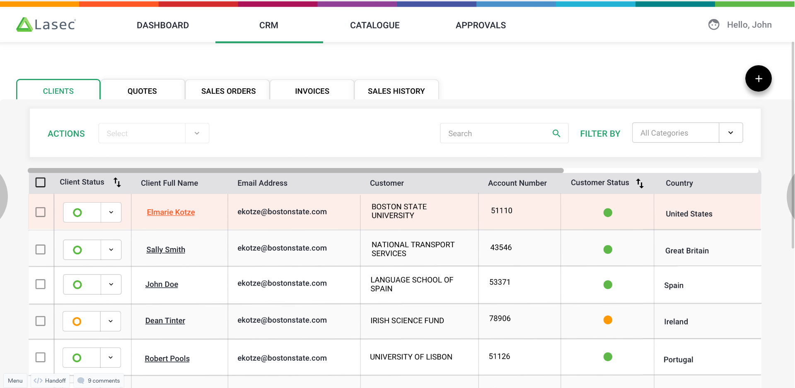

# Specification for CRM

This document will highlight the basic requirements for the CRM dashboad / landing page.

> *See clickable marvel app*
>
> <https://marvelapp.com/dda8714/screen/66032336>
> 
>[]
> The link above is the overview  and requirement for the landing page for site/crm/client

## Layout
Use a Tabbed Navigation to link to each grid view for the following CRM related items

Status: ***in progress - Werner Weber***

JIRA Ticket

Forms is in ./TabbedLayout

1. Clients
2. Quotes
3. Sales Order
4. Invoices
5. Sales History

### Client Grid

**TODO Werner Weber**

#### Client Details / View / Edit

The details specification for clients can be found [here](Client/SPEC.md)

### Quotes Grid

**TODO Werner Weber**

### Sales Order Grid

**TODO Werner Weber**

### Invoices 

**TODO Werner Weber**

### Sales History

**TODO Werner Weber**

