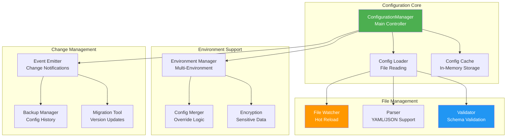
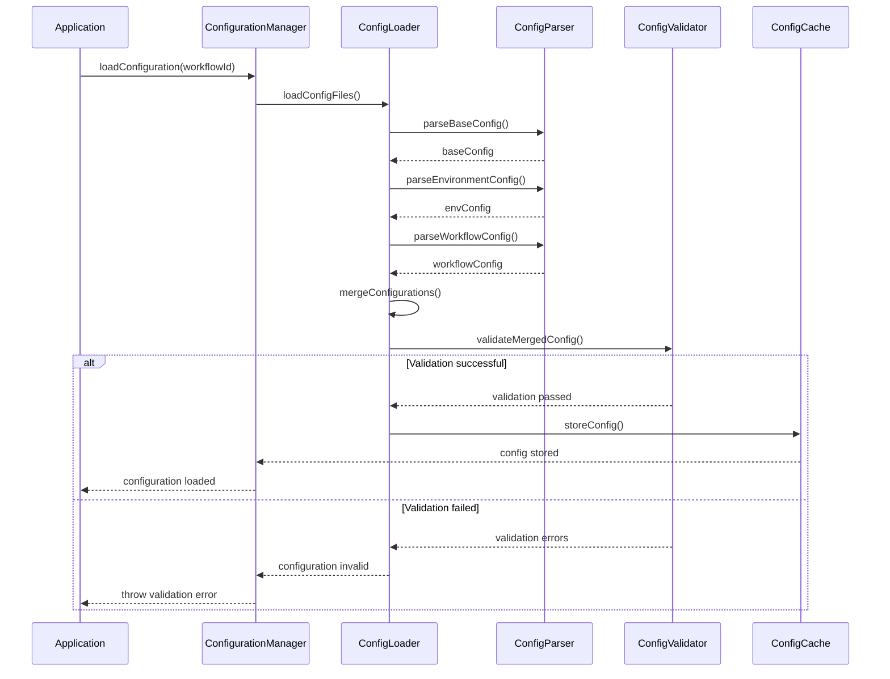

# ConfigurationManager - Dynamic Configuration Management

## Overview

The `ConfigurationManager` provides hot-reloadable, environment-aware configuration management for workflows. It supports file-based configurations, validation, encryption, and real-time configuration updates without requiring system restarts.

## Architecture



## Key Features

### 1. Multi-Format Support
- **YAML Configuration**: Human-readable YAML format
- **JSON Configuration**: Machine-readable JSON format
- **Environment Variables**: Override configurations via environment
- **Mixed Sources**: Combine multiple configuration sources

### 2. Environment Management
- **Environment-Specific Configs**: Separate configs per environment
- **Configuration Inheritance**: Base configs with environment overrides
- **Environment Validation**: Ensure configs are valid for target environment
- **Runtime Environment Detection**: Automatic environment detection

### 3. Hot Reload Capabilities
- **File System Watching**: Monitor configuration file changes
- **Real-time Updates**: Apply changes without restart
- **Change Validation**: Validate changes before applying
- **Rollback Support**: Automatic rollback on validation failures

### 4. Security Features
- **Configuration Encryption**: Encrypt sensitive configuration values
- **Access Control**: Role-based configuration access
- **Audit Logging**: Track all configuration changes
- **Backup and Recovery**: Automatic configuration backups

## Configuration Schema

### Workflow Configuration Structure

```typescript
interface IWorkflowConfig {
  id: string;                    // Unique workflow identifier
  nameSpace?: string;            // Optional namespace
  name: string;                  // Human-readable name
  version: string;               // Configuration version
  enabled: boolean;              // Whether workflow is enabled
  maxRetries: number;            // Maximum retry attempts
  timeout: number;               // Timeout in milliseconds
  priority: 'low' | 'normal' | 'high' | 'critical';
  concurrency: number;           // Maximum concurrent executions
  dependencies?: string[];       // Workflow dependencies
  properties?: Record<string, any>;  // Custom properties
  
  security?: {
    permissions: string[];       // Required permissions
    allowedUsers: string[];      // Allowed user IDs
    allowedRoles: string[];      // Allowed roles
    requireAuth: boolean;        // Authentication required
  };
  
  monitoring?: {
    enabled: boolean;            // Enable monitoring
    metrics: string[];           // Metrics to collect
    alerts: string[];            // Alert configurations
  };
  
  validation?: {
    inputSchema?: Record<string, any>;   // Input validation schema
    outputSchema?: Record<string, any>;  // Output validation schema
    customValidators?: string[];         // Custom validator names
  };
}
```

### Configuration File Examples

#### Base Configuration (base.yml)

```yaml
# config/base.yml - Base configuration for all environments
defaults:
  timeout: 30000              # 30 seconds default timeout
  maxRetries: 3               # 3 retry attempts
  concurrency: 1              # Single execution by default
  priority: normal            # Normal priority
  
  security:
    requireAuth: true         # Authentication required by default
    permissions: []           # No special permissions required
  
  monitoring:
    enabled: true             # Monitoring enabled
    metrics:
      - execution_time
      - error_rate
    alerts:
      - execution_timeout
      - high_error_rate

validation:
  strict: true                # Strict validation enabled
  requireAllFields: false     # Allow optional fields
  
logging:
  level: info
  includeStackTrace: false
```

#### Environment-Specific Configuration (production.yml)

```yaml
# config/environments/production.yml
extends: base.yml

defaults:
  timeout: 60000              # Longer timeout in production
  maxRetries: 5               # More retries in production
  concurrency: 3              # Higher concurrency
  
  security:
    requireAuth: true
    permissions:
      - workflow:execute
    allowedRoles:
      - admin
      - operator
  
  monitoring:
    enabled: true
    metrics:
      - execution_time
      - error_rate
      - resource_usage
      - throughput
    alerts:
      - execution_timeout
      - high_error_rate
      - resource_exhaustion

logging:
  level: warn
  includeStackTrace: true
  
encryption:
  enabled: true
  algorithm: aes-256-gcm
  keyPath: /secrets/config-key
```

#### Workflow-Specific Configuration (data-processing.yml)

```yaml
# config/workflows/data-processing.yml
id: data-processing
nameSpace: etl
name: Data Processing Pipeline
version: "1.2.0"
enabled: true

# Override defaults for this workflow
timeout: 120000             # 2 minutes for data processing
maxRetries: 2               # Fewer retries for data operations
concurrency: 2              # Allow 2 concurrent data processing jobs
priority: high              # High priority for data operations

dependencies:
  - data-validation
  - data-cleanup

properties:
  batchSize: 1000
  outputFormat: json
  compressionEnabled: true
  archiveAfterProcessing: true
  dataRetentionDays: 90

security:
  permissions:
    - data:read
    - data:write
    - data:process
  allowedRoles:
    - data-engineer
    - data-scientist
    - admin
  requireAuth: true

monitoring:
  enabled: true
  metrics:
    - execution_time
    - records_processed
    - error_rate
    - data_quality_score
  alerts:
    - processing_timeout
    - data_quality_degradation
    - high_error_rate

validation:
  inputSchema:
    type: object
    required: [data, metadata]
    properties:
      data:
        type: array
        minItems: 1
      metadata:
        type: object
        required: [source, timestamp]
  
  outputSchema:
    type: object
    required: [processedData, summary]
    properties:
      processedData:
        type: array
      summary:
        type: object
        required: [recordsProcessed, processingTime]

customValidators:
  - validateDataIntegrity
  - validateBusinessRules
```

## Configuration Loading and Merging

### Configuration Loading Flow



### Configuration Merging Strategy

```typescript
class ConfigurationMerger {
  mergeConfigurations(
    baseConfig: Partial<IWorkflowConfig>,
    envConfig: Partial<IWorkflowConfig>,
    workflowConfig: Partial<IWorkflowConfig>
  ): IWorkflowConfig {
    // Merge strategy: workflow > environment > base
    const merged = {
      ...baseConfig,
      ...envConfig,
      ...workflowConfig
    };

    // Special handling for nested objects
    merged.security = this.mergeSecurityConfig(
      baseConfig.security,
      envConfig.security,
      workflowConfig.security
    );

    merged.monitoring = this.mergeMonitoringConfig(
      baseConfig.monitoring,
      envConfig.monitoring,
      workflowConfig.monitoring
    );

    merged.properties = this.mergeProperties(
      baseConfig.properties,
      envConfig.properties,
      workflowConfig.properties
    );

    return merged as IWorkflowConfig;
  }

  private mergeSecurityConfig(
    base?: ISecurityConfig,
    env?: ISecurityConfig,
    workflow?: ISecurityConfig
  ): ISecurityConfig {
    return {
      permissions: this.mergeArrays(
        base?.permissions,
        env?.permissions,
        workflow?.permissions
      ),
      allowedUsers: this.mergeArrays(
        base?.allowedUsers,
        env?.allowedUsers,
        workflow?.allowedUsers
      ),
      allowedRoles: this.mergeArrays(
        base?.allowedRoles,
        env?.allowedRoles,
        workflow?.allowedRoles
      ),
      requireAuth: workflow?.requireAuth ?? env?.requireAuth ?? base?.requireAuth ?? true
    };
  }

  private mergeArrays(...arrays: (string[] | undefined)[]): string[] {
    const result = new Set<string>();
    arrays.forEach(array => {
      if (array) {
        array.forEach(item => result.add(item));
      }
    });
    return Array.from(result);
  }
}
```

## Hot Reload Implementation

### File Watching and Change Detection

```typescript
class ConfigurationWatcher {
  private watchers: Map<string, fs.FSWatcher> = new Map();
  private debounceTimers: Map<string, NodeJS.Timeout> = new Map();
  private readonly debounceDelay = 1000; // 1 second debounce

  watchConfigurationDirectory(directory: string): void {
    const watcher = fs.watch(directory, { recursive: true }, (eventType, filename) => {
      if (filename && this.isConfigFile(filename)) {
        this.handleFileChange(path.join(directory, filename), eventType);
      }
    });

    this.watchers.set(directory, watcher);
    logger.info(`Started watching configuration directory: ${directory}`);
  }

  private handleFileChange(filePath: string, eventType: string): void {
    // Debounce rapid file changes
    const existingTimer = this.debounceTimers.get(filePath);
    if (existingTimer) {
      clearTimeout(existingTimer);
    }

    const timer = setTimeout(() => {
      this.processFileChange(filePath, eventType);
      this.debounceTimers.delete(filePath);
    }, this.debounceDelay);

    this.debounceTimers.set(filePath, timer);
  }

  private async processFileChange(filePath: string, eventType: string): Promise<void> {
    try {
      logger.info(`Configuration file ${eventType}: ${filePath}`);

      if (eventType === 'change') {
        await this.reloadConfiguration(filePath);
      } else if (eventType === 'rename') {
        // File was deleted or moved
        await this.handleConfigurationRemoval(filePath);
      }
    } catch (error) {
      logger.error(`Error processing configuration file change: ${filePath}`, error);
      this.emitConfigurationError(filePath, error);
    }
  }

  private async reloadConfiguration(filePath: string): Promise<void> {
    // Validate new configuration before applying
    const newConfig = await this.configurationManager.loadAndValidateConfigFile(filePath);
    
    if (newConfig.isValid) {
      await this.configurationManager.updateConfiguration(newConfig.workflowId, newConfig.config);
      this.emitConfigurationChanged(newConfig.workflowId, newConfig.config);
    } else {
      logger.error(`Configuration validation failed for ${filePath}:`, newConfig.errors);
      this.emitConfigurationError(filePath, new Error('Validation failed'));
    }
  }
}
```

### Change Validation and Rollback

```typescript
class ConfigurationChangeManager {
  private configBackups: Map<string, IWorkflowConfig> = new Map();
  private changeHistory: IConfigurationChangeEvent[] = [];

  async applyConfigurationChange(
    workflowId: string,
    newConfig: IWorkflowConfig,
    userId?: string
  ): Promise<IConfigurationChangeEvent> {
    // Backup current configuration
    const currentConfig = await this.configurationManager.getConfiguration(workflowId);
    this.configBackups.set(workflowId, currentConfig);

    try {
      // Validate new configuration
      const validationResult = await this.validateConfiguration(newConfig);
      if (!validationResult.isValid) {
        throw new ConfigurationValidationError(validationResult.errors);
      }

      // Calculate changes
      const changes = this.calculateChanges(currentConfig, newConfig);

      // Apply new configuration
      await this.configurationManager.updateConfiguration(workflowId, newConfig);

      // Create change event
      const changeEvent: IConfigurationChangeEvent = {
        workflowId,
        version: newConfig.version,
        changes,
        timestamp: new Date(),
        user: userId
      };

      this.changeHistory.push(changeEvent);
      this.emitConfigurationChanged(changeEvent);

      logger.info(`Configuration updated for workflow ${workflowId}`, changes);
      return changeEvent;

    } catch (error) {
      // Rollback on error
      await this.rollbackConfiguration(workflowId);
      throw error;
    }
  }

  private async rollbackConfiguration(workflowId: string): Promise<void> {
    const backupConfig = this.configBackups.get(workflowId);
    if (backupConfig) {
      await this.configurationManager.updateConfiguration(workflowId, backupConfig);
      logger.info(`Configuration rolled back for workflow ${workflowId}`);
    } else {
      logger.error(`No backup configuration found for workflow ${workflowId}`);
    }
  }

  private calculateChanges(
    oldConfig: IWorkflowConfig,
    newConfig: IWorkflowConfig
  ): { added: string[]; modified: string[]; removed: string[] } {
    const changes = {
      added: [] as string[],
      modified: [] as string[],
      removed: [] as string[]
    };

    // Deep comparison of configuration objects
    const oldKeys = new Set(this.getAllConfigKeys(oldConfig));
    const newKeys = new Set(this.getAllConfigKeys(newConfig));

    // Find added keys
    newKeys.forEach(key => {
      if (!oldKeys.has(key)) {
        changes.added.push(key);
      }
    });

    // Find removed keys
    oldKeys.forEach(key => {
      if (!newKeys.has(key)) {
        changes.removed.push(key);
      }
    });

    // Find modified keys
    oldKeys.forEach(key => {
      if (newKeys.has(key)) {
        const oldValue = this.getConfigValue(oldConfig, key);
        const newValue = this.getConfigValue(newConfig, key);
        if (!this.deepEqual(oldValue, newValue)) {
          changes.modified.push(key);
        }
      }
    });

    return changes;
  }
}
```

## Configuration Encryption

### Sensitive Data Encryption

```typescript
class ConfigurationEncryption {
  private algorithm: string = 'aes-256-gcm';
  private keyPath: string;
  private encryptionKey: Buffer | null = null;

  constructor(config: { algorithm?: string; keyPath?: string }) {
    this.algorithm = config.algorithm || this.algorithm;
    this.keyPath = config.keyPath || process.env.CONFIG_ENCRYPTION_KEY_PATH!;
  }

  async initialize(): Promise<void> {
    if (this.keyPath) {
      this.encryptionKey = await fs.readFile(this.keyPath);
    } else {
      this.encryptionKey = this.generateKey();
    }
  }

  encryptConfiguration(config: IWorkflowConfig): IWorkflowConfig {
    const encryptedConfig = { ...config };

    // Encrypt sensitive fields
    if (config.properties) {
      encryptedConfig.properties = this.encryptSensitiveProperties(config.properties);
    }

    if (config.security?.allowedUsers) {
      encryptedConfig.security = {
        ...config.security,
        allowedUsers: config.security.allowedUsers.map(user => this.encryptValue(user))
      };
    }

    return encryptedConfig;
  }

  decryptConfiguration(config: IWorkflowConfig): IWorkflowConfig {
    const decryptedConfig = { ...config };

    // Decrypt sensitive fields
    if (config.properties) {
      decryptedConfig.properties = this.decryptSensitiveProperties(config.properties);
    }

    if (config.security?.allowedUsers) {
      decryptedConfig.security = {
        ...config.security,
        allowedUsers: config.security.allowedUsers.map(user => this.decryptValue(user))
      };
    }

    return decryptedConfig;
  }

  private encryptValue(value: string): string {
    if (!this.encryptionKey) {
      throw new Error('Encryption key not initialized');
    }

    const iv = crypto.randomBytes(16);
    const cipher = crypto.createCipher(this.algorithm, this.encryptionKey);
    cipher.setAAD(Buffer.from('configuration'));

    let encrypted = cipher.update(value, 'utf8', 'hex');
    encrypted += cipher.final('hex');

    const authTag = cipher.getAuthTag();
    
    return `encrypted:${iv.toString('hex')}:${authTag.toString('hex')}:${encrypted}`;
  }

  private decryptValue(encryptedValue: string): string {
    if (!encryptedValue.startsWith('encrypted:')) {
      return encryptedValue; // Not encrypted
    }

    if (!this.encryptionKey) {
      throw new Error('Encryption key not initialized');
    }

    const parts = encryptedValue.split(':');
    const iv = Buffer.from(parts[1], 'hex');
    const authTag = Buffer.from(parts[2], 'hex');
    const encrypted = parts[3];

    const decipher = crypto.createDecipher(this.algorithm, this.encryptionKey);
    decipher.setAAD(Buffer.from('configuration'));
    decipher.setAuthTag(authTag);

    let decrypted = decipher.update(encrypted, 'hex', 'utf8');
    decrypted += decipher.final('utf8');

    return decrypted;
  }

  private encryptSensitiveProperties(properties: Record<string, any>): Record<string, any> {
    const sensitiveKeys = ['password', 'apiKey', 'secret', 'token', 'key'];
    const result = { ...properties };

    Object.keys(result).forEach(key => {
      if (sensitiveKeys.some(sensitiveKey => 
        key.toLowerCase().includes(sensitiveKey.toLowerCase())
      )) {
        if (typeof result[key] === 'string') {
          result[key] = this.encryptValue(result[key]);
        }
      }
    });

    return result;
  }
}
```

## Usage Examples

### Basic Configuration Management

```typescript
import { ConfigurationManager, IWorkflowConfig } from './ConfigurationManager';

// Initialize configuration manager
const configManager = new ConfigurationManager({
  configPath: './config',
  environment: process.env.NODE_ENV || 'development',
  hotReload: true,
  validationStrict: true,
  backupConfigs: true,
  maxConfigSize: 1024 * 1024, // 1MB
  allowedEnvironments: ['development', 'staging', 'production', 'test']
});

await configManager.initialize();

// Load workflow configuration
const workflowConfig = await configManager.loadConfiguration('data-processing');
console.log('Loaded configuration:', workflowConfig);

// Update configuration
const updatedConfig: IWorkflowConfig = {
  ...workflowConfig,
  timeout: 60000,  // Increase timeout to 60 seconds
  concurrency: 3   // Increase concurrency
};

await configManager.saveConfiguration(updatedConfig);

// Validate configuration
const validationResult = await configManager.validateConfiguration(updatedConfig);
if (!validationResult.isValid) {
  console.error('Configuration validation failed:', validationResult.errors);
}
```

### Environment-Specific Configuration

```typescript
// Load configuration for specific environment
const productionConfig = await configManager.getEnvironmentConfig('production');
console.log('Production configurations:', productionConfig);

// Migrate configuration between environments
await configManager.migrateConfiguration('staging', 'production');

// Override configuration with environment variables
process.env.WORKFLOW_TIMEOUT = '45000';
process.env.WORKFLOW_MAX_RETRIES = '5';

const configWithEnvOverrides = await configManager.loadConfigurationWithEnvOverrides('data-processing');
```

### Hot Reload and Change Monitoring

```typescript
// Enable hot reload
configManager.enableHotReload();

// Listen for configuration changes
configManager.on('configuration-changed', (event: IConfigurationChangeEvent) => {
  console.log(`Configuration changed for workflow ${event.workflowId}:`);
  console.log('Changes:', event.changes);
  
  // React to specific changes
  if (event.changes.modified.includes('timeout')) {
    console.log('Timeout configuration changed, updating active workflows...');
  }
});

configManager.on('configuration-error', (error) => {
  console.error('Configuration error:', error);
  // Implement error handling logic
});

// Disable hot reload when needed
configManager.disableHotReload();
```

### Configuration Validation

```typescript
// Define custom validation schema
const customSchema = {
  type: 'object',
  required: ['id', 'name', 'version'],
  properties: {
    id: { type: 'string', pattern: '^[a-z0-9-]+$' },
    name: { type: 'string', minLength: 1 },
    version: { type: 'string', pattern: '^\\d+\\.\\d+\\.\\d+$' },
    timeout: { type: 'number', minimum: 1000, maximum: 300000 },
    maxRetries: { type: 'number', minimum: 0, maximum: 10 }
  }
};

// Set custom validation schema
await configManager.setValidationSchema(customSchema);

// Validate against schema
const config = await configManager.loadConfiguration('my-workflow');
const validation = await configManager.validateConfiguration(config);

if (!validation.isValid) {
  console.error('Validation errors:');
  validation.errors.forEach(error => {
    console.error(`- ${error.path}: ${error.message}`);
  });
}

// Get validation warnings
if (validation.warnings.length > 0) {
  console.warn('Validation warnings:');
  validation.warnings.forEach(warning => {
    console.warn(`- ${warning}`);
  });
}
```

## Best Practices

### 1. Configuration Organization
- Use a consistent directory structure for configurations
- Separate base, environment, and workflow-specific configurations
- Use meaningful naming conventions for configuration files
- Document configuration schemas and validation rules

### 2. Environment Management
- Maintain separate configurations for each environment
- Use environment variables for sensitive or environment-specific values
- Implement proper configuration inheritance and overrides
- Validate configurations before deployment

### 3. Security
- Encrypt sensitive configuration values
- Implement proper access controls for configuration files
- Audit all configuration changes
- Use secure storage for encryption keys

### 4. Change Management
- Always validate configurations before applying changes
- Implement configuration backups and rollback mechanisms
- Track configuration changes with proper auditing
- Test configuration changes in non-production environments first

### 5. Performance
- Cache frequently accessed configurations
- Implement efficient file watching for hot reload
- Use appropriate debouncing for rapid configuration changes
- Monitor configuration loading performance

## Troubleshooting

### Common Issues

1. **Configuration Validation Failures**
   ```typescript
   // Debug validation issues
   const result = await configManager.validateConfiguration(config);
   if (!result.isValid) {
     console.log('Schema used for validation:', result.schema);
     result.errors.forEach(error => {
       console.log(`Validation error: ${error.path} - ${error.message}`);
     });
   }
   ```

2. **Hot Reload Not Working**
   ```typescript
   // Check file watcher status
   const watcherStatus = configManager.getWatcherStatus();
   console.log('File watchers:', watcherStatus);
   
   // Manually trigger reload
   await configManager.reloadConfiguration('workflow-id');
   ```

3. **Configuration Merge Issues**
   ```typescript
   // Debug configuration merging
   const baseConfig = await configManager.loadBaseConfiguration();
   const envConfig = await configManager.loadEnvironmentConfiguration();
   const workflowConfig = await configManager.loadWorkflowConfiguration('workflow-id');
   
   console.log('Base config:', baseConfig);
   console.log('Environment config:', envConfig);
   console.log('Workflow config:', workflowConfig);
   
   const mergedConfig = configManager.mergeConfigurations(baseConfig, envConfig, workflowConfig);
   console.log('Merged config:', mergedConfig);
   ```

---

The ConfigurationManager provides comprehensive configuration management capabilities with hot reload, validation, encryption, and multi-environment support essential for enterprise workflow systems.
