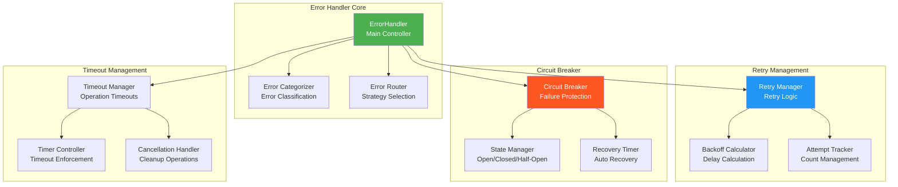
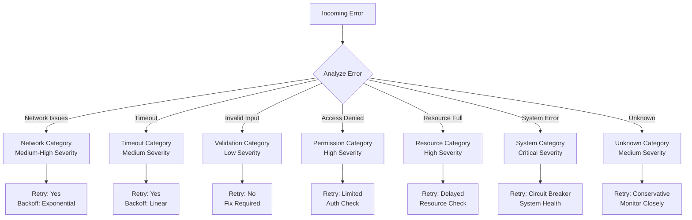
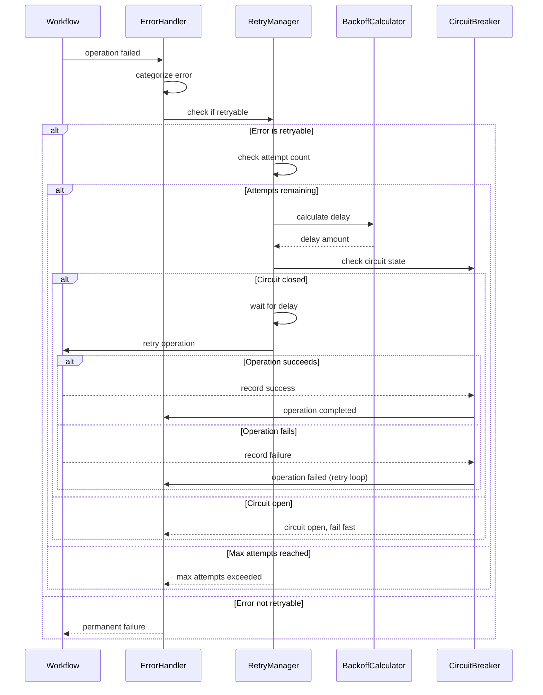
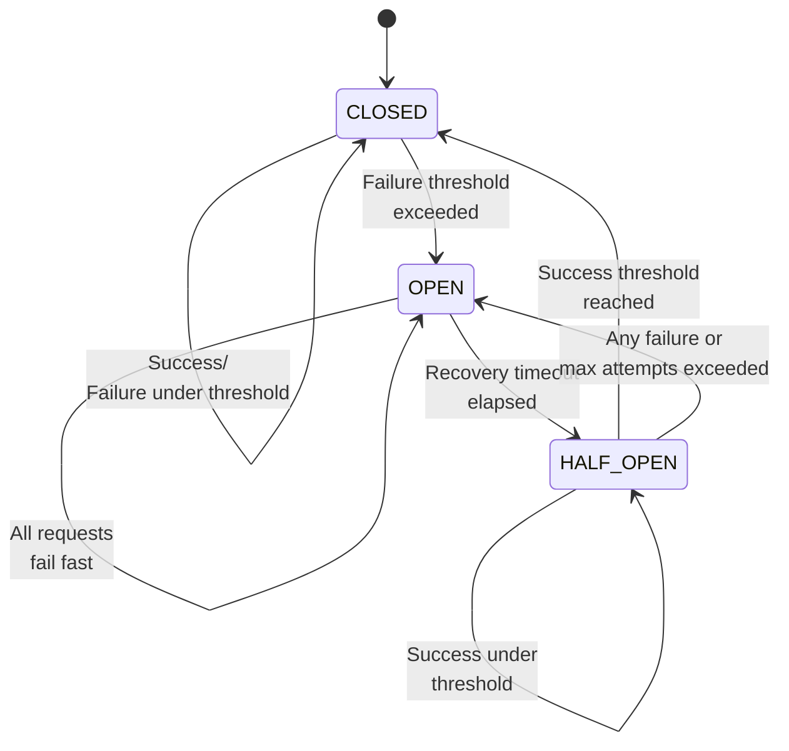

# ErrorHandler - Comprehensive Error Handling and Recovery

## Overview

The `ErrorHandler` provides comprehensive error handling, retry logic, and circuit breaker patterns for the workflow engine. It categorizes errors, implements sophisticated retry strategies, manages circuit breakers, and provides timeout handling to ensure robust workflow execution.

## Architecture



## Key Features

### 1. Intelligent Error Classification
- **Error Categorization**: Automatic classification of errors by type
- **Severity Assessment**: Assign severity levels to errors
- **Context Preservation**: Maintain error context and metadata
- **Error Patterns**: Identify and track error patterns

### 2. Advanced Retry Strategies
- **Exponential Backoff**: Configurable exponential backoff with jitter
- **Conditional Retries**: Retry based on error type and conditions
- **Retry Limits**: Configurable maximum retry attempts
- **Retry Policies**: Custom retry policies per workflow type

### 3. Circuit Breaker Pattern
- **Failure Threshold**: Configurable failure thresholds
- **State Management**: CLOSED/OPEN/HALF_OPEN state management
- **Auto Recovery**: Automatic recovery after timeout periods
- **Failure Rate Monitoring**: Track failure rates and patterns

### 4. Timeout Management
- **Operation Timeouts**: Per-operation timeout configuration
- **Timeout Strategies**: Different timeout strategies per operation type
- **Graceful Cancellation**: Proper cleanup on timeout
- **Timeout Escalation**: Progressive timeout handling

## Error Categories and Severity

### Error Categories

```typescript
enum ErrorCategory {
  NETWORK = 'network',           // Network-related errors
  TIMEOUT = 'timeout',           // Timeout errors
  VALIDATION = 'validation',     // Input validation errors
  PERMISSION = 'permission',     // Authorization/permission errors
  RESOURCE = 'resource',         // Resource exhaustion errors
  SYSTEM = 'system',             // System-level errors
  UNKNOWN = 'unknown'            // Unclassified errors
}

enum ErrorSeverity {
  LOW = 'low',                   // Minor errors, automatic recovery possible
  MEDIUM = 'medium',             // Moderate errors, retry recommended
  HIGH = 'high',                 // Serious errors, immediate attention needed
  CRITICAL = 'critical'          // Critical errors, system stability at risk
}
```

### Error Classification Matrix



## Retry Strategies

### Retry Configuration

```typescript
interface IRetryConfig {
  maxAttempts: number;           // Maximum retry attempts
  baseDelay: number;             // Base delay in milliseconds
  maxDelay: number;              // Maximum delay in milliseconds
  backoffMultiplier: number;     // Exponential backoff multiplier
  jitter: boolean;               // Add random jitter to delays
  retryableErrors: ErrorCategory[];  // Which error types to retry
  nonRetryableErrors: ErrorCategory[];  // Which errors not to retry
}

interface IRetryPolicy {
  name: string;
  description: string;
  config: IRetryConfig;
  condition?: (error: Error, attempt: number) => boolean;
}
```

### Built-in Retry Policies

```typescript
class RetryPolicies {
  static readonly DEFAULT: IRetryPolicy = {
    name: 'default',
    description: 'Default retry policy with exponential backoff',
    config: {
      maxAttempts: 3,
      baseDelay: 1000,         // 1 second
      maxDelay: 30000,         // 30 seconds
      backoffMultiplier: 2,
      jitter: true,
      retryableErrors: [
        ErrorCategory.NETWORK,
        ErrorCategory.TIMEOUT,
        ErrorCategory.RESOURCE,
        ErrorCategory.SYSTEM
      ],
      nonRetryableErrors: [
        ErrorCategory.VALIDATION,
        ErrorCategory.PERMISSION
      ]
    }
  };

  static readonly NETWORK_INTENSIVE: IRetryPolicy = {
    name: 'network-intensive',
    description: 'Aggressive retry for network operations',
    config: {
      maxAttempts: 5,
      baseDelay: 500,
      maxDelay: 60000,         // 1 minute
      backoffMultiplier: 2.5,
      jitter: true,
      retryableErrors: [ErrorCategory.NETWORK, ErrorCategory.TIMEOUT],
      nonRetryableErrors: []
    }
  };

  static readonly CONSERVATIVE: IRetryPolicy = {
    name: 'conservative',
    description: 'Conservative retry for critical operations',
    config: {
      maxAttempts: 2,
      baseDelay: 5000,         // 5 seconds
      maxDelay: 15000,         // 15 seconds
      backoffMultiplier: 1.5,
      jitter: false,
      retryableErrors: [ErrorCategory.NETWORK],
      nonRetryableErrors: [
        ErrorCategory.VALIDATION,
        ErrorCategory.PERMISSION,
        ErrorCategory.SYSTEM
      ]
    }
  };
}
```

### Retry Execution Flow



## Circuit Breaker Implementation

### Circuit Breaker States

```typescript
enum CircuitBreakerState {
  CLOSED = 'CLOSED',           // Normal operation
  OPEN = 'OPEN',               // Failing fast
  HALF_OPEN = 'HALF_OPEN'      // Testing recovery
}

interface ICircuitBreakerConfig {
  failureThreshold: number;     // Number of failures to open circuit
  recoveryTimeout: number;      // Time before attempting recovery
  halfOpenMaxAttempts: number;  // Max attempts in half-open state
  successThreshold: number;     // Successes needed to close circuit
  monitoringWindow: number;     // Time window for failure rate calculation
}
```

### Circuit Breaker State Machine



### Circuit Breaker Implementation

```typescript
class CircuitBreaker {
  private state: CircuitBreakerState = CircuitBreakerState.CLOSED;
  private failureCount: number = 0;
  private successCount: number = 0;
  private lastFailureTime: number = 0;
  private halfOpenAttempts: number = 0;
  private recentFailures: number[] = [];

  constructor(private config: ICircuitBreakerConfig) {}

  async execute<T>(
    operation: () => Promise<T>,
    context: IErrorContext
  ): Promise<T> {
    if (this.state === CircuitBreakerState.OPEN) {
      if (this.shouldAttemptRecovery()) {
        this.transitionToHalfOpen();
      } else {
        throw new CircuitBreakerOpenError(
          `Circuit breaker is OPEN for ${context.workflowId}`
        );
      }
    }

    if (this.state === CircuitBreakerState.HALF_OPEN) {
      if (this.halfOpenAttempts >= this.config.halfOpenMaxAttempts) {
        this.transitionToOpen();
        throw new CircuitBreakerOpenError(
          `Circuit breaker exceeded half-open attempts for ${context.workflowId}`
        );
      }
      this.halfOpenAttempts++;
    }

    try {
      const result = await operation();
      this.recordSuccess();
      return result;
    } catch (error) {
      this.recordFailure();
      throw error;
    }
  }

  private shouldAttemptRecovery(): boolean {
    const now = Date.now();
    return (now - this.lastFailureTime) > this.config.recoveryTimeout;
  }

  private recordSuccess(): void {
    this.successCount++;
    this.failureCount = 0;

    if (this.state === CircuitBreakerState.HALF_OPEN) {
      if (this.successCount >= this.config.successThreshold) {
        this.transitionToClosed();
      }
    }
  }

  private recordFailure(): void {
    this.failureCount++;
    this.successCount = 0;
    this.lastFailureTime = Date.now();
    this.recentFailures.push(this.lastFailureTime);
    
    // Keep only failures within monitoring window
    const cutoff = this.lastFailureTime - this.config.monitoringWindow;
    this.recentFailures = this.recentFailures.filter(time => time > cutoff);

    if (this.shouldOpenCircuit()) {
      this.transitionToOpen();
    }
  }

  private shouldOpenCircuit(): boolean {
    if (this.state === CircuitBreakerState.HALF_OPEN) {
      return true; // Any failure in half-open triggers open
    }

    return this.recentFailures.length >= this.config.failureThreshold;
  }

  private transitionToClosed(): void {
    this.state = CircuitBreakerState.CLOSED;
    this.failureCount = 0;
    this.successCount = 0;
    this.halfOpenAttempts = 0;
    this.recentFailures = [];
    
    logger.info('Circuit breaker transitioned to CLOSED');
  }

  private transitionToOpen(): void {
    this.state = CircuitBreakerState.OPEN;
    this.halfOpenAttempts = 0;
    
    logger.warn(`Circuit breaker transitioned to OPEN after ${this.failureCount} failures`);
  }

  private transitionToHalfOpen(): void {
    this.state = CircuitBreakerState.HALF_OPEN;
    this.halfOpenAttempts = 0;
    
    logger.info('Circuit breaker transitioned to HALF_OPEN');
  }
}
```

## Timeout Management

### Timeout Configuration

```typescript
interface ITimeoutConfig {
  defaultTimeout: number;       // Default timeout in milliseconds
  maxTimeout: number;           // Maximum allowed timeout
  timeoutMultiplier: number;    // Multiplier for progressive timeouts
  timeoutStrategy: 'fixed' | 'progressive' | 'adaptive';
}

interface IOperationTimeout {
  operationType: string;        // Type of operation
  baseTimeout: number;          // Base timeout for this operation
  scalingFactor?: number;       // Scale timeout based on data size
  maxTimeout?: number;          // Maximum timeout for this operation
}
```

### Timeout Strategies

```typescript
class TimeoutManager {
  private timeouts: Map<string, NodeJS.Timeout> = new Map();
  private config: ITimeoutConfig;

  calculateTimeout(
    operationType: string,
    attempt: number,
    dataSize?: number
  ): number {
    const baseTimeout = this.getBaseTimeout(operationType);
    
    switch (this.config.timeoutStrategy) {
      case 'fixed':
        return baseTimeout;
      
      case 'progressive':
        return Math.min(
          baseTimeout * Math.pow(this.config.timeoutMultiplier, attempt - 1),
          this.config.maxTimeout
        );
      
      case 'adaptive':
        return this.calculateAdaptiveTimeout(operationType, attempt, dataSize);
      
      default:
        return baseTimeout;
    }
  }

  private calculateAdaptiveTimeout(
    operationType: string,
    attempt: number,
    dataSize?: number
  ): number {
    const baseTimeout = this.getBaseTimeout(operationType);
    const historicalData = this.getHistoricalExecutionTimes(operationType);
    
    // Calculate timeout based on historical performance
    const avgExecutionTime = this.calculateAverage(historicalData);
    const stdDeviation = this.calculateStandardDeviation(historicalData);
    
    // Use 95th percentile + buffer for timeout
    const adaptiveTimeout = avgExecutionTime + (2 * stdDeviation);
    
    // Apply scaling factor for data size if provided
    const scaledTimeout = dataSize 
      ? adaptiveTimeout * (1 + Math.log10(dataSize / 1000))  // Log scale for data size
      : adaptiveTimeout;
    
    // Apply progressive multiplier for retries
    const progressiveTimeout = scaledTimeout * Math.pow(1.5, attempt - 1);
    
    return Math.min(progressiveTimeout, this.config.maxTimeout);
  }

  async executeWithTimeout<T>(
    operation: () => Promise<T>,
    timeoutMs: number,
    operationId: string
  ): Promise<T> {
    return new Promise<T>((resolve, reject) => {
      const timeout = setTimeout(() => {
        this.timeouts.delete(operationId);
        reject(new TimeoutError(`Operation ${operationId} timed out after ${timeoutMs}ms`));
      }, timeoutMs);

      this.timeouts.set(operationId, timeout);

      operation()
        .then((result) => {
          clearTimeout(timeout);
          this.timeouts.delete(operationId);
          resolve(result);
        })
        .catch((error) => {
          clearTimeout(timeout);
          this.timeouts.delete(operationId);
          reject(error);
        });
    });
  }
}
```

## Usage Examples

### Basic Error Handling

```typescript
import { ErrorHandler, ErrorCategory, ErrorSeverity } from './ErrorHandler';

// Initialize error handler
const errorHandler = new ErrorHandler({
  defaultRetryConfig: {
    maxAttempts: 3,
    baseDelay: 1000,
    maxDelay: 30000,
    backoffMultiplier: 2,
    jitter: true
  },
  circuitBreakerConfig: {
    failureThreshold: 5,
    recoveryTimeout: 60000,
    halfOpenMaxAttempts: 3
  },
  timeoutConfig: {
    defaultTimeout: 30000,
    maxTimeout: 300000,
    timeoutMultiplier: 1.5
  }
});

await errorHandler.initialize();

// Handle an error with retry
try {
  await errorHandler.handleError({
    workflowId: 'data-processing',
    version: '1.0',
    attempt: 1,
    maxAttempts: 3,
    timestamp: new Date(),
    category: ErrorCategory.NETWORK,
    severity: ErrorSeverity.MEDIUM,
    originalError: new Error('Network connection failed'),
    metadata: {
      endpoint: 'https://api.example.com',
      method: 'POST'
    }
  });
} catch (error) {
  console.log('Error handling failed:', error.message);
}
```

### Custom Retry Policies

```typescript
// Define custom retry policy
const customPolicy: IRetryPolicy = {
  name: 'database-operations',
  description: 'Optimized retry policy for database operations',
  config: {
    maxAttempts: 4,
    baseDelay: 2000,        // 2 seconds
    maxDelay: 60000,        // 1 minute
    backoffMultiplier: 1.8,
    jitter: true,
    retryableErrors: [
      ErrorCategory.NETWORK,
      ErrorCategory.TIMEOUT,
      ErrorCategory.RESOURCE
    ],
    nonRetryableErrors: [
      ErrorCategory.VALIDATION,
      ErrorCategory.PERMISSION
    ]
  },
  condition: (error: Error, attempt: number) => {
    // Custom logic to determine if retry should happen
    if (error.message.includes('UNIQUE_CONSTRAINT')) {
      return false; // Don't retry constraint violations
    }
    if (error.message.includes('CONNECTION_POOL_FULL') && attempt < 3) {
      return true; // Retry connection pool issues
    }
    return true;
  }
};

// Register custom policy
errorHandler.registerRetryPolicy(customPolicy);

// Use custom policy for specific operation
await errorHandler.executeWithRetry(
  async () => {
    return await databaseOperation();
  },
  'database-operations',  // Use custom policy
  {
    workflowId: 'db-sync',
    operationType: 'database'
  }
);
```

### Circuit Breaker Usage

```typescript
// Execute operation with circuit breaker
const circuitBreaker = errorHandler.getCircuitBreaker('external-api');

try {
  const result = await circuitBreaker.execute(
    async () => {
      return await externalApiCall();
    },
    {
      workflowId: 'api-integration',
      version: '1.0',
      attempt: 1,
      maxAttempts: 3,
      timestamp: new Date(),
      category: ErrorCategory.NETWORK,
      severity: ErrorSeverity.MEDIUM,
      originalError: new Error('API call context')
    }
  );
  
  console.log('API call successful:', result);
} catch (error) {
  if (error instanceof CircuitBreakerOpenError) {
    console.log('Circuit breaker is open, failing fast');
  } else {
    console.log('API call failed:', error.message);
  }
}

// Monitor circuit breaker state
const stats = circuitBreaker.getStats();
console.log('Circuit breaker stats:', {
  state: stats.state,
  failureCount: stats.failureCount,
  successCount: stats.successCount,
  lastFailureTime: stats.lastFailureTime
});
```

### Timeout Management

```typescript
// Execute operation with timeout
try {
  const result = await errorHandler.executeWithTimeout(
    async () => {
      return await longRunningOperation();
    },
    30000,  // 30 second timeout
    'long-operation-1'
  );
  
  console.log('Operation completed:', result);
} catch (error) {
  if (error instanceof TimeoutError) {
    console.log('Operation timed out');
  } else {
    console.log('Operation failed:', error.message);
  }
}

// Use adaptive timeout based on operation type
const adaptiveTimeout = errorHandler.calculateTimeout('data-import', 2, 1000000); // 2nd attempt, 1MB data
console.log('Calculated adaptive timeout:', adaptiveTimeout);
```

## Error Monitoring and Analytics

### Error Statistics

```typescript
interface IErrorStatistics {
  totalErrors: number;
  errorsByCategory: Record<ErrorCategory, number>;
  errorsBySeverity: Record<ErrorSeverity, number>;
  retrySuccess: {
    totalAttempts: number;
    successfulRetries: number;
    failedRetries: number;
    successRate: number;
  };
  circuitBreakerStats: {
    totalBreakers: number;
    openBreakers: number;
    halfOpenBreakers: number;
    closedBreakers: number;
  };
  timeoutStats: {
    totalTimeouts: number;
    averageTimeout: number;
    timeoutsByOperation: Record<string, number>;
  };
}
```

### Error Trend Analysis

```typescript
class ErrorAnalytics {
  async generateErrorReport(
    fromDate: Date,
    toDate: Date
  ): Promise<IErrorReport> {
    const errors = await this.getErrorsInRange(fromDate, toDate);
    
    return {
      period: { from: fromDate, to: toDate },
      summary: this.generateSummary(errors),
      trends: this.analyzeTrends(errors),
      recommendations: this.generateRecommendations(errors),
      topErrors: this.getTopErrors(errors, 10),
      errorPatterns: this.identifyPatterns(errors)
    };
  }

  private analyzeTrends(errors: IErrorRecord[]): IErrorTrends {
    // Group errors by time periods
    const hourlyErrors = this.groupByHour(errors);
    const dailyErrors = this.groupByDay(errors);
    
    return {
      hourlyDistribution: hourlyErrors,
      dailyDistribution: dailyErrors,
      peakErrorTimes: this.findPeakTimes(hourlyErrors),
      errorGrowthRate: this.calculateGrowthRate(dailyErrors),
      seasonalPatterns: this.identifySeasonalPatterns(errors)
    };
  }

  private generateRecommendations(errors: IErrorRecord[]): string[] {
    const recommendations: string[] = [];
    
    const categoryStats = this.groupByCategory(errors);
    
    // High network error rate
    if (categoryStats[ErrorCategory.NETWORK] / errors.length > 0.3) {
      recommendations.push(
        'High network error rate detected. Consider implementing connection pooling and network resilience patterns.'
      );
    }
    
    // Frequent timeouts
    if (categoryStats[ErrorCategory.TIMEOUT] / errors.length > 0.2) {
      recommendations.push(
        'Frequent timeout errors detected. Review timeout configurations and consider increasing limits for long-running operations.'
      );
    }
    
    // Many validation errors
    if (categoryStats[ErrorCategory.VALIDATION] / errors.length > 0.15) {
      recommendations.push(
        'High validation error rate detected. Review input validation and consider implementing better data quality checks.'
      );
    }
    
    return recommendations;
  }
}
```

## Best Practices

### 1. Error Classification
- Always categorize errors accurately for proper handling
- Use appropriate severity levels to prioritize error handling
- Preserve error context and metadata for debugging
- Implement custom error types for specific scenarios

### 2. Retry Strategy Design
- Use exponential backoff with jitter to avoid thundering herd
- Implement different retry policies for different operation types
- Don't retry non-retryable errors (validation, permission)
- Set reasonable maximum retry attempts and delays

### 3. Circuit Breaker Configuration
- Set failure thresholds based on expected failure rates
- Use appropriate recovery timeouts for different services
- Monitor circuit breaker states and adjust thresholds as needed
- Implement proper fallback mechanisms when circuits are open

### 4. Timeout Management
- Set realistic timeout values based on operation characteristics
- Use progressive timeouts for retry scenarios
- Implement proper cleanup for timed-out operations
- Monitor timeout patterns to optimize configurations

### 5. Monitoring and Alerting
- Track error rates and patterns over time
- Set up alerts for high error rates or circuit breaker openings
- Analyze error trends to identify systemic issues
- Use error analytics to improve system reliability

## Troubleshooting

### Common Issues

1. **High Retry Overhead**
   ```typescript
   // Monitor retry statistics
   const retryStats = errorHandler.getRetryStatistics();
   if (retryStats.averageAttempts > 2.5) {
     console.log('High retry rate detected, review error patterns');
   }
   ```

2. **Circuit Breaker Stuck Open**
   ```typescript
   // Check circuit breaker state and manually reset if needed
   const circuitBreaker = errorHandler.getCircuitBreaker('service-name');
   const stats = circuitBreaker.getStats();
   
   if (stats.state === 'OPEN' && stats.timeSinceLastFailure > 300000) {
     console.log('Circuit breaker may be stuck, consider manual reset');
     circuitBreaker.reset(); // Manual reset if appropriate
   }
   ```

3. **Timeout Tuning**
   ```typescript
   // Analyze timeout patterns
   const timeoutStats = errorHandler.getTimeoutStatistics();
   timeoutStats.operationTimeouts.forEach((stats, operation) => {
     if (stats.timeoutRate > 0.1) { // More than 10% timeout rate
       console.log(`High timeout rate for ${operation}: ${stats.timeoutRate * 100}%`);
       console.log(`Consider increasing timeout from ${stats.averageTimeout}ms`);
     }
   });
   ```

---

The ErrorHandler provides comprehensive error handling capabilities with intelligent retry strategies, circuit breaker protection, and sophisticated timeout management to ensure robust and resilient workflow execution.
