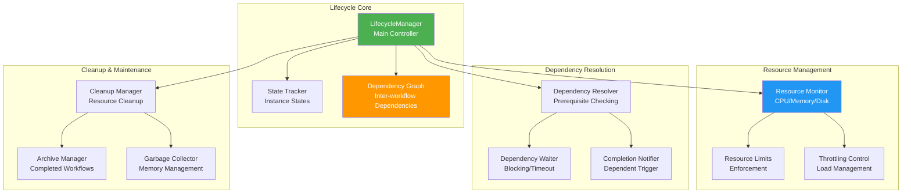
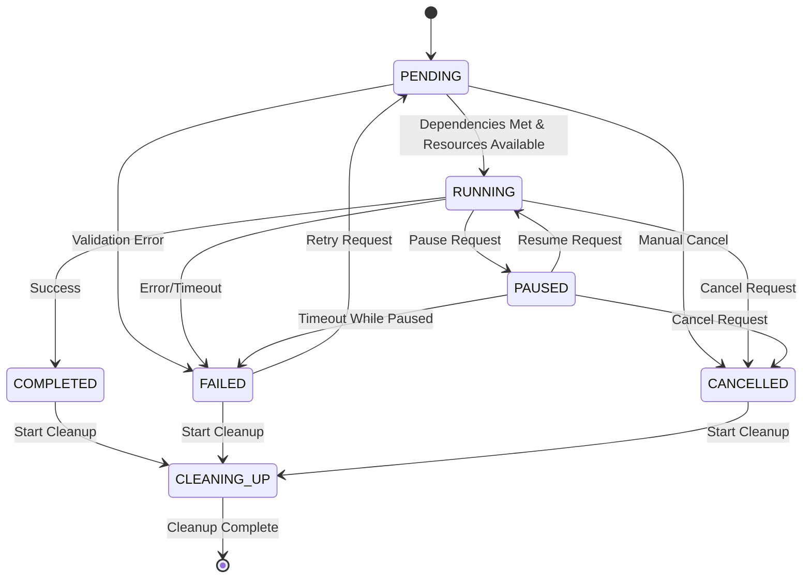
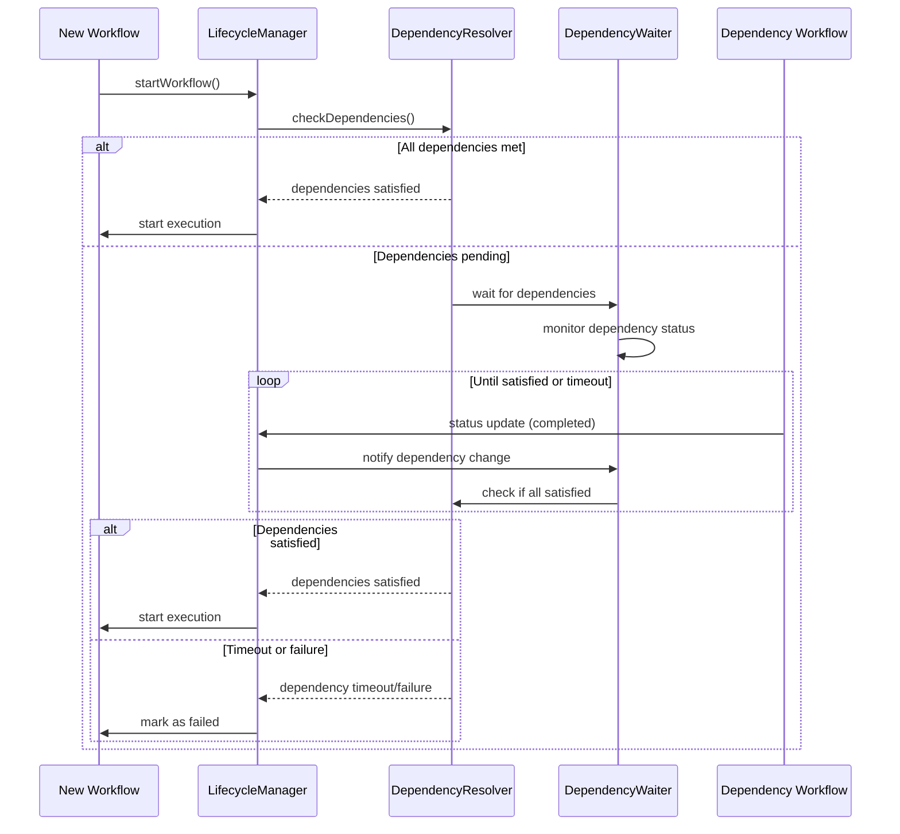
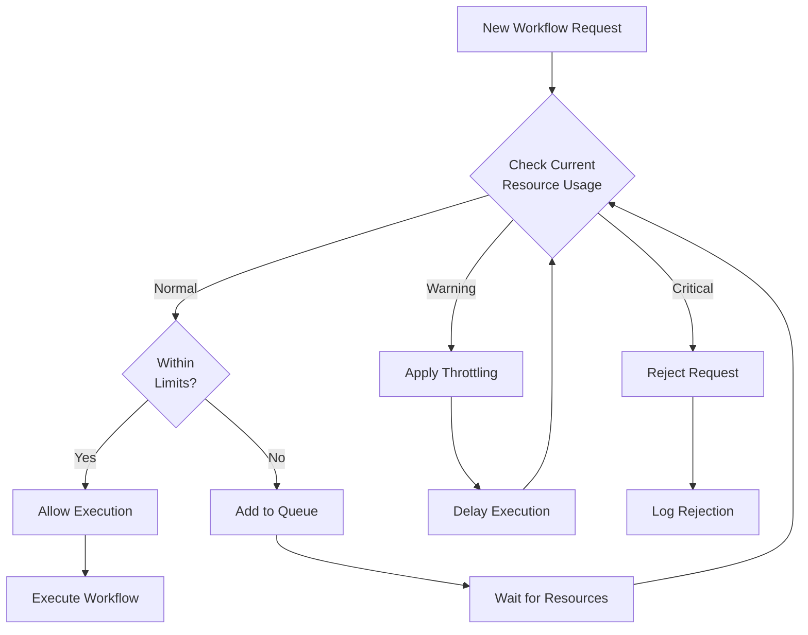

# WorkflowLifecycleManager - Instance Lifecycle and Dependency Management

## Overview

The `WorkflowLifecycleManager` provides comprehensive workflow instance lifecycle management, including state tracking, dependency resolution, resource monitoring, and cleanup operations. It ensures proper workflow execution order and resource utilization across the entire workflow ecosystem.

## Architecture



## Key Features

### 1. Comprehensive State Management
- **Workflow Status Tracking**: Track all workflow instances through their lifecycle
- **State Transitions**: Manage valid state transitions and prevent invalid operations
- **State Persistence**: Persist state information for recovery and monitoring
- **Event Emission**: Emit events for state changes and lifecycle events

### 2. Dependency Management
- **Dependency Graph**: Build and maintain dependency relationships
- **Prerequisite Validation**: Ensure dependencies are met before execution
- **Dependency Timeouts**: Handle stuck dependencies with timeout mechanisms
- **Circular Dependency Detection**: Prevent and detect circular dependencies

### 3. Resource Monitoring
- **Resource Utilization**: Monitor CPU, memory, and disk usage
- **Resource Limits**: Enforce resource constraints per workflow
- **Resource Throttling**: Throttle workflow execution based on resource availability
- **Resource Cleanup**: Clean up resources after workflow completion

### 4. Advanced Lifecycle Features
- **Priority Management**: Execute workflows based on priority levels
- **Cleanup Operations**: Automated cleanup of completed workflows
- **Archive Management**: Archive completed workflows for historical analysis
- **Performance Monitoring**: Track execution metrics and performance statistics

## Workflow States

### State Definitions

```typescript
enum WorkflowStatus {
  PENDING = 'pending',        // Waiting to start
  RUNNING = 'running',        // Currently executing
  PAUSED = 'paused',         // Execution paused
  COMPLETED = 'completed',    // Successfully completed
  FAILED = 'failed',         // Failed with error
  CANCELLED = 'cancelled',    // Manually cancelled
  CLEANING_UP = 'cleaning_up' // Performing cleanup
}

enum WorkflowPriority {
  LOW = 1,
  NORMAL = 2,
  HIGH = 3,
  CRITICAL = 4
}
```

### State Transition Diagram



### State Transition Rules

```typescript
class StateTransitionValidator {
  private static validTransitions: Record<WorkflowStatus, WorkflowStatus[]> = {
    [WorkflowStatus.PENDING]: [
      WorkflowStatus.RUNNING,
      WorkflowStatus.CANCELLED,
      WorkflowStatus.FAILED
    ],
    [WorkflowStatus.RUNNING]: [
      WorkflowStatus.PAUSED,
      WorkflowStatus.COMPLETED,
      WorkflowStatus.FAILED,
      WorkflowStatus.CANCELLED
    ],
    [WorkflowStatus.PAUSED]: [
      WorkflowStatus.RUNNING,
      WorkflowStatus.CANCELLED,
      WorkflowStatus.FAILED
    ],
    [WorkflowStatus.COMPLETED]: [
      WorkflowStatus.CLEANING_UP
    ],
    [WorkflowStatus.FAILED]: [
      WorkflowStatus.PENDING,     // For retry
      WorkflowStatus.CLEANING_UP
    ],
    [WorkflowStatus.CANCELLED]: [
      WorkflowStatus.CLEANING_UP
    ],
    [WorkflowStatus.CLEANING_UP]: []
  };

  static isValidTransition(from: WorkflowStatus, to: WorkflowStatus): boolean {
    return this.validTransitions[from]?.includes(to) || false;
  }
}
```

## Dependency Management

### Dependency Configuration

```typescript
interface IWorkflowDependency {
  workflowId: string;                    // ID of the dependency workflow
  version: string;                       // Version of the dependency
  condition: 'completed' | 'failed' | 'any';  // Completion condition
  timeout?: number;                      // Timeout in milliseconds
  optional?: boolean;                    // Whether dependency is optional
  retryOnFailure?: boolean;              // Retry if dependency fails
}

interface IDependencyConfig {
  dependencies: IWorkflowDependency[];
  dependencyTimeout: number;             // Global dependency timeout
  maxDependencyDepth: number;            // Maximum dependency chain depth
  allowCircularDependencies: boolean;    // Whether to allow circular deps
}
```

### Dependency Resolution Flow



### Dependency Graph Management

```typescript
class DependencyGraph {
  private graph: Map<string, Set<string>> = new Map();
  private reverseGraph: Map<string, Set<string>> = new Map();

  addDependency(workflowId: string, dependsOnId: string): void {
    // Add forward dependency
    if (!this.graph.has(workflowId)) {
      this.graph.set(workflowId, new Set());
    }
    this.graph.get(workflowId)!.add(dependsOnId);

    // Add reverse dependency
    if (!this.reverseGraph.has(dependsOnId)) {
      this.reverseGraph.set(dependsOnId, new Set());
    }
    this.reverseGraph.get(dependsOnId)!.add(workflowId);
  }

  detectCircularDependency(workflowId: string): boolean {
    const visited = new Set<string>();
    const recursionStack = new Set<string>();
    
    return this.hasCycle(workflowId, visited, recursionStack);
  }

  private hasCycle(
    node: string, 
    visited: Set<string>, 
    recursionStack: Set<string>
  ): boolean {
    visited.add(node);
    recursionStack.add(node);

    const dependencies = this.graph.get(node) || new Set();
    for (const dependency of dependencies) {
      if (!visited.has(dependency)) {
        if (this.hasCycle(dependency, visited, recursionStack)) {
          return true;
        }
      } else if (recursionStack.has(dependency)) {
        return true;
      }
    }

    recursionStack.delete(node);
    return false;
  }

  getDependents(workflowId: string): string[] {
    return Array.from(this.reverseGraph.get(workflowId) || new Set());
  }
}
```

## Resource Management

### Resource Monitoring

```typescript
interface IResourceUsage {
  memory: number;    // Memory usage in MB
  cpu: number;       // CPU usage percentage
  disk: number;      // Disk usage in MB
  network?: number;  // Network I/O in MB/s
}

interface IResourceThresholds {
  memory: {
    warning: number;   // Warning threshold in MB
    critical: number;  // Critical threshold in MB
    max: number;       // Maximum allowed in MB
  };
  cpu: {
    warning: number;   // Warning threshold percentage
    critical: number;  // Critical threshold percentage
    max: number;       // Maximum allowed percentage
  };
  disk: {
    warning: number;   // Warning threshold in MB
    critical: number;  // Critical threshold in MB
    max: number;       // Maximum allowed in MB
  };
}
```

### Resource Monitoring Implementation

```typescript
class ResourceMonitor {
  private thresholds: IResourceThresholds;
  private monitoringInterval: NodeJS.Timeout | null = null;

  constructor(thresholds: IResourceThresholds) {
    this.thresholds = thresholds;
  }

  async getCurrentResourceUsage(): Promise<IResourceUsage> {
    const memUsage = process.memoryUsage();
    const cpuUsage = process.cpuUsage();
    
    return {
      memory: memUsage.heapUsed / 1024 / 1024, // Convert to MB
      cpu: this.calculateCpuPercentage(cpuUsage),
      disk: await this.getDiskUsage()
    };
  }

  private calculateCpuPercentage(cpuUsage: NodeJS.CpuUsage): number {
    const totalCpu = cpuUsage.user + cpuUsage.system;
    const totalTime = process.uptime() * 1000000; // Convert to microseconds
    return (totalCpu / totalTime) * 100;
  }

  checkResourceThresholds(usage: IResourceUsage): {
    level: 'normal' | 'warning' | 'critical';
    violations: string[];
  } {
    const violations: string[] = [];
    let level: 'normal' | 'warning' | 'critical' = 'normal';

    // Check memory
    if (usage.memory > this.thresholds.memory.critical) {
      violations.push(`Memory usage critical: ${usage.memory}MB`);
      level = 'critical';
    } else if (usage.memory > this.thresholds.memory.warning) {
      violations.push(`Memory usage warning: ${usage.memory}MB`);
      if (level !== 'critical') level = 'warning';
    }

    // Check CPU
    if (usage.cpu > this.thresholds.cpu.critical) {
      violations.push(`CPU usage critical: ${usage.cpu}%`);
      level = 'critical';
    } else if (usage.cpu > this.thresholds.cpu.warning) {
      violations.push(`CPU usage warning: ${usage.cpu}%`);
      if (level !== 'critical') level = 'warning';
    }

    return { level, violations };
  }
}
```

### Resource-Based Throttling



## Usage Examples

### Basic Lifecycle Management

```typescript
import { WorkflowLifecycleManager, WorkflowStatus, WorkflowPriority } from './LifecycleManager';

// Initialize lifecycle manager
const lifecycleManager = new WorkflowLifecycleManager({
  maxConcurrentWorkflows: 10,
  maxWorkflowDuration: 3600000, // 1 hour
  cleanupInterval: 300000,      // 5 minutes
  resourceThresholds: {
    memory: 512,  // 512 MB
    cpu: 80,      // 80%
    disk: 1024    // 1 GB
  }
});

await lifecycleManager.initialize();

// Create a new workflow instance
const instance = await lifecycleManager.createInstance({
  id: 'workflow-001',
  workflowId: 'data-processing',
  version: '1.0',
  status: WorkflowStatus.PENDING,
  priority: WorkflowPriority.HIGH,
  startedAt: new Date(),
  updatedAt: new Date(),
  dependencies: ['data-validation'],
  dependents: [],
  cleanupTasks: [],
  resourceUsage: {
    memory: 0,
    cpu: 0,
    disk: 0
  }
});

// Update workflow status
await lifecycleManager.updateInstanceStatus('workflow-001', WorkflowStatus.RUNNING);

// Add dependencies
await lifecycleManager.addDependency('workflow-001', {
  workflowId: 'data-validation',
  version: '1.0',
  condition: 'completed',
  timeout: 300000 // 5 minutes
});
```

### Dependency Management

```typescript
// Create workflow with dependencies
const workflowWithDeps = await lifecycleManager.createInstance({
  id: 'dependent-workflow',
  workflowId: 'report-generation',
  version: '1.0',
  status: WorkflowStatus.PENDING,
  priority: WorkflowPriority.NORMAL,
  startedAt: new Date(),
  updatedAt: new Date(),
  dependencies: [
    'data-extraction',
    'data-transformation',
    'data-validation'
  ],
  dependents: [],
  cleanupTasks: [],
  resourceUsage: { memory: 0, cpu: 0, disk: 0 }
});

// Check if dependencies are satisfied
const dependenciesSatisfied = await lifecycleManager.checkDependencies('dependent-workflow');

if (dependenciesSatisfied) {
  await lifecycleManager.updateInstanceStatus('dependent-workflow', WorkflowStatus.RUNNING);
} else {
  console.log('Waiting for dependencies to complete...');
}

// Get dependency status
const dependencyStatus = await lifecycleManager.getDependencyStatus('dependent-workflow');
console.log('Dependency status:', dependencyStatus);
```

### Resource Monitoring

```typescript
// Monitor resource usage
const resourceUsage = await lifecycleManager.getCurrentResourceUsage();
console.log('Current resource usage:', resourceUsage);

// Check if workflow can be started based on resources
const canStart = await lifecycleManager.canStartWorkflow('new-workflow', {
  estimatedMemory: 256,
  estimatedCpu: 25,
  estimatedDisk: 100
});

if (canStart) {
  await lifecycleManager.startWorkflow('new-workflow');
} else {
  console.log('Insufficient resources, queuing workflow...');
  await lifecycleManager.queueWorkflow('new-workflow');
}

// Get resource statistics
const resourceStats = await lifecycleManager.getResourceStatistics();
console.log('Resource statistics:', resourceStats);
```

### Cleanup and Maintenance

```typescript
// Manual cleanup of completed workflows
await lifecycleManager.cleanupCompletedWorkflows();

// Archive old workflows
await lifecycleManager.archiveOldWorkflows({
  olderThan: new Date(Date.now() - 30 * 24 * 60 * 60 * 1000), // 30 days
  status: [WorkflowStatus.COMPLETED, WorkflowStatus.FAILED]
});

// Get cleanup statistics
const cleanupStats = await lifecycleManager.getCleanupStatistics();
console.log('Cleanup statistics:', cleanupStats);

// Force cleanup of specific workflow
await lifecycleManager.forceCleanup('workflow-001');
```

## Configuration

### Lifecycle Configuration

```typescript
interface IWorkflowLifecycleConfig {
  maxConcurrentWorkflows: number;        // Maximum concurrent workflows
  maxWorkflowDuration: number;           // Maximum duration in milliseconds
  cleanupInterval: number;               // Cleanup interval in milliseconds
  statusUpdateInterval: number;          // Status update interval
  dependencyTimeout: number;             // Default dependency timeout
  resourceThresholds: {
    memory: number;                      // Memory threshold in MB
    cpu: number;                         // CPU threshold percentage
    disk: number;                        // Disk threshold in MB
  };
  archivalPolicy: {
    enabled: boolean;                    // Enable automatic archival
    retentionPeriod: number;             // Retention period in days
    archivalInterval: number;            // Archival check interval
  };
  priorityManagement: {
    enabled: boolean;                    // Enable priority-based execution
    priorityWeights: Record<WorkflowPriority, number>;  // Priority weights
  };
}
```

### Environment-Based Configuration

```typescript
const lifecycleConfig: IWorkflowLifecycleConfig = {
  maxConcurrentWorkflows: parseInt(process.env.MAX_CONCURRENT_WORKFLOWS || '10'),
  maxWorkflowDuration: parseInt(process.env.MAX_WORKFLOW_DURATION || '3600000'),
  cleanupInterval: parseInt(process.env.CLEANUP_INTERVAL || '300000'),
  statusUpdateInterval: parseInt(process.env.STATUS_UPDATE_INTERVAL || '60000'),
  dependencyTimeout: parseInt(process.env.DEPENDENCY_TIMEOUT || '300000'),
  resourceThresholds: {
    memory: parseInt(process.env.MEMORY_THRESHOLD || '512'),
    cpu: parseInt(process.env.CPU_THRESHOLD || '80'),
    disk: parseInt(process.env.DISK_THRESHOLD || '1024')
  },
  archivalPolicy: {
    enabled: process.env.ARCHIVAL_ENABLED === 'true',
    retentionPeriod: parseInt(process.env.RETENTION_PERIOD || '30'),
    archivalInterval: parseInt(process.env.ARCHIVAL_INTERVAL || '86400000')
  },
  priorityManagement: {
    enabled: process.env.PRIORITY_MANAGEMENT_ENABLED === 'true',
    priorityWeights: {
      [WorkflowPriority.LOW]: 1,
      [WorkflowPriority.NORMAL]: 2,
      [WorkflowPriority.HIGH]: 4,
      [WorkflowPriority.CRITICAL]: 8
    }
  }
};
```

## Monitoring and Statistics

### Lifecycle Statistics

```typescript
interface IWorkflowLifecycleStats {
  totalWorkflows: number;
  runningWorkflows: number;
  pausedWorkflows: number;
  completedWorkflows: number;
  failedWorkflows: number;
  cancelledWorkflows: number;
  averageExecutionTime: number;
  resourceUtilization: {
    memory: number;
    cpu: number;
    disk: number;
  };
  dependencyStats: {
    totalDependencies: number;
    satisfiedDependencies: number;
    pendingDependencies: number;
    timedOutDependencies: number;
  };
  cleanupStats: {
    totalCleaned: number;
    archivedWorkflows: number;
    freedMemory: number;
  };
}
```

### Real-time Monitoring

```typescript
// Set up real-time monitoring
lifecycleManager.on('status-changed', (event) => {
  console.log(`Workflow ${event.instanceId} status changed: ${event.oldStatus} -> ${event.newStatus}`);
});

lifecycleManager.on('dependency-satisfied', (event) => {
  console.log(`Dependencies satisfied for workflow ${event.instanceId}`);
});

lifecycleManager.on('resource-threshold-exceeded', (event) => {
  console.log(`Resource threshold exceeded: ${event.resource} = ${event.currentValue}`);
});

lifecycleManager.on('cleanup-completed', (event) => {
  console.log(`Cleanup completed: ${event.workflowsCleaned} workflows processed`);
});

// Get live statistics
setInterval(async () => {
  const stats = await lifecycleManager.getLifecycleStats();
  console.log('Lifecycle stats:', stats);
}, 60000); // Every minute
```

## Error Handling

### Error Categories

```typescript
enum LifecycleErrorType {
  INVALID_STATE_TRANSITION = 'invalid_state_transition',
  DEPENDENCY_TIMEOUT = 'dependency_timeout',
  RESOURCE_EXCEEDED = 'resource_exceeded',
  CIRCULAR_DEPENDENCY = 'circular_dependency',
  CLEANUP_FAILED = 'cleanup_failed',
  ARCHIVAL_FAILED = 'archival_failed'
}

class LifecycleError extends Error {
  constructor(
    public type: LifecycleErrorType,
    public instanceId: string,
    message: string,
    public metadata?: any
  ) {
    super(message);
    this.name = 'LifecycleError';
  }
}
```

### Error Handling Strategies

```typescript
class LifecycleErrorHandler {
  async handleError(error: LifecycleError): Promise<void> {
    switch (error.type) {
      case LifecycleErrorType.INVALID_STATE_TRANSITION:
        await this.handleInvalidStateTransition(error);
        break;
      
      case LifecycleErrorType.DEPENDENCY_TIMEOUT:
        await this.handleDependencyTimeout(error);
        break;
      
      case LifecycleErrorType.RESOURCE_EXCEEDED:
        await this.handleResourceExceeded(error);
        break;
      
      case LifecycleErrorType.CIRCULAR_DEPENDENCY:
        await this.handleCircularDependency(error);
        break;
      
      default:
        await this.handleGenericError(error);
    }
  }

  private async handleDependencyTimeout(error: LifecycleError): Promise<void> {
    // Mark workflow as failed due to dependency timeout
    await this.lifecycleManager.updateInstanceStatus(
      error.instanceId, 
      WorkflowStatus.FAILED
    );
    
    // Log error for monitoring
    logger.error('Dependency timeout', {
      instanceId: error.instanceId,
      error: error.message,
      metadata: error.metadata
    });
    
    // Notify dependent workflows
    await this.lifecycleManager.notifyDependents(error.instanceId, 'dependency_failed');
  }
}
```

## Best Practices

### 1. Dependency Design
- Keep dependency chains shallow (max 3-4 levels)
- Use optional dependencies for non-critical prerequisites
- Implement proper timeout handling for all dependencies
- Avoid circular dependencies in workflow design

### 2. Resource Management
- Set realistic resource thresholds based on system capacity
- Monitor resource usage trends over time
- Implement graceful degradation for resource exhaustion
- Use priority-based execution for critical workflows

### 3. State Management
- Always validate state transitions before executing
- Implement proper error handling for invalid states
- Use event-driven architecture for state change notifications
- Persist state information for recovery scenarios

### 4. Performance Optimization
- Regularly clean up completed workflows
- Archive old workflow data to reduce memory usage
- Use efficient data structures for dependency graphs
- Implement batch operations for bulk state updates

## Troubleshooting

### Common Issues

1. **Dependency Deadlocks**
   ```typescript
   // Check for circular dependencies
   const hasCircular = lifecycleManager.detectCircularDependencies('workflow-id');
   if (hasCircular) {
     console.log('Circular dependency detected, review workflow design');
   }
   ```

2. **Resource Exhaustion**
   ```typescript
   // Monitor resource usage
   const usage = await lifecycleManager.getCurrentResourceUsage();
   const thresholds = lifecycleManager.getResourceThresholds();
   
   if (usage.memory > thresholds.memory.critical) {
     console.log('Critical memory usage, triggering cleanup...');
     await lifecycleManager.forceCleanup();
   }
   ```

3. **Stuck Workflows**
   ```typescript
   // Find long-running workflows
   const longRunning = await lifecycleManager.getLongRunningWorkflows({
     threshold: 3600000 // 1 hour
   });
   
   longRunning.forEach(async (workflow) => {
     console.log(`Workflow ${workflow.id} has been running for ${workflow.duration}ms`);
     // Consider manual intervention or cancellation
   });
   ```

---

The WorkflowLifecycleManager provides robust workflow instance management with comprehensive dependency resolution, resource monitoring, and lifecycle tracking capabilities essential for enterprise workflow orchestration.
