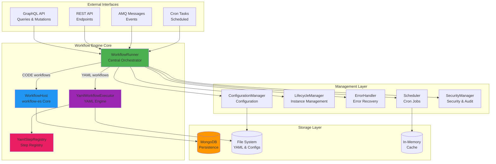
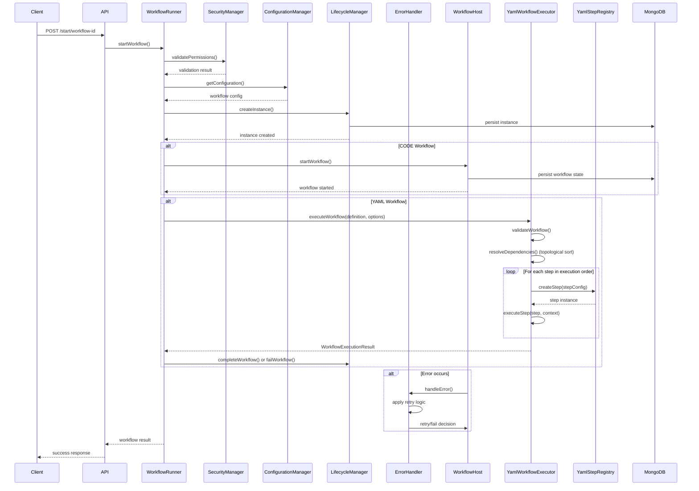
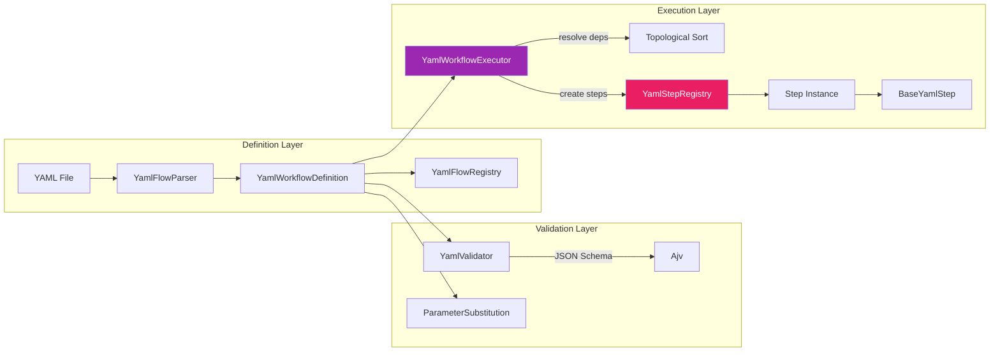
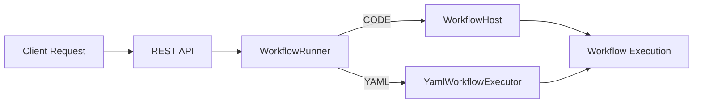
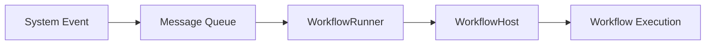
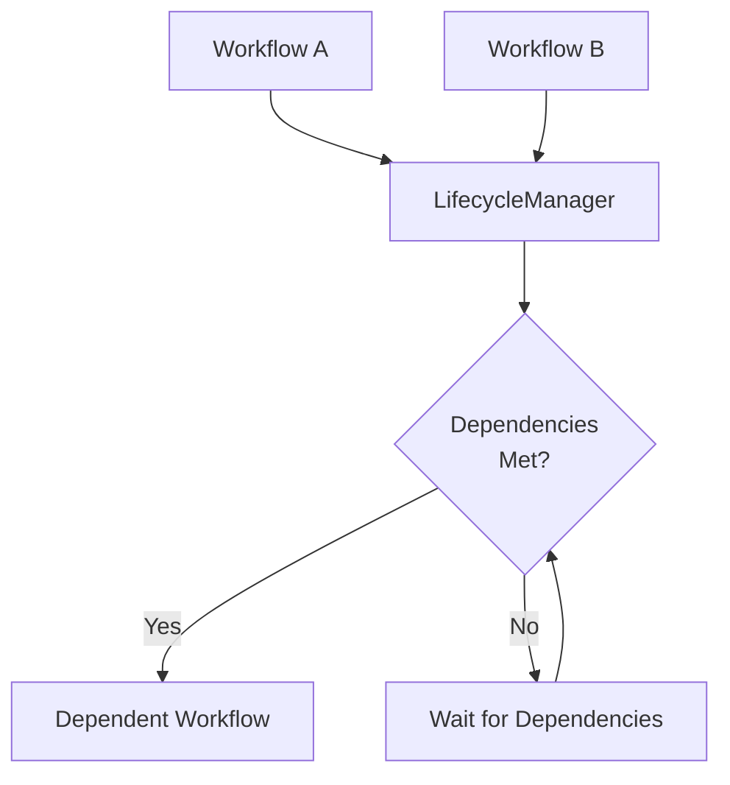
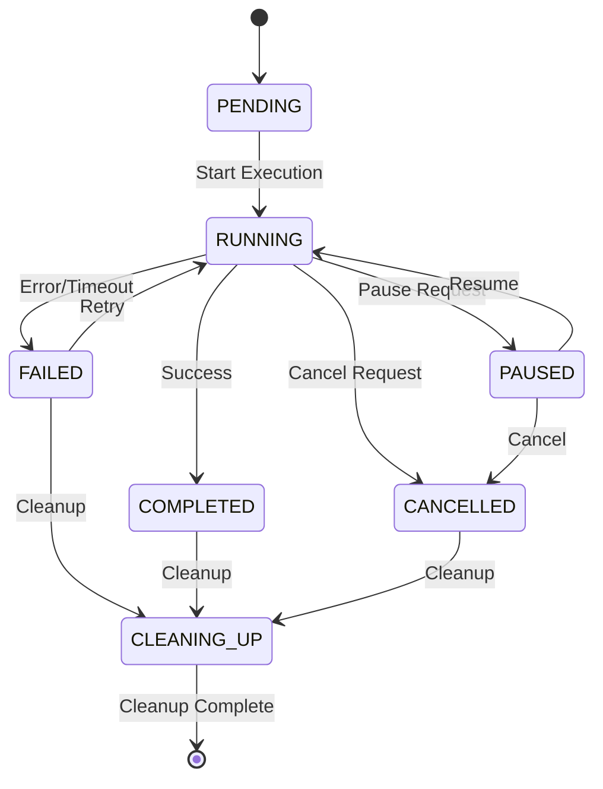
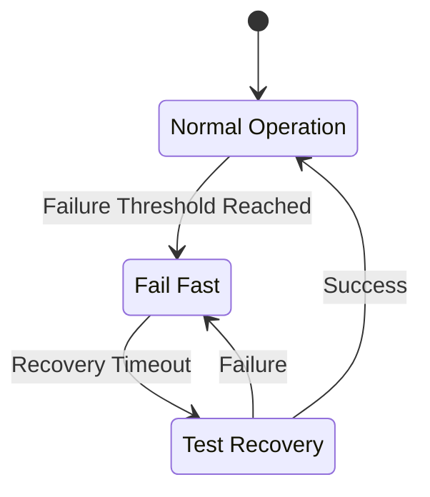
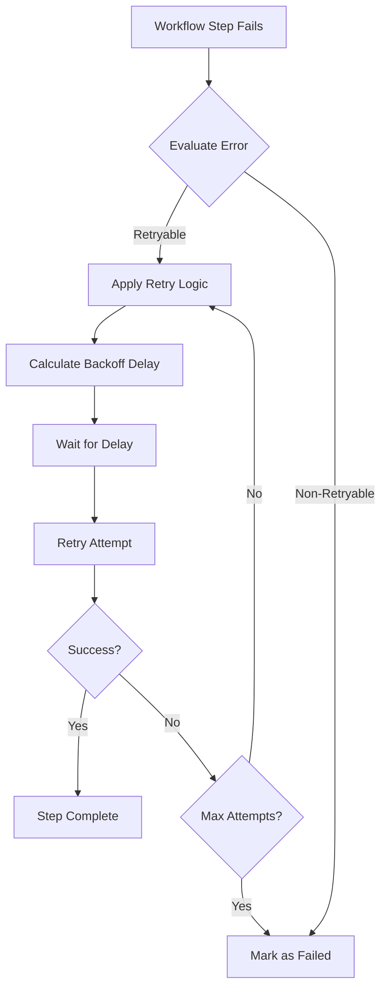
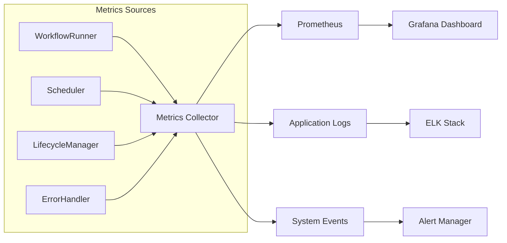

# Reactory Workflow Engine

## Overview

The Reactory Workflow Engine is a comprehensive workflow orchestration system that supports two distinct workflow paradigms:

- **CODE workflows** -- Programmatic TypeScript workflows built on the `workflow-es` library, supporting sequential, parallel, conditional, and loop patterns.
- **YAML workflows (YamlFlow)** -- Declarative, YAML-defined workflows executed by the `YamlWorkflowExecutor`, with a rich step registry, parameter substitution, dependency resolution, dry-run mode, cancellation, and progress callbacks.

Both paradigms are managed through a unified `WorkflowRunner` singleton that provides enterprise-grade features including scheduling, error handling with circuit breakers, lifecycle management, configuration management, security controls, and a GraphQL API.

## Architecture

The workflow engine follows a modular architecture with core orchestration components, a YAML execution engine, and a step registry system.

### Core Components

1. **WorkflowRunner** -- Central orchestrator and singleton manager. Routes CODE workflows to the `workflow-es` host and YAML workflows to `YamlWorkflowExecutor`.
2. **YamlWorkflowExecutor** -- Execution engine for declarative YAML workflows with step-by-step execution, validation, dependency resolution (topological sort), dry-run mode, cancellation, and progress callbacks.
3. **YamlStepRegistry** -- Central registry for all step types. Auto-registers 12 built-in core steps and supports module-contributed steps via `IReactoryModule.workflowSteps`.
4. **Scheduler** -- Cron-based scheduling system for recurring workflows.
5. **LifecycleManager** -- Workflow instance lifecycle and dependency management.
6. **ErrorHandler** -- Comprehensive error handling with circuit breakers and retry logic.
7. **ConfigurationManager** -- Hot-reloadable configuration management.
8. **SecurityManager** -- Authentication, authorization, and audit logging.

### Workflow Types

| Type | Definition | Execution Engine | Patterns |
|------|-----------|-----------------|----------|
| **CODE** | TypeScript classes implementing `WorkflowBase<T>` | `workflow-es` WorkflowHost | Sequential, parallel, conditional, loop, saga |
| **YAML** | Declarative `.yaml` files with step definitions | `YamlWorkflowExecutor` | Step dependencies, conditional branching, iteration, service invocation |

The `WorkflowRunner.startWorkflow()` method inspects the `workflowType` property on the registered workflow and routes execution accordingly. YAML workflows receive full lifecycle tracking through the `LifecycleManager`, just like CODE workflows.

## High-Level Architecture Diagram


```mermaid
graph TB
    subgraph "Workflow Engine Core"
        WR[WorkflowRunner<br/>Central Orchestrator]
        WH[WorkflowHost<br/>workflow-es Core]
        YE[YamlWorkflowExecutor<br/>YAML Engine]
        SR[YamlStepRegistry<br/>Step Registry]

        WR -->|CODE workflows| WH
        WR -->|YAML workflows| YE
        YE --> SR
    end

    subgraph "Management Layer"
        SCH[Scheduler<br/>Cron Jobs]
        LCM[LifecycleManager<br/>Instance Management]
        EH[ErrorHandler<br/>Error Recovery]
        CM[ConfigurationManager<br/>Configuration]
        SM[SecurityManager<br/>Security & Audit]
    end

    subgraph "Storage Layer"
        MONGO[(MongoDB<br/>Persistence)]
        FS[(File System<br/>YAML & Configs)]
        MEM[(In-Memory<br/>Cache)]
    end

    subgraph "External Interfaces"
        GQL[GraphQL API<br/>Queries & Mutations]
        API[REST API<br/>Endpoints]
        AMQ[AMQ Messages<br/>Events]
        CRON[Cron Tasks<br/>Scheduled]
    end

    WR --> SCH
    WR --> LCM
    WR --> EH
    WR --> CM
    WR --> SM

    WH --> MONGO
    CM --> FS
    SCH --> MEM
    YE --> FS

    GQL --> WR
    API --> WR
    AMQ --> WR
    CRON --> WR

    style WR fill:#4CAF50
    style WH fill:#2196F3
    style YE fill:#9C27B0
    style SR fill:#E91E63
    style MONGO fill:#FF9800
```

## Component Interaction Flow


```mermaid
sequenceDiagram
    participant Client
    participant API
    participant WR as WorkflowRunner
    participant SM as SecurityManager
    participant CM as ConfigurationManager
    participant LCM as LifecycleManager
    participant EH as ErrorHandler
    participant WH as WorkflowHost
    participant YE as YamlWorkflowExecutor
    participant SR as YamlStepRegistry
    participant DB as MongoDB

    Client->>API: POST /start/workflow-id
    API->>WR: startWorkflow()
    WR->>SM: validatePermissions()
    SM-->>WR: validation result
    WR->>CM: getConfiguration()
    CM-->>WR: workflow config
    WR->>LCM: createInstance()
    LCM->>DB: persist instance
    LCM-->>WR: instance created

    alt CODE Workflow
        WR->>WH: startWorkflow()
        WH->>DB: persist workflow state
        WH-->>WR: workflow started
    end

    alt YAML Workflow
        WR->>YE: executeWorkflow(definition, options)
        YE->>YE: validateWorkflow()
        YE->>YE: resolveDependencies() (topological sort)
        loop For each step in execution order
            YE->>SR: createStep(stepConfig)
            SR-->>YE: step instance
            YE->>YE: executeStep(step, context)
        end
        YE-->>WR: WorkflowExecutionResult
        WR->>LCM: completeWorkflow() or failWorkflow()
    end

    alt Error occurs
        WH->>EH: handleError()
        EH->>EH: apply retry logic
        EH->>WH: retry/fail decision
    end

    WR-->>API: workflow result
    API-->>Client: success response
```

---

## YAML Workflow Engine (YamlFlow)

The YamlFlow engine provides a declarative, configuration-driven approach to workflow definition and execution. Workflows are defined in YAML files and executed by the `YamlWorkflowExecutor` with full step-by-step tracking.

### YamlFlow Components

| Component | File | Description |
|-----------|------|-------------|
| **YamlFlowParser** | `YamlFlow/YamlFlowParser.ts` | Parses YAML workflow definition strings into `YamlWorkflowDefinition` objects. Computes workflow complexity metrics. |
| **YamlFlowBuilder** | `YamlFlow/YamlFlowBuilder.ts` | Builds executable workflow representations from parsed YAML definitions. |
| **YamlFlowRegistry** | `YamlFlow/YamlFlowRegistry.ts` | Registers and manages YAML workflow definitions by namespace, name, and version. |
| **YamlWorkflowExecutor** | `YamlFlow/execution/YamlWorkflowExecutor.ts` | Main execution engine. Validates workflows, resolves dependencies via topological sort, executes steps in order, supports dry-run, cancellation, and progress callbacks. |
| **YamlStepRegistry** | `YamlFlow/steps/registry/YamlStepRegistry.ts` | Central registry for all step types. Auto-registers 12 core steps. Supports dynamic registration from modules. |
| **YamlValidator** | `YamlFlow/validators/YamlValidator.ts` | Validates YAML workflow structure against a JSON Schema (`WorkflowSchema.json`) using Ajv. |
| **ParameterSubstitution** | `YamlFlow/parsers/ParameterSubstitution.ts` | Resolves `${variable}` expressions in workflow definitions. Supports `env`, `workflow`, `input`, `variables`, `step`, and `outputs` sources. |
| **BaseYamlStep** | `YamlFlow/steps/base/BaseYamlStep.ts` | Abstract base class for all step implementations. Provides `execute()` wrapper with timing, error handling, skip-if-disabled, `resolveTemplate()`, `getConfigValue()`, and `validateConfig()`. |

### YamlFlow Architecture Diagram


```mermaid
graph LR
    subgraph "Definition Layer"
        YAML[YAML File] --> PARSER[YamlFlowParser]
        PARSER --> DEF[YamlWorkflowDefinition]
        DEF --> REG[YamlFlowRegistry]
    end

    subgraph "Validation Layer"
        DEF --> VAL[YamlValidator]
        VAL -->|JSON Schema| AJV[Ajv]
        DEF --> PSUB[ParameterSubstitution]
    end

    subgraph "Execution Layer"
        DEF --> EXEC[YamlWorkflowExecutor]
        EXEC -->|resolve deps| TOPO[Topological Sort]
        EXEC -->|create steps| SREG[YamlStepRegistry]
        SREG --> STEP[Step Instance]
        STEP --> BASE[BaseYamlStep]
    end

    style EXEC fill:#9C27B0,color:#fff
    style SREG fill:#E91E63,color:#fff
```

### YAML Workflow Definition Format

YAML workflows follow a structured definition format with metadata, inputs, outputs, variables, and steps:

```yaml
nameSpace: sampleWorkflows
name: userOnboardingWorkflow
version: 1.0.0
description: Complete user onboarding process
author: Reactory Development Team
tags:
  - onboarding
  - user-management

metadata:
  timeout: 300000
  retryPolicy:
    maxAttempts: 3
    backoffStrategy: exponential
    initialDelay: 1000
  security:
    requiresAuthentication: true
    permissions:
      - user.create

inputs:
  userData:
    type: object
    required: true
    description: User data for onboarding

outputs:
  userId:
    type: string
    source: step.createUser.userId

variables:
  currentTimestamp: "${workflow.startTime}"

steps:
  - id: logStart
    name: Log Workflow Start
    type: log
    config:
      message: "Starting onboarding for ${input.userData.email}"
      level: info

  - id: validateData
    name: Validate Input
    type: validation
    dependsOn: logStart
    config:
      rules:
        - field: "${input.userData.email}"
          type: pattern
          value: "^[\\w-\\.]+@([\\w-]+\\.)+[\\w-]{2,4}$"
          message: "Invalid email format"
```

### Parameter Substitution

The `ParameterSubstitution` engine supports the following expression sources within `${...}` syntax:

| Pattern | Source | Example |
|---------|--------|---------|
| `${env.VAR}` | Environment variables | `${env.API_BASE_URL}` |
| `${workflow.property}` | Workflow properties (id, instanceId, nameSpace, name, version) | `${workflow.name}` |
| `${input.param}` | Input parameters | `${input.userData.email}` |
| `${variables.name}` | Workflow variables | `${variables.currentTimestamp}` |
| `${step.stepId.output}` | Previous step outputs | `${step.createUser.userId}` |
| `${outputs.name}` | Workflow outputs | `${outputs.userId}` |

Substitution is performed recursively over strings, arrays, and objects. The engine supports strict mode (errors on unresolved references) and non-strict mode (returns empty strings for unresolved references).

### Execution Lifecycle

The `YamlWorkflowExecutor` follows this execution flow:

1. **Validation** -- Validates workflow structure, checks for duplicate step IDs, verifies step types exist in the registry, validates dependencies, checks for circular dependencies, and validates individual step configurations.
2. **Dependency Resolution** -- Performs topological sort on step dependencies to determine execution order.
3. **Context Creation** -- Builds the execution context with workflow inputs, environment variables, and step output tracking.
4. **Step Execution** -- Iterates through steps in dependency order, creating step instances from the registry and executing them with the current context. Step outputs are accumulated and made available to subsequent steps.
5. **Progress Reporting** -- Emits progress events (`workflow_started`, `step_started`, `step_completed`, `step_failed`, `workflow_completed`, `workflow_failed`) via an optional callback.
6. **Cancellation** -- Checks a cancellation flag before each step, enabling graceful mid-execution cancellation.

### Execution Options

```typescript
interface ExecutionOptions {
  dryRun?: boolean;          // Validate only, don't execute
  continueOnError?: boolean;  // Continue executing after step failure
  inputs?: Record<string, any>;  // Additional input data
  environment?: Record<string, string>;  // Additional env vars
  onProgress?: (event: ProgressEvent) => void;  // Progress callback
  reactoryContext?: Reactory.Server.IReactoryContext;  // Server context
}
```

---

## Step Registry System

The `YamlStepRegistry` is the central registry for all workflow step types. It manages step registration, instantiation, and validation.

### How It Works

1. **Auto-Registration** -- On construction, the registry automatically registers all 12 built-in core step types.
2. **Module Discovery** -- During `WorkflowRunner.initialize()`, the `discoverModuleSteps()` method iterates all enabled `IReactoryModule` instances and registers any step providers found in their `workflowSteps` array.
3. **Step Creation** -- When the executor needs a step, it calls `registry.createStep(stepConfig)`, which resolves the configuration (supporting both `config` objects and `inputs` JSON strings from the YAML designer), instantiates the step class, and validates the configuration.

### Module Step Registration

Any Reactory module can contribute custom step types to the workflow engine by implementing the `workflowSteps` property on `IReactoryModule`:

```typescript
// In a module's index.ts
const MyModule: Reactory.Server.IReactoryModule = {
  nameSpace: 'mycompany',
  name: 'MyModule',
  version: '1.0.0',
  // ... other module properties
  workflowSteps: [
    {
      stepType: 'myCustomStep',
      constructor: MyCustomStep,
      options: {
        description: 'My custom workflow step',
        version: '1.0.0'
      }
    }
  ]
};
```

The `WorkflowRunner.discoverModuleSteps()` method handles registration:

```typescript
private discoverModuleSteps(): void {
  for (const mod of modules) {
    if (!mod.workflowSteps) continue;
    for (const stepProvider of mod.workflowSteps) {
      this.stepRegistry.registerStep(
        stepProvider.stepType,
        stepProvider.constructor,
        stepProvider.options || {}
      );
    }
  }
}
```

### Built-in Step Types

All 12 core steps are located in `YamlFlow/steps/core/` and extend `BaseYamlStep`:

| Step Type | Class | Description |
|-----------|-------|-------------|
| `start` | `StartStep` | Workflow entry point. Marks the beginning of workflow execution. |
| `end` | `EndStep` | Workflow exit point. Marks the end of workflow execution. |
| `log` | `LogStep` | Log messages during execution with configurable level (debug, info, warn, error) and structured data. |
| `delay` | `DelayStep` | Pause execution for a specified duration in milliseconds or human-readable format ("5s", "1m"). |
| `validation` | `ValidationStep` | Validate data against JSON Schema and custom rules (pattern, required, range, etc.). |
| `dataTransformation` | `DataTransformationStep` | Pipeline of data transformations: filter, map, sort, group, aggregate, merge, extract. |
| `apiCall` | `ApiCallStep` | HTTP client with configurable auth, retry, timeout, expected status codes, and response field extraction. |
| `cliCommand` | `CliCommandStep` | Execute shell commands with configurable security checks and output capture. |
| `fileOperation` | `FileOperationStep` | Full filesystem operations: read, write, copy, move, delete, mkdir, stat, list. |
| `condition` | `ConditionStep` | Conditional branching with sandboxed JavaScript expression evaluation. |
| `for_each` | `ForEachStep` | Iterate over a collection with configurable concurrency. |
| `service_invoke` | `ServiceInvokeStep` | Invoke Reactory service methods by FQN (e.g., `"namespace.ServiceName@version"`). Resolves the service from the Reactory context and calls the specified method with parameters. |

### Placeholder Step Stubs

The following step types exist as empty placeholder implementations for future development:

| Step Type | Class | Planned Purpose |
|-----------|-------|-----------------|
| `serviceCall` | `ServiceCallStep` | Generic service call abstraction |
| `telemetry` | `TelemetryStep` | Emit telemetry/tracing data |
| `mongoDbQuery` | `MongoDbQStep` | MongoDB query execution |
| `postgresQuery` | `PostgresSQLStep` | PostgreSQL query execution |
| `mssqlQuery` | `MSSQLStep` | Microsoft SQL Server query execution |
| `mysqlQuery` | `MySqlStep` | MySQL query execution |

### BaseYamlStep Abstract Class

All step implementations extend `BaseYamlStep` (`YamlFlow/steps/base/BaseYamlStep.ts`), which provides:

- **`execute(context)`** -- Wrapper method that handles timing, skip-if-disabled logic, error catching, and metadata attachment. Delegates to the abstract `executeStep()` method.
- **`executeStep(context)`** -- Abstract method that subclasses must implement with their step-specific logic.
- **`resolveTemplate(template, context)`** -- Resolves `${variable}` substitutions in strings using the execution context. Supports `context.variables`, `context.env`, and `steps.<stepId>.<outputPath>` references.
- **`getConfigValue(path, defaultValue)`** -- Safely access nested configuration values via dot-notation paths.
- **`validateConfig(config)`** -- Override point for step-specific configuration validation. Returns `{ valid: boolean, errors: string[] }`.
- **`getStepInfo()`** -- Returns step metadata for debugging and logging.

### CoreStepType Type System

The type system includes a `CoreStepType` union that enumerates all known step types, plus `(string & {})` for extensibility:

```typescript
type CoreStepType =
  | 'log' | 'delay' | 'validation' | 'dataTransformation'
  | 'apiCall' | 'cliCommand' | 'fileOperation'
  | 'conditional' | 'parallel' | 'forEach' | 'while' | 'custom'
  | 'start' | 'end' | 'condition' | 'for_each' | 'service_invoke';

type StepType = CoreStepType | (string & {});
```

This pattern allows TypeScript autocompletion for known types while permitting any string for custom step types contributed by modules.

---

## WorkflowDesigner UI (In Progress)

A visual workflow builder has been implemented in the PWA client at `src/components/shared/WorkflowDesigner/WorkflowDesigner.tsx`. This designer provides a graphical interface for creating, editing, and visualizing workflows.

### Features

- **Three rendering modes**: DOM, Optimized DOM, and WebGL (circuit board theme)
- **Drag-and-drop** step placement on a canvas
- **Visual connection creation** between steps via ports
- **Step library panel** with categorized steps for browsing and adding
- **Properties panel** for editing step configuration
- **Validation summary** showing workflow errors and warnings
- **Keyboard shortcuts** for common operations
- **Undo/redo history** for edit operations
- **YAML integration** via `convertYamlToDesignerDefinition` for loading existing YAML workflows into the designer
- **Server-side integration** -- The `WorkflowDetailsPanel` includes a "Designer" tab for YAML workflows

### Current Status

The designer is functional for visualization and basic editing. The following items remain in progress:

- Rendering performance optimizations for large workflows
- Additional step visual representations
- Full round-trip designer-to-YAML export (designer -> YAML serialization)

---

## Modes of Workflow Invocation

### 1. Direct API Invocation

**Use Case**: On-demand workflow execution triggered by user actions or external systems.

```typescript
// REST API endpoint
POST /workflow/start/:workflowId?version=1
{
  "data": { /* workflow input data */ },
  "priority": "normal",
  "metadata": { /* additional context */ }
}
```

**Architecture Flow**:

```mermaid
graph LR
    Client[Client Request] --> API[REST API]
    API --> WR[WorkflowRunner]
    WR -->|CODE| WH[WorkflowHost]
    WR -->|YAML| YE[YamlWorkflowExecutor]
    WH --> EXEC[Workflow Execution]
    YE --> EXEC
```

### 2. Scheduled Execution

**Use Case**: Recurring workflows, batch processing, maintenance tasks.

```yaml
# Schedule configuration
schedules:
  - id: "daily-report"
    name: "Daily Report Generation"
    workflow:
      id: "generate-report"
      version: "1"
    schedule:
      cron: "0 9 * * *"  # Daily at 9 AM
      timezone: "UTC"
    properties:
      reportType: "daily"
```

**Architecture Flow**:

```mermaid
graph LR
    CRON[Cron Schedule] --> SCH[Scheduler]
    SCH --> WR[WorkflowRunner]
    WR --> WH[WorkflowHost]
    WH --> EXEC[Workflow Execution]
```

### 3. Event-Driven Execution

**Use Case**: Reactive workflows triggered by system events, message queues, or external notifications.

```typescript
// AMQ Message Handler
amq.subscribe('workflow.trigger', (message) => {
  workflowRunner.startWorkflow(
    message.workflowId,
    message.version,
    message.data
  );
});
```

**Architecture Flow**:

```mermaid
graph LR
    EVENT[System Event] --> AMQ[Message Queue]
    AMQ --> WR[WorkflowRunner]
    WR --> WH[WorkflowHost]
    WH --> EXEC[Workflow Execution]
```

### 4. Dependency-Based Execution

**Use Case**: Complex workflows with inter-dependencies, pipeline orchestration.

```typescript
// Workflow with dependencies
const dependencyConfig = {
  workflowId: "process-results",
  dependencies: [
    { workflowId: "data-extraction", condition: "completed" },
    { workflowId: "validation", condition: "completed" }
  ]
};
```

**Architecture Flow**:

```mermaid
graph TB
    WF1[Workflow A] --> LCM[LifecycleManager]
    WF2[Workflow B] --> LCM
    LCM --> DEP{Dependencies<br/>Met?}
    DEP -->|Yes| WF3[Dependent Workflow]
    DEP -->|No| WAIT[Wait for Dependencies]
    WAIT --> DEP
```

## Workflow Lifecycle States


```mermaid
stateDiagram-v2
    [*] --> PENDING
    PENDING --> RUNNING: Start Execution
    RUNNING --> PAUSED: Pause Request
    RUNNING --> COMPLETED: Success
    RUNNING --> FAILED: Error/Timeout
    RUNNING --> CANCELLED: Cancel Request

    PAUSED --> RUNNING: Resume
    PAUSED --> CANCELLED: Cancel

    FAILED --> RUNNING: Retry
    FAILED --> CLEANING_UP: Cleanup

    COMPLETED --> CLEANING_UP: Cleanup
    CANCELLED --> CLEANING_UP: Cleanup

    CLEANING_UP --> [*]: Cleanup Complete
```

## Error Handling and Recovery

### Circuit Breaker Pattern


```mermaid
stateDiagram-v2
    [*] --> CLOSED
    CLOSED --> OPEN: Failure Threshold Reached
    OPEN --> HALF_OPEN: Recovery Timeout
    HALF_OPEN --> CLOSED: Success
    HALF_OPEN --> OPEN: Failure

    CLOSED: Normal Operation
    OPEN: Fail Fast
    HALF_OPEN: Test Recovery
```

### Retry Strategy


```mermaid
graph TD
    START[Workflow Step Fails] --> EVAL{Evaluate Error}
    EVAL -->|Retryable| RETRY[Apply Retry Logic]
    EVAL -->|Non-Retryable| FAIL[Mark as Failed]

    RETRY --> BACKOFF[Calculate Backoff Delay]
    BACKOFF --> WAIT[Wait for Delay]
    WAIT --> ATTEMPT[Retry Attempt]
    ATTEMPT --> SUCCESS{Success?}

    SUCCESS -->|Yes| COMPLETE[Step Complete]
    SUCCESS -->|No| MAXED{Max Attempts?}

    MAXED -->|Yes| FAIL
    MAXED -->|No| RETRY
```

## Management Interfaces

### 1. WorkflowRunner - Central Orchestrator

**Primary Interface**: Main entry point for all workflow operations.

```typescript
class WorkflowRunner {
  // Core operations
  async initialize(): Promise<void>
  async startWorkflow(id: string, version: string, data: any): Promise<string>
  async pauseWorkflow(instanceId: string): Promise<void>
  async resumeWorkflow(instanceId: string): Promise<void>
  async cancelWorkflow(instanceId: string): Promise<void>

  // YAML workflow support
  getStepRegistry(): YamlStepRegistry
  private discoverModuleSteps(): void
  private executeYamlWorkflow(workflow: IWorkflow, data: any, context?): Promise<string>

  // Management operations
  registerWorkflow(workflow: IWorkflow): void
  getWorkflowStatus(instanceId: string): WorkflowStatus
  getWorkflowStats(): Promise<IWorkflowStats>
}
```

**Use Cases**:
- Single point of entry for workflow operations
- Workflow registration and discovery (CODE and YAML)
- Instance management and monitoring
- Integration with external systems

### 2. Scheduler - Time-Based Execution

**Primary Interface**: Manage cron-based workflow scheduling.

```typescript
class WorkflowScheduler {
  // Schedule management
  async addSchedule(config: IScheduleConfig): Promise<void>
  async removeSchedule(scheduleId: string): Promise<void>
  async updateSchedule(scheduleId: string, config: IScheduleConfig): Promise<void>

  // Monitoring
  getScheduleStatus(scheduleId: string): IScheduledWorkflow
  getSchedulerStats(): ISchedulerStats

  // Control
  async pauseSchedule(scheduleId: string): Promise<void>
  async resumeSchedule(scheduleId: string): Promise<void>
}
```

**Use Cases**:
- Batch processing jobs
- Recurring maintenance tasks
- Report generation
- Data synchronization
- Cleanup operations

### 3. LifecycleManager - Instance Management

**Primary Interface**: Comprehensive workflow instance lifecycle management.

```typescript
class WorkflowLifecycleManager {
  // Instance management
  async createInstance(config: IWorkflowInstance): Promise<string>
  async updateInstanceStatus(instanceId: string, status: WorkflowStatus): Promise<void>
  async addDependency(instanceId: string, dependency: IWorkflowDependency): Promise<void>

  // Resource management
  async checkResourceUsage(instanceId: string): Promise<ResourceUsage>
  async enforceResourceLimits(): Promise<void>

  // Cleanup and maintenance
  async cleanupCompletedWorkflows(): Promise<void>
  async getLifecycleStats(): Promise<IWorkflowLifecycleStats>
}
```

**Use Cases**:
- Complex workflow orchestration
- Resource-constrained environments
- Dependency management
- Performance monitoring
- Automated cleanup

### 4. ConfigurationManager - Dynamic Configuration

**Primary Interface**: Hot-reloadable configuration management.

```typescript
class ConfigurationManager {
  // Configuration operations
  async loadConfiguration(workflowId: string): Promise<IWorkflowConfig>
  async saveConfiguration(config: IWorkflowConfig): Promise<void>
  async validateConfiguration(config: IWorkflowConfig): Promise<IValidationResult>

  // Hot reload
  enableHotReload(): void
  disableHotReload(): void

  // Environment management
  getEnvironmentConfig(environment: string): Promise<IWorkflowConfig[]>
  migrateConfiguration(fromEnv: string, toEnv: string): Promise<void>
}
```

**Use Cases**:
- Environment-specific configurations
- A/B testing workflows
- Feature flags and toggles
- Runtime parameter adjustments
- Configuration validation and migration

### 5. SecurityManager - Security and Audit

**Primary Interface**: Comprehensive security and audit management.

```typescript
class SecurityManager {
  // Authentication & Authorization
  async validateUser(userId: string, token: string): Promise<IUser>
  async checkPermissions(userId: string, workflowId: string, action: string): Promise<boolean>

  // Rate limiting
  async checkRateLimit(userId: string, endpoint: string): Promise<IRateLimitInfo>

  // Audit logging
  async logAction(entry: IAuditLogEntry): Promise<void>
  async getAuditLog(filters: AuditFilters): Promise<IAuditLogEntry[]>

  // Security events
  async reportSecurityEvent(event: ISecurityEvent): Promise<void>
  async getSecurityEvents(): Promise<ISecurityEvent[]>
}
```

**Use Cases**:
- Multi-tenant environments
- Compliance requirements
- Security monitoring
- Access control
- Forensic analysis

## Workflow Definition Patterns

### CODE Workflows

#### 1. Simple Sequential Workflow

```typescript
class SimpleWorkflow implements WorkflowBase<any> {
  public id: string = "simple-workflow";
  public version: number = 1;

  public build(builder: WorkflowBuilder<any>) {
    builder
      .startWith(InitializeStep)
      .then(ProcessDataStep)
      .then(SaveResultsStep)
      .then(CleanupStep);
  }
}
```

#### 2. Parallel Execution Workflow

```typescript
class ParallelWorkflow implements WorkflowBase<any> {
  public id: string = "parallel-workflow";
  public version: number = 1;

  public build(builder: WorkflowBuilder<any>) {
    builder
      .startWith(InitializeStep)
      .parallel()
        .do(branch1 => branch1
          .startWith(ProcessTypeAStep)
          .then(ValidateTypeAStep))
        .do(branch2 => branch2
          .startWith(ProcessTypeBStep)
          .then(ValidateTypeBStep))
      .joinWith(CombineResultsStep)
      .then(FinalizeStep);
  }
}
```

#### 3. Conditional Workflow

```typescript
class ConditionalWorkflow implements WorkflowBase<any> {
  public id: string = "conditional-workflow";
  public version: number = 1;

  public build(builder: WorkflowBuilder<any>) {
    builder
      .startWith(CheckConditionStep)
      .if(data => data.condition === 'A')
        .do(then => then
          .startWith(ProcessPathAStep)
          .then(ValidatePathAStep))
      .if(data => data.condition === 'B')
        .do(then => then
          .startWith(ProcessPathBStep)
          .then(ValidatePathBStep))
      .then(FinalizeStep);
  }
}
```

#### 4. Loop-based Workflow

```typescript
class LoopWorkflow implements WorkflowBase<any> {
  public id: string = "loop-workflow";
  public version: number = 1;

  public build(builder: WorkflowBuilder<any>) {
    builder
      .startWith(InitializeStep)
      .foreach(data => data.items)
        .do(then => then
          .startWith(ProcessItemStep)
          .then(ValidateItemStep))
      .then(AggregateResultsStep);
  }
}
```

### YAML Workflows

#### 1. Simple Sequential YAML Workflow

```yaml
nameSpace: examples
name: simpleSequential
version: 1.0.0
description: A simple sequential workflow

steps:
  - id: start
    name: Start
    type: start
    config: {}

  - id: logMessage
    name: Log a message
    type: log
    dependsOn: start
    config:
      message: "Hello from YAML workflow"
      level: info

  - id: end
    name: End
    type: end
    dependsOn: logMessage
    config: {}
```

#### 2. Conditional YAML Workflow

```yaml
nameSpace: examples
name: conditionalFlow
version: 1.0.0
description: Demonstrates conditional branching

inputs:
  action:
    type: string
    required: true

steps:
  - id: checkAction
    name: Evaluate Condition
    type: condition
    config:
      expression: "input.action === 'approve'"
      thenStep: approve
      elseStep: reject

  - id: approve
    name: Approve
    type: log
    config:
      message: "Request approved"
      level: info

  - id: reject
    name: Reject
    type: log
    config:
      message: "Request rejected"
      level: warn
```

#### 3. Service Invocation YAML Workflow

```yaml
nameSpace: examples
name: serviceInvoke
version: 1.0.0
description: Invoke a Reactory service

steps:
  - id: callService
    name: Invoke User Service
    type: service_invoke
    config:
      service: "core.ReactoryUserService@1.0.0"
      method: "findByEmail"
      params:
        email: "${input.email}"
```

## GraphQL API

The `WorkflowResolver` exposes a comprehensive GraphQL API with role-based access control. All queries and mutations use the `core.ReactoryWorkflowService@1.0.0` service.

### Queries

| Query | Required Roles | Description |
|-------|---------------|-------------|
| `workflowSystemStatus` | ADMIN, WORKFLOW_ADMIN, WORKFLOW_OPERATOR | System health and status |
| `workflowMetrics` | ADMIN, WORKFLOW_ADMIN, WORKFLOW_OPERATOR | Execution metrics and statistics |
| `workflowConfigurations` | ADMIN, WORKFLOW_ADMIN | All workflow configurations |
| `workflows` | USER | List workflows with optional filter and pagination |
| `workflowRegistry` | ADMIN, WORKFLOW_ADMIN, WORKFLOW_OPERATOR | Full workflow registry |
| `workflow` | USER | Get workflow by namespace and name |
| `workflowWithId` | ADMIN, WORKFLOW_ADMIN, WORKFLOW_OPERATOR | Get workflow by FQN ID |
| `workflowYamlDefinition` | USER | Get YAML workflow definition by namespace, name, and version |
| `workflowInstances` | USER | List workflow instances with filter and pagination |
| `workflowInstance` | USER | Get a specific workflow instance |
| `workflowExecutionHistory` | USER | Execution history with filtering |

## Monitoring and Observability

### Metrics Collection


```mermaid
graph LR
    subgraph "Metrics Sources"
        WR[WorkflowRunner] --> METRICS[Metrics Collector]
        SCH[Scheduler] --> METRICS
        LCM[LifecycleManager] --> METRICS
        EH[ErrorHandler] --> METRICS
    end

    METRICS --> PROM[Prometheus]
    METRICS --> LOGS[Application Logs]
    METRICS --> EVENTS[System Events]

    PROM --> GRAFANA[Grafana Dashboard]
    LOGS --> ELK[ELK Stack]
    EVENTS --> ALERTS[Alert Manager]
```

### Key Metrics

- **Workflow Execution Metrics**
  - Execution time distribution
  - Success/failure rates
  - Queue depth and throughput
  - Resource utilization

- **System Health Metrics**
  - Circuit breaker states
  - Retry attempt rates
  - Database connection health
  - Memory and CPU usage

- **Business Metrics**
  - Workflow completion by type
  - SLA compliance
  - Error categorization
  - User activity patterns

## API Reference

### REST Endpoints

```
GET    /workflow/status                    # System health
POST   /workflow/start/:workflowId         # Start workflow
GET    /workflow/instance/:instanceId      # Get instance status
POST   /workflow/instance/:instanceId/pause # Pause instance
POST   /workflow/instance/:instanceId/resume # Resume instance
DELETE /workflow/instance/:instanceId      # Cancel instance

GET    /workflow/schedules                 # List schedules
POST   /workflow/schedules                 # Create schedule
GET    /workflow/schedules/:scheduleId     # Get schedule
PUT    /workflow/schedules/:scheduleId     # Update schedule
DELETE /workflow/schedules/:scheduleId     # Delete schedule

GET    /workflow/audit                     # Audit logs
GET    /workflow/metrics                   # System metrics
GET    /workflow/configs                   # Configuration list
```

## Configuration Examples

### Workflow Configuration

```yaml
# config/workflows/data-processing.yml
id: "data-processing"
nameSpace: "etl"
name: "Data Processing Pipeline"
version: "1.0"
enabled: true
maxRetries: 3
timeout: 300000  # 5 minutes
priority: "normal"
concurrency: 5

dependencies:
  - "data-validation"

properties:
  batchSize: 1000
  outputFormat: "json"

security:
  permissions:
    - "data:read"
    - "data:write"
  requireAuth: true
  allowedRoles:
    - "data-engineer"
    - "admin"

monitoring:
  enabled: true
  metrics:
    - "execution_time"
    - "error_rate"
  alerts:
    - "execution_timeout"
    - "high_error_rate"
```

### Schedule Configuration

```yaml
# config/schedules/daily-reports.yml
id: "daily-reports"
name: "Daily Report Generation"
description: "Generate daily reports for all clients"

workflow:
  id: "generate-reports"
  version: "1.0"
  nameSpace: "reporting"

schedule:
  cron: "0 6 * * *"  # Daily at 6 AM
  timezone: "UTC"
  enabled: true

properties:
  reportTypes:
    - "sales"
    - "inventory"
    - "analytics"
  outputPath: "/reports/daily"

retry:
  attempts: 3
  delay: 300  # 5 minutes

timeout: 1800  # 30 minutes
maxConcurrent: 1
```

## Best Practices

### 1. Workflow Design

- **Single Responsibility**: Each workflow should have a clear, single purpose
- **Idempotency**: Design workflows to be safely retryable
- **Error Handling**: Include explicit error handling for all external dependencies
- **Resource Management**: Consider memory and CPU usage in long-running workflows
- **State Management**: Keep workflow state minimal and serializable
- **Prefer YAML for Declarative Flows**: Use YAML workflows when the logic is primarily linear or branch-based; use CODE workflows when complex programmatic logic is needed

### 2. YAML Workflow Design

- **Use `dependsOn`** to express step ordering rather than relying on array position
- **Validate early**: Place `validation` steps near the start of the workflow
- **Use parameter substitution** (`${...}`) to keep workflows environment-agnostic
- **Keep step configs focused**: Each step should do one thing well
- **Provide meaningful step IDs**: Use descriptive IDs like `validateUserInput` rather than `step1`

### 3. Custom Step Development

- **Extend `BaseYamlStep`**: Always extend the base class rather than implementing `IYamlStep` directly
- **Implement `validateConfig()`**: Provide meaningful configuration validation
- **Use `resolveTemplate()`**: Always resolve templates for string config values to support parameter substitution
- **Handle errors gracefully**: Return error results rather than throwing exceptions when possible
- **Register via module**: Contribute steps through `IReactoryModule.workflowSteps` for clean module boundaries

### 4. Configuration Management

- **Environment Separation**: Use separate configurations for different environments
- **Version Control**: Store configurations in version control
- **Validation**: Always validate configurations before deployment
- **Documentation**: Document all configuration parameters and their effects

### 5. Security

- **Principle of Least Privilege**: Grant minimal necessary permissions
- **Input Validation**: Validate all input data and parameters
- **Audit Logging**: Log all significant actions and access attempts
- **Rate Limiting**: Implement appropriate rate limits for API endpoints

### 6. Monitoring

- **Comprehensive Metrics**: Monitor both technical and business metrics
- **Alerting**: Set up alerts for critical failures and performance degradation
- **Dashboard**: Create operational dashboards for real-time monitoring
- **Trend Analysis**: Track metrics over time to identify patterns

### 7. Performance

- **Connection Pooling**: Use connection pooling for database access
- **Caching**: Implement appropriate caching strategies
- **Batching**: Process data in batches when possible
- **Resource Limits**: Set appropriate resource limits and timeouts

## Troubleshooting Guide

### Common Issues

1. **Workflow Stuck in Running State**
   - Check for deadlocks in workflow steps
   - Verify database connectivity
   - Review step timeout configurations

2. **High Error Rates**
   - Examine error handler logs
   - Check circuit breaker states
   - Verify external service availability

3. **Performance Issues**
   - Monitor resource utilization
   - Check database query performance
   - Review workflow concurrency settings

4. **Schedule Not Executing**
   - Verify cron expression syntax
   - Check scheduler service status
   - Review schedule configuration

5. **YAML Workflow Validation Failures**
   - Check for duplicate step IDs
   - Verify all step types are registered in the `YamlStepRegistry`
   - Ensure `dependsOn` references point to existing step IDs
   - Look for circular dependencies between steps
   - Validate parameter substitution expressions match available sources

6. **Step Type Not Found**
   - Confirm the step type is registered in `YamlStepRegistry` (check the 12 core types)
   - If using a custom step from a module, verify the module is enabled and its `workflowSteps` array is populated
   - Check `WorkflowRunner.discoverModuleSteps()` log output at startup

7. **Parameter Substitution Not Resolving**
   - Verify the expression source (`env`, `input`, `variables`, `step`, `workflow`, `outputs`) is correct
   - Check that referenced step outputs are available (step must have executed successfully)
   - Enable strict mode to surface unresolved reference errors

## Directory Structure

```
workflow/
  README.md                          # This file
  ARCHITECTURE.md                    # Detailed architecture docs
  GRAPHQL_MAPPING.md                 # GraphQL schema mapping
  index.ts                           # Module exports

  WorkflowRunner/
    WorkflowRunner.ts                # Central orchestrator (singleton)
    index.ts
    __tests__/

  Scheduler/
    Scheduler.ts                     # Cron-based scheduler
    SchedulerLock.model.ts
    __tests__/

  LifecycleManager/
    LifecycleManager.ts              # Workflow instance lifecycle
    index.ts
    models/
    __tests__/

  ErrorHandler/
    ErrorHandler.ts                  # Circuit breakers, retry logic
    __tests__/

  ConfigurationManager/
    ConfigurationManager.ts          # Hot-reloadable config
    __tests__/

  SecurityManager/
    SecurityManager.ts               # Auth, audit, rate limiting
    __tests__/

  YamlFlow/
    index.ts                         # YamlFlow entry point
    YamlFlowParser.ts                # YAML parsing
    YamlFlowBuilder.ts               # Workflow building
    YamlFlowRegistry.ts              # Definition registry
    YamlToWorkflow.ts                # Conversion utilities

    execution/
      YamlWorkflowExecutor.ts        # Execution engine
      types/
        ExecutionTypes.ts            # Execution type definitions

    parsers/
      ParameterSubstitution.ts       # ${variable} resolution

    validators/
      YamlValidator.ts               # JSON Schema validation

    schema/
      WorkflowSchema.json            # Workflow JSON Schema

    steps/
      base/
        BaseYamlStep.ts              # Abstract base class
      core/
        StartStep.ts                 # start
        EndStep.ts                   # end
        LogStep.ts                   # log
        DelayStep.ts                 # delay
        ValidationStep.ts            # validation
        DataTransformationStep.ts    # dataTransformation
        ApiCallStep.ts               # apiCall
        CliCommandStep.ts            # cliCommand
        FileOperationStep.ts         # fileOperation
        ConditionStep.ts             # condition
        ForEachStep.ts               # for_each
        ServiceInvokeStep.ts         # service_invoke
        ServiceCallStep.ts           # (placeholder)
        TelemetryStep.ts             # (placeholder)
        MongoDbQStep.ts              # (placeholder)
        PostgresSQLStep.ts           # (placeholder)
        MSSQLStep.ts                 # (placeholder)
        MySqlStep.ts                 # (placeholder)
      interfaces/
        IYamlStep.ts                 # Step interfaces (re-exports from reactory-core)
      registry/
        YamlStepRegistry.ts          # Central step registry

    types/
      WorkflowDefinition.ts          # YAML type definitions (re-exports from reactory-core)

    samples/
      user-onboarding.yaml           # Sample YAML workflow

    __tests__/
      YamlWorkflowSchema.test.ts
      execution/
        YamlWorkflowExecutor.test.ts
      steps/
        YamlStepRegistry.test.ts

  samples/                           # CODE workflow samples (workflow-es)
    01-hello-world.ts
    02-hello-world.ts
    03-data.ts
    04-events.ts
    05-outcomes.ts
    06-deferred-steps.ts
    07-foreach.ts
    08-while.ts
    09-if.ts
    11-parallel.ts
    12-saga.ts
```

## Future Enhancements

### Planned

- **Database step implementations** -- Complete the MongoDB, PostgreSQL, MSSQL, and MySQL step stubs with query execution, parameterized queries, connection pooling, and result mapping
- **Telemetry step** -- Implement OpenTelemetry span creation and trace context propagation within workflows
- **AI-powered workflow generation** -- WorkflowWill persona integration from the `reactory-reactor` module for natural language workflow creation
- **Additional module-contributed steps** -- GraphQL query steps, search index steps (MeiliSearch), and other integration steps from `reactory-reactor`
- **Full round-trip designer export** -- Complete the designer-to-YAML serialization pipeline so workflows edited in the visual designer can be saved back as YAML definitions
- **Complete module step registry ingestion** -- Wire all enabled modules through the step discovery pipeline at startup for production readiness
- **Advanced Analytics** -- Machine learning-based performance optimization
- **Multi-Region Support** -- Distributed workflow execution
- **Workflow Versioning** -- Advanced version management and migration
- **Integration Hub** -- Pre-built connectors for common services
- **Real-time Streaming** -- Support for real-time data processing workflows

### Completed

- YAML Workflow Engine (YamlFlow) with parser, builder, registry, executor, validator
- 12 core step implementations with BaseYamlStep base class
- YamlStepRegistry with auto-registration and module discovery
- Parameter substitution engine with 6 source types
- WorkflowDesigner UI (in progress, functional for visualization)
- GraphQL API with role-based access control
- Dual-engine routing (CODE/YAML) in WorkflowRunner
- Lifecycle tracking for YAML workflows via LifecycleManager

---

This documentation provides a comprehensive overview of the Reactory Workflow Engine. For specific implementation details, refer to the individual component documentation and code examples in the samples directory.
