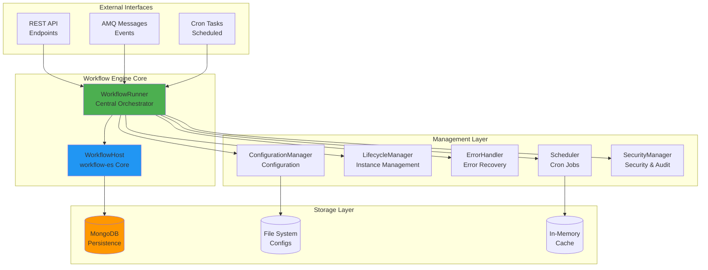
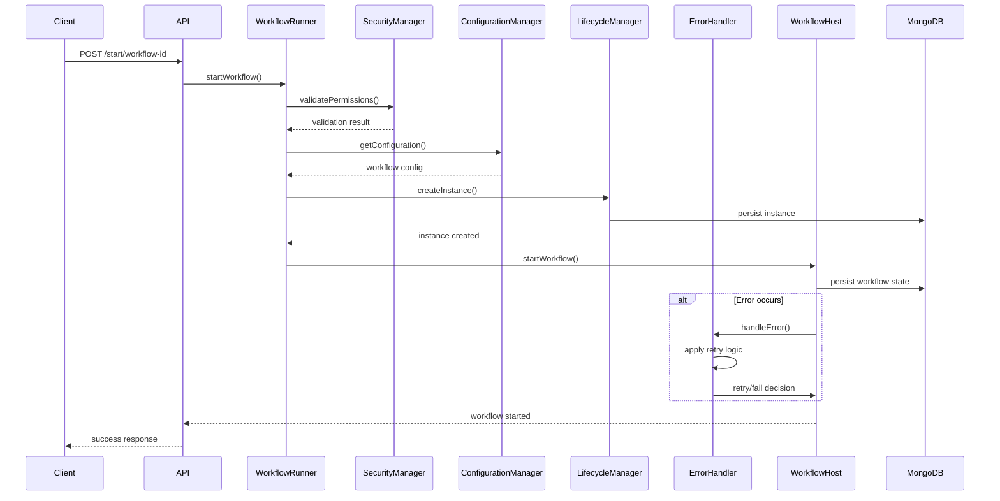
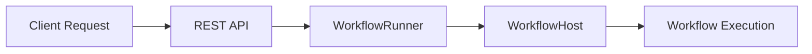
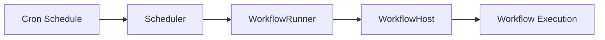
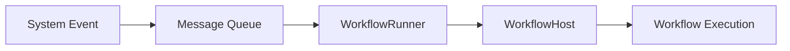
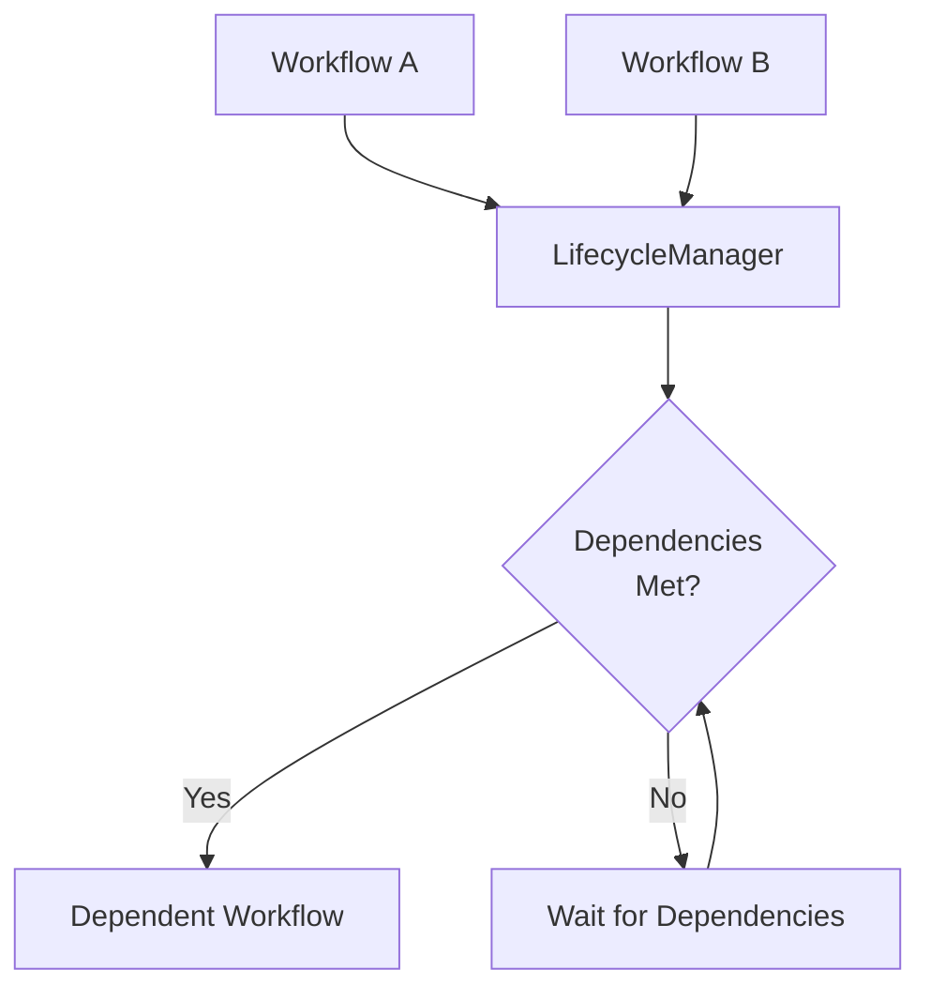
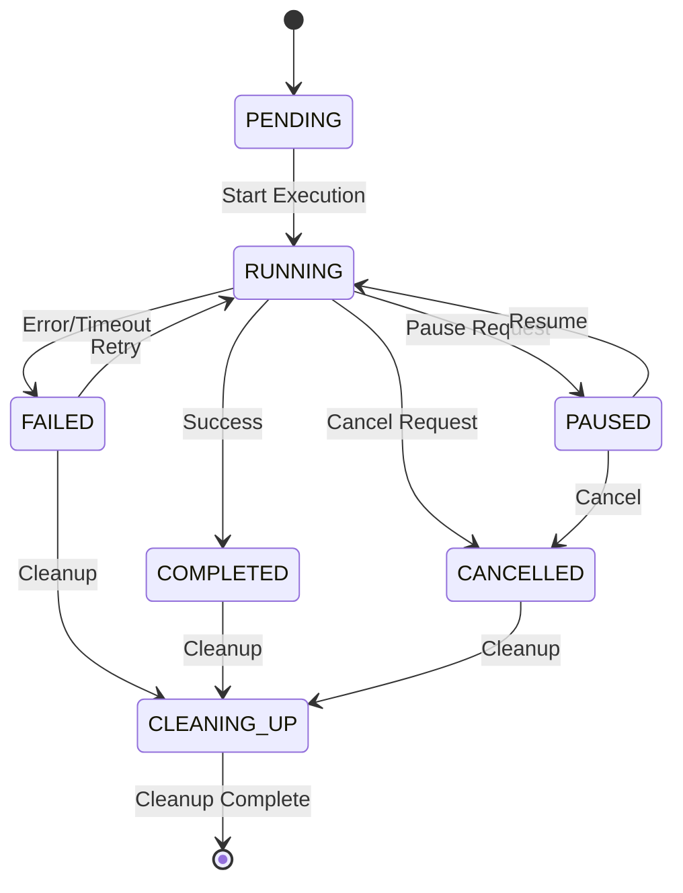
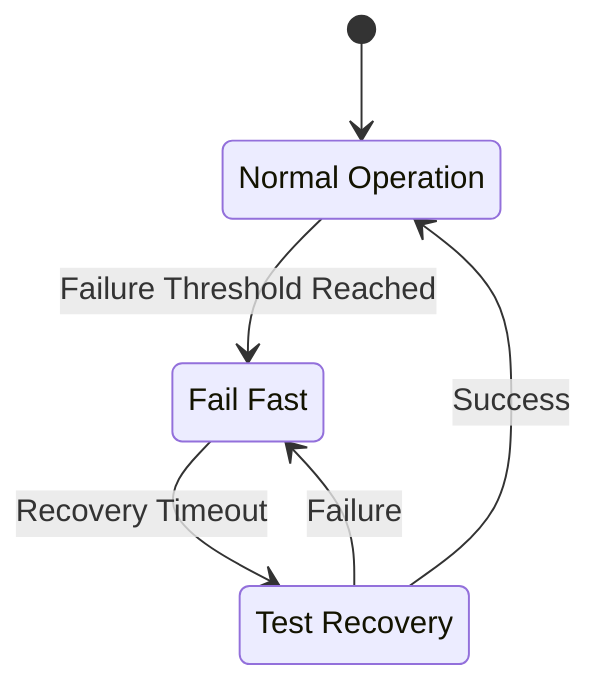
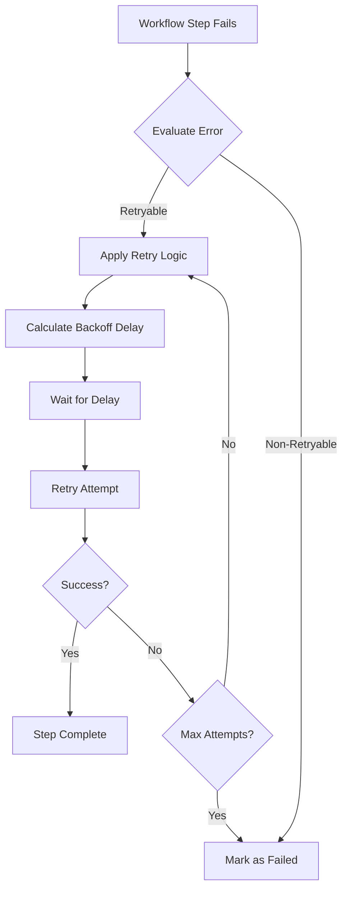
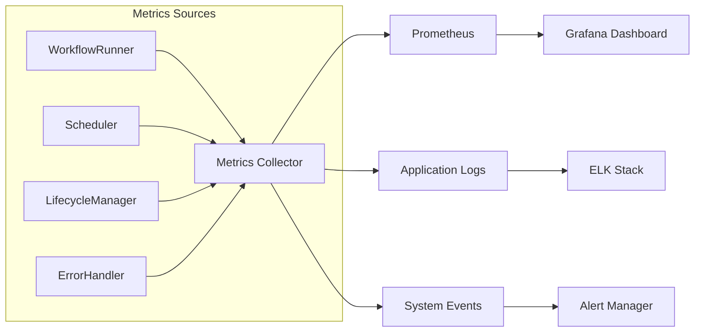

# Reactory Workflow Engine

## Overview

The Reactory Workflow Engine is a comprehensive workflow orchestration system built on top of the `workflow-es` library, enhanced with enterprise-grade features including scheduling, error handling, lifecycle management, configuration management, and security controls.

## Architecture

The workflow engine follows a modular architecture with six core components:

### Core Components

1. **WorkflowRunner** - Central orchestrator and singleton manager
2. **Scheduler** - Cron-based scheduling system  
3. **LifecycleManager** - Workflow instance lifecycle and dependency management
4. **ErrorHandler** - Comprehensive error handling with circuit breakers and retry logic
5. **ConfigurationManager** - Hot-reloadable configuration management
6. **SecurityManager** - Authentication, authorization, and audit logging

## High-Level Architecture Diagram



## Component Interaction Flow



## Modes of Workflow Invocation

### 1. Direct API Invocation

**Use Case**: On-demand workflow execution triggered by user actions or external systems.

```typescript
// REST API endpoint
POST /workflow/start/:workflowId?version=1
{
  "data": { /* workflow input data */ },
  "priority": "normal",
  "metadata": { /* additional context */ }
}
```

**Architecture Flow**:


### 2. Scheduled Execution

**Use Case**: Recurring workflows, batch processing, maintenance tasks.

```yaml
# Schedule configuration
schedules:
  - id: "daily-report"
    name: "Daily Report Generation"
    workflow:
      id: "generate-report"
      version: "1"
    schedule:
      cron: "0 9 * * *"  # Daily at 9 AM
      timezone: "UTC"
    properties:
      reportType: "daily"
```

**Architecture Flow**:


### 3. Event-Driven Execution

**Use Case**: Reactive workflows triggered by system events, message queues, or external notifications.

```typescript
// AMQ Message Handler
amq.subscribe('workflow.trigger', (message) => {
  workflowRunner.startWorkflow(
    message.workflowId, 
    message.version, 
    message.data
  );
});
```

**Architecture Flow**:


### 4. Dependency-Based Execution

**Use Case**: Complex workflows with inter-dependencies, pipeline orchestration.

```typescript
// Workflow with dependencies
const dependencyConfig = {
  workflowId: "process-results",
  dependencies: [
    { workflowId: "data-extraction", condition: "completed" },
    { workflowId: "validation", condition: "completed" }
  ]
};
```

**Architecture Flow**:


## Workflow Lifecycle States



## Error Handling and Recovery

### Circuit Breaker Pattern



### Retry Strategy



## Management Interfaces

### 1. WorkflowRunner - Central Orchestrator

**Primary Interface**: Main entry point for all workflow operations.

```typescript
class WorkflowRunner {
  // Core operations
  async initialize(): Promise<void>
  async startWorkflow(id: string, version: string, data: any): Promise<string>
  async pauseWorkflow(instanceId: string): Promise<void>
  async resumeWorkflow(instanceId: string): Promise<void>
  async cancelWorkflow(instanceId: string): Promise<void>
  
  // Management operations
  registerWorkflow(workflow: IWorkflow): void
  getWorkflowStatus(instanceId: string): WorkflowStatus
  getWorkflowStats(): Promise<IWorkflowStats>
}
```

**Use Cases**:
- Single point of entry for workflow operations
- Workflow registration and discovery
- Instance management and monitoring
- Integration with external systems

### 2. Scheduler - Time-Based Execution

**Primary Interface**: Manage cron-based workflow scheduling.

```typescript
class WorkflowScheduler {
  // Schedule management
  async addSchedule(config: IScheduleConfig): Promise<void>
  async removeSchedule(scheduleId: string): Promise<void>
  async updateSchedule(scheduleId: string, config: IScheduleConfig): Promise<void>
  
  // Monitoring
  getScheduleStatus(scheduleId: string): IScheduledWorkflow
  getSchedulerStats(): ISchedulerStats
  
  // Control
  async pauseSchedule(scheduleId: string): Promise<void>
  async resumeSchedule(scheduleId: string): Promise<void>
}
```

**Use Cases**:
- Batch processing jobs
- Recurring maintenance tasks
- Report generation
- Data synchronization
- Cleanup operations

### 3. LifecycleManager - Instance Management

**Primary Interface**: Comprehensive workflow instance lifecycle management.

```typescript
class WorkflowLifecycleManager {
  // Instance management
  async createInstance(config: IWorkflowInstance): Promise<string>
  async updateInstanceStatus(instanceId: string, status: WorkflowStatus): Promise<void>
  async addDependency(instanceId: string, dependency: IWorkflowDependency): Promise<void>
  
  // Resource management
  async checkResourceUsage(instanceId: string): Promise<ResourceUsage>
  async enforceResourceLimits(): Promise<void>
  
  // Cleanup and maintenance
  async cleanupCompletedWorkflows(): Promise<void>
  async getLifecycleStats(): Promise<IWorkflowLifecycleStats>
}
```

**Use Cases**:
- Complex workflow orchestration
- Resource-constrained environments
- Dependency management
- Performance monitoring
- Automated cleanup

### 4. ConfigurationManager - Dynamic Configuration

**Primary Interface**: Hot-reloadable configuration management.

```typescript
class ConfigurationManager {
  // Configuration operations
  async loadConfiguration(workflowId: string): Promise<IWorkflowConfig>
  async saveConfiguration(config: IWorkflowConfig): Promise<void>
  async validateConfiguration(config: IWorkflowConfig): Promise<IValidationResult>
  
  // Hot reload
  enableHotReload(): void
  disableHotReload(): void
  
  // Environment management
  getEnvironmentConfig(environment: string): Promise<IWorkflowConfig[]>
  migrateConfiguration(fromEnv: string, toEnv: string): Promise<void>
}
```

**Use Cases**:
- Environment-specific configurations
- A/B testing workflows
- Feature flags and toggles
- Runtime parameter adjustments
- Configuration validation and migration

### 5. SecurityManager - Security and Audit

**Primary Interface**: Comprehensive security and audit management.

```typescript
class SecurityManager {
  // Authentication & Authorization
  async validateUser(userId: string, token: string): Promise<IUser>
  async checkPermissions(userId: string, workflowId: string, action: string): Promise<boolean>
  
  // Rate limiting
  async checkRateLimit(userId: string, endpoint: string): Promise<IRateLimitInfo>
  
  // Audit logging
  async logAction(entry: IAuditLogEntry): Promise<void>
  async getAuditLog(filters: AuditFilters): Promise<IAuditLogEntry[]>
  
  // Security events
  async reportSecurityEvent(event: ISecurityEvent): Promise<void>
  async getSecurityEvents(): Promise<ISecurityEvent[]>
}
```

**Use Cases**:
- Multi-tenant environments
- Compliance requirements
- Security monitoring
- Access control
- Forensic analysis

## Workflow Definition Patterns

### 1. Simple Sequential Workflow

```typescript
class SimpleWorkflow implements WorkflowBase<any> {
  public id: string = "simple-workflow";
  public version: number = 1;

  public build(builder: WorkflowBuilder<any>) {
    builder
      .startWith(InitializeStep)
      .then(ProcessDataStep)
      .then(SaveResultsStep)
      .then(CleanupStep);
  }
}
```

### 2. Parallel Execution Workflow

```typescript
class ParallelWorkflow implements WorkflowBase<any> {
  public id: string = "parallel-workflow";
  public version: number = 1;

  public build(builder: WorkflowBuilder<any>) {
    builder
      .startWith(InitializeStep)
      .parallel()
        .do(branch1 => branch1
          .startWith(ProcessTypeAStep)
          .then(ValidateTypeAStep))
        .do(branch2 => branch2
          .startWith(ProcessTypeBStep)
          .then(ValidateTypeBStep))
      .joinWith(CombineResultsStep)
      .then(FinalizeStep);
  }
}
```

### 3. Conditional Workflow

```typescript
class ConditionalWorkflow implements WorkflowBase<any> {
  public id: string = "conditional-workflow";
  public version: number = 1;

  public build(builder: WorkflowBuilder<any>) {
    builder
      .startWith(CheckConditionStep)
      .if(data => data.condition === 'A')
        .do(then => then
          .startWith(ProcessPathAStep)
          .then(ValidatePathAStep))
      .if(data => data.condition === 'B')
        .do(then => then
          .startWith(ProcessPathBStep)
          .then(ValidatePathBStep))
      .then(FinalizeStep);
  }
}
```

### 4. Loop-based Workflow

```typescript
class LoopWorkflow implements WorkflowBase<any> {
  public id: string = "loop-workflow";
  public version: number = 1;

  public build(builder: WorkflowBuilder<any>) {
    builder
      .startWith(InitializeStep)
      .foreach(data => data.items)
        .do(then => then
          .startWith(ProcessItemStep)
          .then(ValidateItemStep))
      .then(AggregateResultsStep);
  }
}
```

## Monitoring and Observability

### Metrics Collection



### Key Metrics

- **Workflow Execution Metrics**
  - Execution time distribution
  - Success/failure rates
  - Queue depth and throughput
  - Resource utilization

- **System Health Metrics**
  - Circuit breaker states
  - Retry attempt rates
  - Database connection health
  - Memory and CPU usage

- **Business Metrics**
  - Workflow completion by type
  - SLA compliance
  - Error categorization
  - User activity patterns

## API Reference

### REST Endpoints

```
GET    /workflow/status                    # System health
POST   /workflow/start/:workflowId         # Start workflow
GET    /workflow/instance/:instanceId      # Get instance status
POST   /workflow/instance/:instanceId/pause # Pause instance
POST   /workflow/instance/:instanceId/resume # Resume instance
DELETE /workflow/instance/:instanceId      # Cancel instance

GET    /workflow/schedules                 # List schedules
POST   /workflow/schedules                 # Create schedule
GET    /workflow/schedules/:scheduleId     # Get schedule
PUT    /workflow/schedules/:scheduleId     # Update schedule
DELETE /workflow/schedules/:scheduleId     # Delete schedule

GET    /workflow/audit                     # Audit logs
GET    /workflow/metrics                   # System metrics
GET    /workflow/configs                   # Configuration list
```

## Configuration Examples

### Workflow Configuration

```yaml
# config/workflows/data-processing.yml
id: "data-processing"
nameSpace: "etl"
name: "Data Processing Pipeline"
version: "1.0"
enabled: true
maxRetries: 3
timeout: 300000  # 5 minutes
priority: "normal"
concurrency: 5

dependencies:
  - "data-validation"

properties:
  batchSize: 1000
  outputFormat: "json"

security:
  permissions:
    - "data:read"
    - "data:write"
  requireAuth: true
  allowedRoles:
    - "data-engineer"
    - "admin"

monitoring:
  enabled: true
  metrics:
    - "execution_time"
    - "error_rate"
  alerts:
    - "execution_timeout"
    - "high_error_rate"
```

### Schedule Configuration

```yaml
# config/schedules/daily-reports.yml
id: "daily-reports"
name: "Daily Report Generation"
description: "Generate daily reports for all clients"

workflow:
  id: "generate-reports"
  version: "1.0"
  nameSpace: "reporting"

schedule:
  cron: "0 6 * * *"  # Daily at 6 AM
  timezone: "UTC"
  enabled: true

properties:
  reportTypes:
    - "sales"
    - "inventory"
    - "analytics"
  outputPath: "/reports/daily"

retry:
  attempts: 3
  delay: 300  # 5 minutes

timeout: 1800  # 30 minutes
maxConcurrent: 1
```

## Best Practices

### 1. Workflow Design

- **Single Responsibility**: Each workflow should have a clear, single purpose
- **Idempotency**: Design workflows to be safely retryable
- **Error Handling**: Include explicit error handling for all external dependencies
- **Resource Management**: Consider memory and CPU usage in long-running workflows
- **State Management**: Keep workflow state minimal and serializable

### 2. Configuration Management

- **Environment Separation**: Use separate configurations for different environments
- **Version Control**: Store configurations in version control
- **Validation**: Always validate configurations before deployment
- **Documentation**: Document all configuration parameters and their effects

### 3. Security

- **Principle of Least Privilege**: Grant minimal necessary permissions
- **Input Validation**: Validate all input data and parameters
- **Audit Logging**: Log all significant actions and access attempts
- **Rate Limiting**: Implement appropriate rate limits for API endpoints

### 4. Monitoring

- **Comprehensive Metrics**: Monitor both technical and business metrics
- **Alerting**: Set up alerts for critical failures and performance degradation
- **Dashboard**: Create operational dashboards for real-time monitoring
- **Trend Analysis**: Track metrics over time to identify patterns

### 5. Performance

- **Connection Pooling**: Use connection pooling for database access
- **Caching**: Implement appropriate caching strategies
- **Batching**: Process data in batches when possible
- **Resource Limits**: Set appropriate resource limits and timeouts

## Troubleshooting Guide

### Common Issues

1. **Workflow Stuck in Running State**
   - Check for deadlocks in workflow steps
   - Verify database connectivity
   - Review step timeout configurations

2. **High Error Rates**
   - Examine error handler logs
   - Check circuit breaker states
   - Verify external service availability

3. **Performance Issues**
   - Monitor resource utilization
   - Check database query performance
   - Review workflow concurrency settings

4. **Schedule Not Executing**
   - Verify cron expression syntax
   - Check scheduler service status
   - Review schedule configuration

## Future Enhancements

- **Workflow Designer UI**: Visual workflow builder interface
- **Advanced Analytics**: Machine learning-based performance optimization
- **Multi-Region Support**: Distributed workflow execution
- **Workflow Versioning**: Advanced version management and migration
- **Integration Hub**: Pre-built connectors for common services
- **Real-time Streaming**: Support for real-time data processing workflows

---

This documentation provides a comprehensive overview of the Reactory Workflow Engine. For specific implementation details, refer to the individual component documentation and code examples in the samples directory.