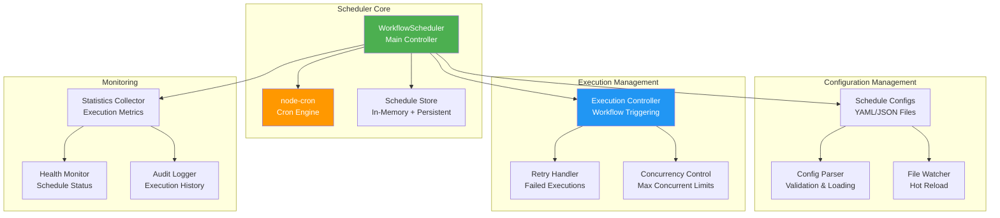
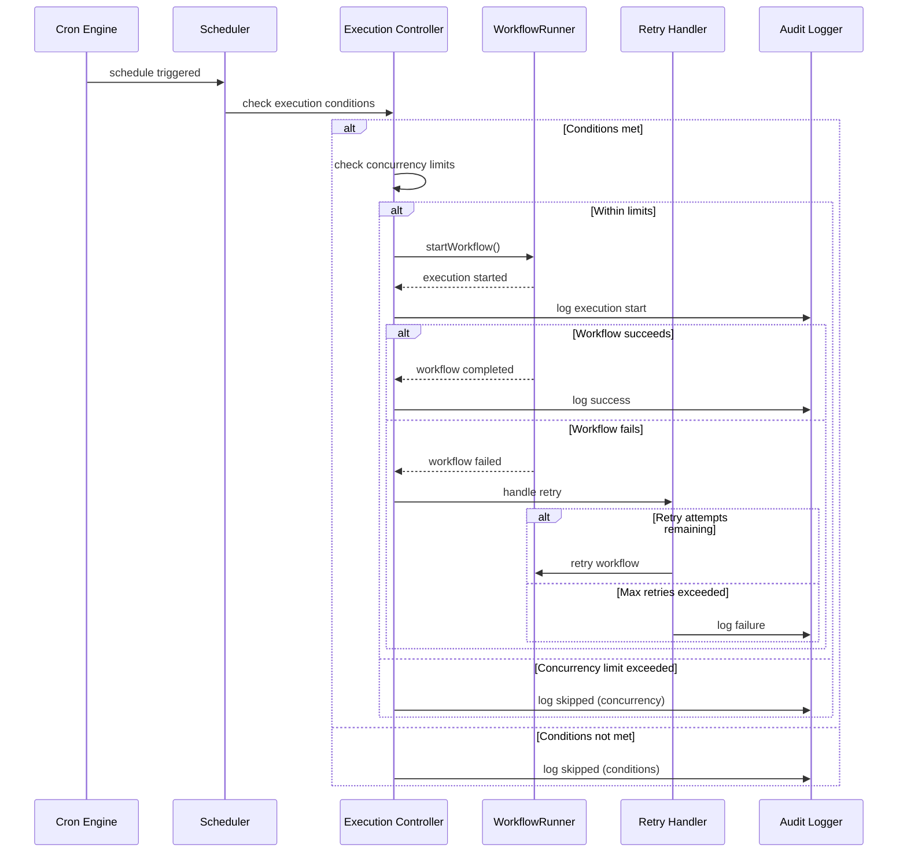
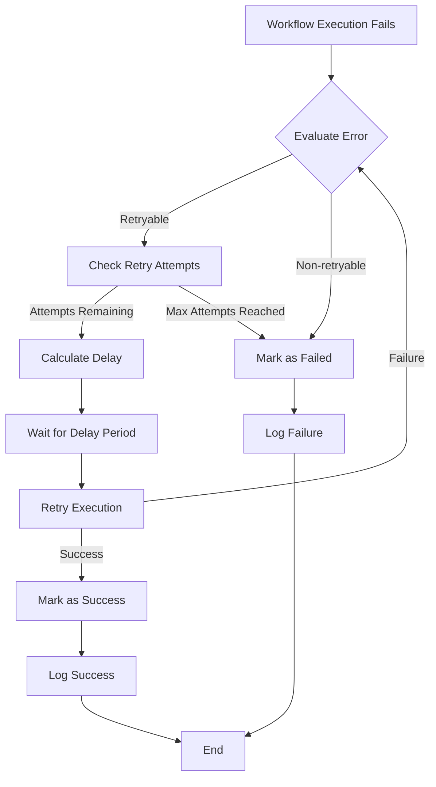

# WorkflowScheduler - Time-Based Workflow Execution

## Overview

The `WorkflowScheduler` provides cron-based scheduling capabilities for the workflow engine. It allows workflows to be executed automatically based on time schedules, with support for complex scheduling patterns, timezone handling, retry logic, and comprehensive monitoring.

## Architecture



## Key Features

### 1. Flexible Scheduling
- **Cron Expressions**: Full cron syntax support with seconds precision
- **Timezone Support**: Schedule workflows in specific timezones
- **Multiple Schedules**: Single workflow can have multiple schedules
- **Dynamic Scheduling**: Add/remove schedules at runtime

### 2. Robust Execution
- **Retry Logic**: Configurable retry attempts with exponential backoff
- **Timeout Handling**: Per-schedule timeout configurations
- **Concurrency Control**: Limit concurrent executions per schedule
- **Overlap Prevention**: Prevent overlapping executions of the same schedule

### 3. Configuration Management
- **File-based Configuration**: YAML/JSON configuration files
- **Hot Reload**: Automatic reload when configuration files change
- **Validation**: Comprehensive configuration validation
- **Environment Support**: Environment-specific configurations

### 4. Monitoring & Observability
- **Execution Statistics**: Track runs, errors, and performance
- **Health Monitoring**: Monitor schedule health and status
- **Audit Logging**: Complete execution history
- **Real-time Metrics**: Live monitoring of scheduler performance

## Schedule Configuration

### Basic Schedule Configuration

```yaml
# schedules/basic-schedule.yml
id: "daily-report"
name: "Daily Report Generation"
description: "Generate daily reports at 9 AM every day"

workflow:
  id: "generate-report"
  version: "1.0"
  nameSpace: "reporting"

schedule:
  cron: "0 9 * * *"          # Daily at 9:00 AM
  timezone: "America/New_York"
  enabled: true

properties:
  reportType: "daily"
  outputFormat: "pdf"
  emailRecipients:
    - "manager@company.com"
    - "team@company.com"

retry:
  attempts: 3
  delay: 300  # 5 minutes between retries

timeout: 1800  # 30 minutes
maxConcurrent: 1
```

### Advanced Schedule Configuration

```yaml
# schedules/complex-schedule.yml
id: "data-sync"
name: "Data Synchronization"
description: "Sync data every 15 minutes during business hours"

workflow:
  id: "sync-data"
  version: "2.0"
  nameSpace: "integration"

schedule:
  cron: "0 */15 8-17 * * 1-5"  # Every 15 min, 8AM-5PM, Mon-Fri
  timezone: "UTC"
  enabled: true

properties:
  syncType: "incremental"
  batchSize: 1000
  targets:
    - "database"
    - "elasticsearch"
    - "cache"

retry:
  attempts: 5
  delay: 60   # 1 minute initial delay
  backoffMultiplier: 2.0
  maxDelay: 600  # 10 minutes max delay

timeout: 900    # 15 minutes
maxConcurrent: 2

conditions:
  skipIfPreviousRunning: true
  skipOnHolidays: true
  requiredServices:
    - "database"
    - "api-gateway"
```

## Cron Expression Reference

### Standard Cron Format
```
┌───────────── second (0-59)
│ ┌─────────── minute (0-59)
│ │ ┌───────── hour (0-23)
│ │ │ ┌─────── day of month (1-31)
│ │ │ │ ┌───── month (1-12)
│ │ │ │ │ ┌─── day of week (0-7, 0 and 7 are Sunday)
│ │ │ │ │ │
* * * * * *
```

### Common Cron Patterns

```yaml
# Every minute
cron: "0 * * * * *"

# Every hour at minute 0
cron: "0 0 * * * *"

# Daily at 2:30 AM
cron: "0 30 2 * * *"

# Every weekday at 9 AM
cron: "0 0 9 * * 1-5"

# First day of every month at midnight
cron: "0 0 0 1 * *"

# Every 15 minutes during business hours (9 AM - 5 PM)
cron: "0 */15 9-17 * * *"

# Twice a day at 9 AM and 6 PM
cron: "0 0 9,18 * * *"
```

## Usage Examples

### Creating and Managing Schedules

```typescript
import { WorkflowScheduler, IScheduleConfig } from './Scheduler';

// Initialize scheduler
const scheduler = new WorkflowScheduler(workflowRunner);
await scheduler.initialize();

// Add a new schedule
const scheduleConfig: IScheduleConfig = {
  id: 'backup-job',
  name: 'Database Backup',
  description: 'Daily database backup at midnight',
  workflow: {
    id: 'database-backup',
    version: '1.0'
  },
  schedule: {
    cron: '0 0 0 * * *',
    timezone: 'UTC',
    enabled: true
  },
  properties: {
    backupType: 'full',
    retention: 30
  },
  retry: {
    attempts: 3,
    delay: 600
  },
  timeout: 3600000, // 1 hour
  maxConcurrent: 1
};

await scheduler.addSchedule(scheduleConfig);

// Update schedule
scheduleConfig.schedule.cron = '0 0 2 * * *'; // Change to 2 AM
await scheduler.updateSchedule('backup-job', scheduleConfig);

// Pause schedule
await scheduler.pauseSchedule('backup-job');

// Resume schedule
await scheduler.resumeSchedule('backup-job');

// Remove schedule
await scheduler.removeSchedule('backup-job');
```

### Loading Schedules from Configuration Files

```typescript
// Load schedules from directory
await scheduler.loadSchedulesFromDirectory('./config/schedules');

// Load specific schedule file
await scheduler.loadScheduleFromFile('./config/schedules/daily-reports.yml');

// Enable hot reload for configuration changes
scheduler.enableHotReload('./config/schedules');
```

### Monitoring and Statistics

```typescript
// Get overall scheduler statistics
const stats = scheduler.getSchedulerStats();
console.log(`Total schedules: ${stats.totalSchedules}`);
console.log(`Active schedules: ${stats.activeSchedules}`);
console.log(`Total runs: ${stats.totalRuns}`);
console.log(`Total errors: ${stats.totalErrors}`);

// Get specific schedule status
const scheduleStatus = scheduler.getScheduleStatus('daily-report');
console.log(`Last run: ${scheduleStatus.lastRun}`);
console.log(`Next run: ${scheduleStatus.nextRun}`);
console.log(`Run count: ${scheduleStatus.runCount}`);
console.log(`Error count: ${scheduleStatus.errorCount}`);

// Get execution history
const history = await scheduler.getExecutionHistory('daily-report', {
  limit: 10,
  fromDate: new Date('2023-01-01'),
  toDate: new Date('2023-12-31')
});
```

## Execution Flow



## Error Handling and Retry Logic

### Retry Configuration

```typescript
interface IRetryConfig {
  attempts: number;           // Maximum retry attempts
  delay: number;              // Initial delay in seconds
  backoffMultiplier?: number; // Exponential backoff multiplier
  maxDelay?: number;          // Maximum delay between retries
  retryOn?: string[];         // Error types to retry on
  skipOn?: string[];          // Error types to skip retries
}
```

### Retry Execution Flow



---

This documentation provides comprehensive coverage of the WorkflowScheduler component with detailed examples, configuration options, and best practices for time-based workflow execution.
