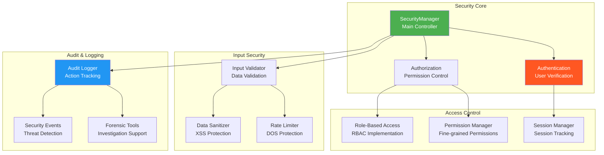
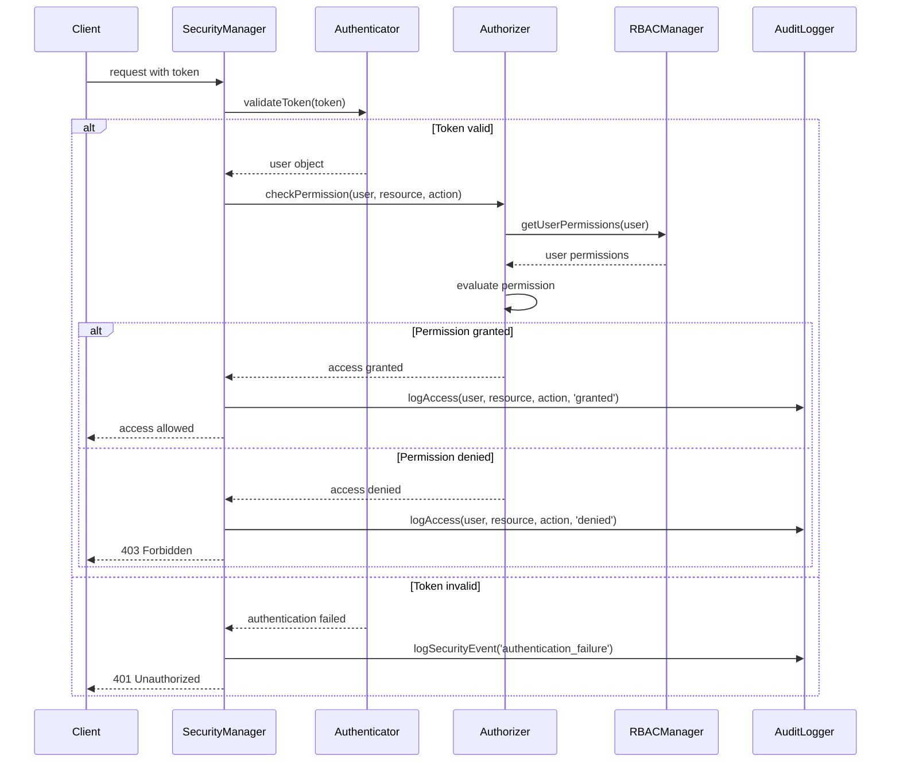

# SecurityManager - Security and Audit Management

## Overview

The `SecurityManager` provides comprehensive security controls, authentication, authorization, and audit logging for the workflow engine. It implements role-based access control, input validation, rate limiting, and detailed audit trails to ensure secure workflow execution.

## Architecture



## Key Features

### 1. Authentication & Authorization
- **Multi-factor Authentication**: Support for MFA and SSO
- **Role-Based Access Control**: Hierarchical role management
- **Fine-grained Permissions**: Granular permission control
- **Session Management**: Secure session handling with timeouts

### 2. Input Security
- **Input Validation**: Schema-based input validation
- **Data Sanitization**: XSS and injection prevention
- **Rate Limiting**: Per-user and per-endpoint rate limits
- **Request Size Limits**: Prevent oversized requests

### 3. Audit & Compliance
- **Comprehensive Audit Logs**: Track all user actions
- **Security Event Detection**: Real-time threat detection
- **Compliance Reporting**: Generate compliance reports
- **Forensic Analysis**: Investigation and analysis tools

### 4. Data Protection
- **Encryption at Rest**: Encrypt sensitive data
- **Encryption in Transit**: TLS/SSL enforcement
- **Data Masking**: Mask sensitive data in logs
- **Access Logging**: Track data access patterns

## User Management

### User Model

```typescript
interface IUser {
  id: string;                    // Unique user identifier
  username: string;              // Username for login
  email: string;                 // User email address
  roles: string[];               // Assigned roles
  permissions: string[];         // Direct permissions
  active: boolean;               // Account status
  lastLogin?: Date;              // Last login timestamp
  metadata?: {
    department?: string;         // User department
    manager?: string;            // Manager user ID
    location?: string;           // User location
    clearanceLevel?: number;     // Security clearance level
  };
  preferences?: {
    timezone?: string;           // User timezone
    language?: string;           // Preferred language
    notifications?: boolean;     // Email notifications enabled
  };
}
```

### Role and Permission Model

```typescript
interface IRole {
  id: string;                    // Unique role identifier
  name: string;                  // Role display name
  description: string;           // Role description
  permissions: string[];         // Permissions granted by this role
  inherits?: string[];           // Parent roles to inherit from
  constraints?: {
    timeRestrictions?: {         // Time-based access restrictions
      allowedHours: [number, number];  // [start, end] hours (24h format)
      allowedDays: number[];     // Days of week (0=Sunday)
      timezone: string;          // Timezone for restrictions
    };
    ipRestrictions?: string[];   // Allowed IP addresses/CIDR blocks
    locationRestrictions?: string[];  // Allowed geographic locations
  };
}

interface IPermission {
  id: string;                    // Permission identifier
  resource: string;              // Resource type (workflow, schedule, config)
  action: string;                // Action (read, write, execute, delete)
  conditions?: {
    resourcePattern?: string;    // Resource pattern matching
    contextRequired?: string[];  // Required context fields
    timeLimit?: number;          // Permission time limit (ms)
  };
}
```

### Permission Examples

```typescript
// Predefined workflow permissions
const WORKFLOW_PERMISSIONS = {
  // Workflow execution permissions
  WORKFLOW_EXECUTE: 'workflow:execute',
  WORKFLOW_PAUSE: 'workflow:pause',
  WORKFLOW_RESUME: 'workflow:resume',
  WORKFLOW_CANCEL: 'workflow:cancel',
  WORKFLOW_RETRY: 'workflow:retry',
  
  // Workflow management permissions
  WORKFLOW_CREATE: 'workflow:create',
  WORKFLOW_UPDATE: 'workflow:update',
  WORKFLOW_DELETE: 'workflow:delete',
  WORKFLOW_VIEW: 'workflow:view',
  
  // Schedule management permissions
  SCHEDULE_CREATE: 'schedule:create',
  SCHEDULE_UPDATE: 'schedule:update',
  SCHEDULE_DELETE: 'schedule:delete',
  SCHEDULE_VIEW: 'schedule:view',
  
  // Configuration permissions
  CONFIG_READ: 'config:read',
  CONFIG_WRITE: 'config:write',
  CONFIG_VALIDATE: 'config:validate',
  
  // Security permissions
  AUDIT_VIEW: 'audit:view',
  SECURITY_MANAGE: 'security:manage',
  USER_MANAGE: 'user:manage',
  
  // System permissions
  SYSTEM_MONITOR: 'system:monitor',
  SYSTEM_ADMIN: 'system:admin'
};

// Role definitions
const PREDEFINED_ROLES = {
  ADMIN: {
    id: 'admin',
    name: 'Administrator',
    description: 'Full system access',
    permissions: Object.values(WORKFLOW_PERMISSIONS)
  },
  
  OPERATOR: {
    id: 'operator',
    name: 'Workflow Operator',
    description: 'Can execute and manage workflows',
    permissions: [
      WORKFLOW_PERMISSIONS.WORKFLOW_EXECUTE,
      WORKFLOW_PERMISSIONS.WORKFLOW_PAUSE,
      WORKFLOW_PERMISSIONS.WORKFLOW_RESUME,
      WORKFLOW_PERMISSIONS.WORKFLOW_CANCEL,
      WORKFLOW_PERMISSIONS.WORKFLOW_VIEW,
      WORKFLOW_PERMISSIONS.SCHEDULE_VIEW,
      WORKFLOW_PERMISSIONS.CONFIG_READ
    ]
  },
  
  DEVELOPER: {
    id: 'developer',
    name: 'Workflow Developer',
    description: 'Can create and modify workflows',
    permissions: [
      WORKFLOW_PERMISSIONS.WORKFLOW_CREATE,
      WORKFLOW_PERMISSIONS.WORKFLOW_UPDATE,
      WORKFLOW_PERMISSIONS.WORKFLOW_VIEW,
      WORKFLOW_PERMISSIONS.SCHEDULE_CREATE,
      WORKFLOW_PERMISSIONS.SCHEDULE_UPDATE,
      WORKFLOW_PERMISSIONS.CONFIG_READ,
      WORKFLOW_PERMISSIONS.CONFIG_VALIDATE
    ]
  },
  
  VIEWER: {
    id: 'viewer',
    name: 'Read-Only User',
    description: 'Can view workflows and schedules',
    permissions: [
      WORKFLOW_PERMISSIONS.WORKFLOW_VIEW,
      WORKFLOW_PERMISSIONS.SCHEDULE_VIEW,
      WORKFLOW_PERMISSIONS.CONFIG_READ
    ]
  }
};
```

## Authorization Flow

### Permission Checking Process



### Authorization Implementation

```typescript
class AuthorizationManager {
  async checkPermission(
    user: IUser,
    resource: string,
    action: string,
    context?: any
  ): Promise<boolean> {
    // Check if user is active
    if (!user.active) {
      await this.auditLogger.logSecurityEvent({
        type: 'authorization_failure',
        userId: user.id,
        reason: 'inactive_user',
        resource,
        action
      });
      return false;
    }

    // Get all user permissions (direct + role-based)
    const userPermissions = await this.getUserPermissions(user);

    // Check for exact permission match
    const requiredPermission = `${resource}:${action}`;
    if (userPermissions.includes(requiredPermission)) {
      return true;
    }

    // Check for wildcard permissions
    const wildcardPermission = `${resource}:*`;
    if (userPermissions.includes(wildcardPermission)) {
      return true;
    }

    // Check for admin permissions
    if (userPermissions.includes('*:*') || userPermissions.includes('system:admin')) {
      return true;
    }

    // Check contextual permissions
    if (context) {
      const contextualMatch = await this.checkContextualPermissions(
        user,
        resource,
        action,
        context
      );
      if (contextualMatch) {
        return true;
      }
    }

    return false;
  }

  private async getUserPermissions(user: IUser): Promise<string[]> {
    const permissions = new Set<string>();

    // Add direct permissions
    user.permissions.forEach(permission => permissions.add(permission));

    // Add role-based permissions
    for (const roleId of user.roles) {
      const role = await this.getRoleById(roleId);
      if (role) {
        role.permissions.forEach(permission => permissions.add(permission));
        
        // Handle role inheritance
        if (role.inherits) {
          const inheritedPermissions = await this.getInheritedPermissions(role.inherits);
          inheritedPermissions.forEach(permission => permissions.add(permission));
        }
      }
    }

    return Array.from(permissions);
  }

  private async checkContextualPermissions(
    user: IUser,
    resource: string,
    action: string,
    context: any
  ): Promise<boolean> {
    // Check if user owns the resource
    if (context.ownerId === user.id) {
      const ownerPermission = `${resource}:${action}:own`;
      const userPermissions = await this.getUserPermissions(user);
      return userPermissions.includes(ownerPermission);
    }

    // Check department-based permissions
    if (context.department && user.metadata?.department === context.department) {
      const deptPermission = `${resource}:${action}:department`;
      const userPermissions = await this.getUserPermissions(user);
      return userPermissions.includes(deptPermission);
    }

    return false;
  }
}
```

## Input Validation and Sanitization

### Input Validation Framework

```typescript
interface IInputValidationRule {
  field: string;                 // Field name to validate
  type: 'string' | 'number' | 'boolean' | 'object' | 'array';
  required?: boolean;            // Whether field is required
  minLength?: number;            // Minimum length for strings
  maxLength?: number;            // Maximum length for strings
  pattern?: string;              // Regex pattern for validation
  allowedValues?: any[];         // Enumerated allowed values
  customValidator?: string;      // Custom validator function name
}

interface IInputValidationSchema {
  name: string;                  // Schema name
  description: string;           // Schema description
  rules: IInputValidationRule[]; // Validation rules
  strictMode?: boolean;          // Reject unknown fields
}

class InputValidator {
  private schemas: Map<string, IInputValidationSchema> = new Map();
  private customValidators: Map<string, (value: any, context?: any) => boolean> = new Map();

  registerSchema(schema: IInputValidationSchema): void {
    this.schemas.set(schema.name, schema);
  }

  registerCustomValidator(
    name: string,
    validator: (value: any, context?: any) => boolean
  ): void {
    this.customValidators.set(name, validator);
  }

  async validateInput(
    data: any,
    schemaName: string,
    context?: any
  ): Promise<IInputValidationResult> {
    const schema = this.schemas.get(schemaName);
    if (!schema) {
      return {
        isValid: false,
        errors: [`Schema '${schemaName}' not found`],
        warnings: []
      };
    }

    const errors: string[] = [];
    const warnings: string[] = [];
    const sanitizedData: any = {};

    // Check for unknown fields in strict mode
    if (schema.strictMode) {
      const knownFields = new Set(schema.rules.map(rule => rule.field));
      const unknownFields = Object.keys(data).filter(field => !knownFields.has(field));
      if (unknownFields.length > 0) {
        errors.push(`Unknown fields: ${unknownFields.join(', ')}`);
      }
    }

    // Validate each field
    for (const rule of schema.rules) {
      const fieldValue = data[rule.field];
      const fieldErrors = await this.validateField(fieldValue, rule, context);
      
      if (fieldErrors.length > 0) {
        errors.push(...fieldErrors.map(error => `${rule.field}: ${error}`));
      } else {
        // Sanitize and include valid field
        sanitizedData[rule.field] = this.sanitizeField(fieldValue, rule);
      }
    }

    return {
      isValid: errors.length === 0,
      errors,
      warnings,
      sanitizedData: errors.length === 0 ? sanitizedData : undefined
    };
  }

  private async validateField(
    value: any,
    rule: IInputValidationRule,
    context?: any
  ): Promise<string[]> {
    const errors: string[] = [];

    // Check required fields
    if (rule.required && (value === undefined || value === null || value === '')) {
      errors.push('is required');
      return errors;
    }

    // Skip validation for optional empty fields
    if (!rule.required && (value === undefined || value === null)) {
      return errors;
    }

    // Type validation
    if (!this.validateType(value, rule.type)) {
      errors.push(`must be of type ${rule.type}`);
      return errors;
    }

    // String validations
    if (rule.type === 'string' && typeof value === 'string') {
      if (rule.minLength && value.length < rule.minLength) {
        errors.push(`must be at least ${rule.minLength} characters long`);
      }
      if (rule.maxLength && value.length > rule.maxLength) {
        errors.push(`must be no more than ${rule.maxLength} characters long`);
      }
      if (rule.pattern && !new RegExp(rule.pattern).test(value)) {
        errors.push(`does not match required pattern`);
      }
    }

    // Allowed values validation
    if (rule.allowedValues && !rule.allowedValues.includes(value)) {
      errors.push(`must be one of: ${rule.allowedValues.join(', ')}`);
    }

    // Custom validation
    if (rule.customValidator) {
      const validator = this.customValidators.get(rule.customValidator);
      if (validator && !validator(value, context)) {
        errors.push(`failed custom validation`);
      }
    }

    return errors;
  }

  private sanitizeField(value: any, rule: IInputValidationRule): any {
    if (rule.type === 'string' && typeof value === 'string') {
      // Basic XSS protection
      return this.sanitizeString(value);
    }
    return value;
  }

  private sanitizeString(input: string): string {
    return input
      .replace(/</g, '&lt;')
      .replace(/>/g, '&gt;')
      .replace(/"/g, '&quot;')
      .replace(/'/g, '&#x27;')
      .replace(/\//g, '&#x2F;');
  }
}
```

### Predefined Validation Schemas

```typescript
const WORKFLOW_VALIDATION_SCHEMAS = {
  START_WORKFLOW: {
    name: 'start_workflow',
    description: 'Validation for workflow start requests',
    strictMode: true,
    rules: [
      {
        field: 'workflowId',
        type: 'string',
        required: true,
        pattern: '^[a-z0-9-]+$',
        maxLength: 100
      },
      {
        field: 'version',
        type: 'string',
        required: true,
        pattern: '^\\d+\\.\\d+(\\.\\d+)?$'
      },
      {
        field: 'data',
        type: 'object',
        required: false
      },
      {
        field: 'priority',
        type: 'string',
        required: false,
        allowedValues: ['low', 'normal', 'high', 'critical']
      },
      {
        field: 'timeout',
        type: 'number',
        required: false,
        customValidator: 'validateTimeout'
      }
    ]
  },
  
  CREATE_SCHEDULE: {
    name: 'create_schedule',
    description: 'Validation for schedule creation',
    strictMode: true,
    rules: [
      {
        field: 'id',
        type: 'string',
        required: true,
        pattern: '^[a-z0-9-]+$',
        maxLength: 50
      },
      {
        field: 'name',
        type: 'string',
        required: true,
        minLength: 1,
        maxLength: 200
      },
      {
        field: 'cron',
        type: 'string',
        required: true,
        customValidator: 'validateCronExpression'
      },
      {
        field: 'timezone',
        type: 'string',
        required: false,
        customValidator: 'validateTimezone'
      },
      {
        field: 'enabled',
        type: 'boolean',
        required: false
      }
    ]
  }
};

// Custom validators
const CUSTOM_VALIDATORS = {
  validateTimeout: (value: number): boolean => {
    return value > 0 && value <= 3600000; // Max 1 hour
  },
  
  validateCronExpression: (value: string): boolean => {
    const cronRegex = /^(\*|[0-9]|[1-5][0-9])\s+(\*|[0-9]|[1-5][0-9])\s+(\*|[0-9]|1[0-9]|2[0-3])\s+(\*|[1-9]|[12][0-9]|3[01])\s+(\*|[1-9]|1[0-2])\s+(\*|[0-6])$/;
    return cronRegex.test(value);
  },
  
  validateTimezone: (value: string): boolean => {
    try {
      Intl.DateTimeFormat(undefined, { timeZone: value });
      return true;
    } catch {
      return false;
    }
  }
};
```

## Rate Limiting

### Rate Limiting Implementation

```typescript
interface IRateLimitConfig {
  windowMs: number;              // Time window in milliseconds
  maxRequests: number;           // Maximum requests per window
  skipSuccessfulRequests?: boolean;  // Don't count successful requests
  skipFailedRequests?: boolean;      // Don't count failed requests
  keyGenerator?: (req: any) => string;  // Custom key generation
  onLimitReached?: (req: any) => void;  // Callback when limit reached
}

class RateLimiter {
  private store: Map<string, { count: number; resetTime: number }> = new Map();
  private cleanupInterval: NodeJS.Timeout;

  constructor(private config: IRateLimitConfig) {
    // Clean up expired entries periodically
    this.cleanupInterval = setInterval(() => {
      this.cleanup();
    }, this.config.windowMs);
  }

  async checkRateLimit(identifier: string): Promise<IRateLimitInfo> {
    const now = Date.now();
    const key = identifier;
    const window = this.store.get(key);
    
    if (!window || now > window.resetTime) {
      // New window or expired window
      const newWindow = {
        count: 1,
        resetTime: now + this.config.windowMs
      };
      this.store.set(key, newWindow);
      
      return {
        current: 1,
        limit: this.config.maxRequests,
        window: this.config.windowMs,
        resetTime: new Date(newWindow.resetTime)
      };
    }
    
    // Increment counter
    window.count++;
    this.store.set(key, window);
    
    return {
      current: window.count,
      limit: this.config.maxRequests,
      window: this.config.windowMs,
      resetTime: new Date(window.resetTime)
    };
  }

  async isRateLimited(identifier: string): Promise<boolean> {
    const info = await this.checkRateLimit(identifier);
    return info.current > info.limit;
  }

  private cleanup(): void {
    const now = Date.now();
    for (const [key, window] of this.store.entries()) {
      if (now > window.resetTime) {
        this.store.delete(key);
      }
    }
  }

  destroy(): void {
    clearInterval(this.cleanupInterval);
    this.store.clear();
  }
}

// Rate limit configurations
const RATE_LIMIT_CONFIGS = {
  API_GENERAL: {
    windowMs: 60 * 1000,        // 1 minute
    maxRequests: 100            // 100 requests per minute
  },
  
  WORKFLOW_START: {
    windowMs: 60 * 1000,        // 1 minute
    maxRequests: 10             // 10 workflow starts per minute
  },
  
  LOGIN_ATTEMPTS: {
    windowMs: 15 * 60 * 1000,   // 15 minutes
    maxRequests: 5              // 5 login attempts per 15 minutes
  },
  
  CONFIGURATION_UPDATES: {
    windowMs: 5 * 60 * 1000,    // 5 minutes
    maxRequests: 20             // 20 config updates per 5 minutes
  }
};
```

## Audit Logging

### Audit Log Structure

```typescript
interface IAuditLogEntry {
  id: string;                    // Unique log entry ID
  timestamp: Date;               // When the action occurred
  userId?: string;               // User who performed the action
  username?: string;             // Username for the action
  action: string;                // Action performed
  resource: string;              // Resource affected
  resourceId: string;            // Specific resource identifier
  details: Record<string, any>;  // Additional action details
  ipAddress?: string;            // Source IP address
  userAgent?: string;            // User agent string
  success: boolean;              // Whether action was successful
  error?: string;                // Error message if failed
  sessionId?: string;            // Session identifier
  metadata?: {
    correlationId?: string;      // For tracking related actions
    workflowInstanceId?: string; // Related workflow instance
    duration?: number;           // Action duration in milliseconds
    dataSize?: number;           // Size of data involved
  };
}

interface ISecurityEvent {
  id: string;                    // Unique event ID
  timestamp: Date;               // When the event occurred
  type: 'permission_denied' | 'rate_limit_exceeded' | 'suspicious_activity' | 
        'authentication_failure' | 'authorization_failure' | 'data_breach_attempt';
  severity: 'low' | 'medium' | 'high' | 'critical';
  userId?: string;               // User involved (if any)
  username?: string;             // Username involved
  ipAddress?: string;            // Source IP address
  details: Record<string, any>;  // Event-specific details
  resolved: boolean;             // Whether event has been resolved
  resolution?: string;           // Resolution details
  investigationNotes?: string[]; // Investigation notes
}
```

### Audit Logger Implementation

```typescript
class AuditLogger {
  private logStore: IAuditLogEntry[] = [];
  private securityEvents: ISecurityEvent[] = [];
  private maxLogSize: number = 100000; // Max 100k entries in memory
  private persistenceEnabled: boolean = true;

  async logAction(entry: Omit<IAuditLogEntry, 'id' | 'timestamp'>): Promise<void> {
    const auditEntry: IAuditLogEntry = {
      id: this.generateId(),
      timestamp: new Date(),
      ...entry
    };

    // Add to in-memory store
    this.logStore.push(auditEntry);
    
    // Maintain size limit
    if (this.logStore.length > this.maxLogSize) {
      this.logStore.shift(); // Remove oldest entry
    }

    // Persist to storage if enabled
    if (this.persistenceEnabled) {
      await this.persistAuditEntry(auditEntry);
    }

    // Check for security patterns
    await this.analyzeForSecurityEvents(auditEntry);

    logger.debug('Audit entry logged', {
      action: auditEntry.action,
      resource: auditEntry.resource,
      userId: auditEntry.userId,
      success: auditEntry.success
    });
  }

  async logSecurityEvent(event: Omit<ISecurityEvent, 'id' | 'timestamp'>): Promise<void> {
    const securityEvent: ISecurityEvent = {
      id: this.generateId(),
      timestamp: new Date(),
      resolved: false,
      ...event
    };

    this.securityEvents.push(securityEvent);
    
    // Persist security event
    if (this.persistenceEnabled) {
      await this.persistSecurityEvent(securityEvent);
    }

    // Alert on high/critical severity events
    if (securityEvent.severity === 'high' || securityEvent.severity === 'critical') {
      await this.sendSecurityAlert(securityEvent);
    }

    logger.warn('Security event logged', {
      type: securityEvent.type,
      severity: securityEvent.severity,
      userId: securityEvent.userId
    });
  }

  async getAuditLog(filters: {
    userId?: string;
    action?: string;
    resource?: string;
    fromDate?: Date;
    toDate?: Date;
    success?: boolean;
    limit?: number;
  }): Promise<IAuditLogEntry[]> {
    let filteredLogs = this.logStore;

    // Apply filters
    if (filters.userId) {
      filteredLogs = filteredLogs.filter(log => log.userId === filters.userId);
    }
    if (filters.action) {
      filteredLogs = filteredLogs.filter(log => log.action === filters.action);
    }
    if (filters.resource) {
      filteredLogs = filteredLogs.filter(log => log.resource === filters.resource);
    }
    if (filters.fromDate) {
      filteredLogs = filteredLogs.filter(log => log.timestamp >= filters.fromDate!);
    }
    if (filters.toDate) {
      filteredLogs = filteredLogs.filter(log => log.timestamp <= filters.toDate!);
    }
    if (filters.success !== undefined) {
      filteredLogs = filteredLogs.filter(log => log.success === filters.success);
    }

    // Sort by timestamp (newest first)
    filteredLogs.sort((a, b) => b.timestamp.getTime() - a.timestamp.getTime());

    // Apply limit
    if (filters.limit) {
      filteredLogs = filteredLogs.slice(0, filters.limit);
    }

    return filteredLogs;
  }

  private async analyzeForSecurityEvents(entry: IAuditLogEntry): Promise<void> {
    // Detect failed login patterns
    if (entry.action === 'login' && !entry.success) {
      const recentFailures = await this.getRecentFailedLogins(entry.userId, entry.ipAddress);
      if (recentFailures >= 3) {
        await this.logSecurityEvent({
          type: 'authentication_failure',
          severity: 'medium',
          userId: entry.userId,
          username: entry.username,
          ipAddress: entry.ipAddress,
          details: {
            consecutiveFailures: recentFailures,
            action: 'login',
            timeWindow: '15 minutes'
          }
        });
      }
    }

    // Detect permission escalation attempts
    if (entry.action.includes('permission') && !entry.success) {
      await this.logSecurityEvent({
        type: 'permission_denied',
        severity: 'low',
        userId: entry.userId,
        username: entry.username,
        ipAddress: entry.ipAddress,
        details: {
          attemptedAction: entry.action,
          resource: entry.resource,
          resourceId: entry.resourceId
        }
      });
    }

    // Detect unusual access patterns
    if (entry.success && entry.userId) {
      const userActivity = await this.analyzeUserActivity(entry.userId);
      if (userActivity.isAnomalous) {
        await this.logSecurityEvent({
          type: 'suspicious_activity',
          severity: 'medium',
          userId: entry.userId,
          username: entry.username,
          ipAddress: entry.ipAddress,
          details: {
            anomalyType: userActivity.anomalyType,
            normalPattern: userActivity.normalPattern,
            currentPattern: userActivity.currentPattern
          }
        });
      }
    }
  }
}
```

## Usage Examples

### Authentication and Authorization

```typescript
import { SecurityManager, IUser } from './SecurityManager';

// Initialize security manager
const securityManager = new SecurityManager({
  auditLogEnabled: true,
  auditLogRetention: 90, // 90 days
  securityEventsEnabled: true,
  rateLimitingEnabled: true,
  inputValidationEnabled: true,
  encryptionEnabled: process.env.NODE_ENV === 'production',
  allowedOrigins: ['https://app.company.com'],
  maxRequestSize: 1024 * 1024, // 1MB
  sessionTimeout: 30 * 60 * 1000 // 30 minutes
});

await securityManager.initialize();

// Authenticate user
const authResult = await securityManager.validateUser('user123', 'auth-token');
if (authResult.isValid) {
  const user = authResult.user;
  
  // Check workflow execution permission
  const canExecute = await securityManager.checkPermissions(
    user.id,
    'workflow',
    'execute',
    { workflowId: 'data-processing' }
  );
  
  if (canExecute) {
    console.log('User can execute workflow');
  } else {
    console.log('Permission denied');
  }
}

// Log security action
await securityManager.logAction({
  userId: 'user123',
  username: 'john.doe',
  action: 'workflow:start',
  resource: 'workflow',
  resourceId: 'data-processing',
  details: {
    workflowVersion: '1.0',
    priority: 'normal'
  },
  ipAddress: '192.168.1.100',
  userAgent: 'WorkflowClient/1.0',
  success: true
});
```

### Input Validation

```typescript
// Validate workflow start request
const validationResult = await securityManager.validateInput(
  {
    workflowId: 'data-processing',
    version: '1.0',
    data: { source: 'api', batch: 100 },
    priority: 'high',
    timeout: 30000
  },
  'start_workflow'
);

if (validationResult.isValid) {
  console.log('Input validation passed');
  console.log('Sanitized data:', validationResult.sanitizedData);
} else {
  console.error('Validation errors:', validationResult.errors);
}

// Check rate limits
const rateLimitInfo = await securityManager.checkRateLimit(
  'user123',
  'workflow_start'
);

if (rateLimitInfo.current > rateLimitInfo.limit) {
  console.log('Rate limit exceeded');
  return res.status(429).json({
    error: 'Rate limit exceeded',
    resetTime: rateLimitInfo.resetTime
  });
}
```

### Security Event Monitoring

```typescript
// Get recent security events
const securityEvents = await securityManager.getSecurityEvents({
  severity: ['high', 'critical'],
  resolved: false,
  fromDate: new Date(Date.now() - 24 * 60 * 60 * 1000), // Last 24 hours
  limit: 50
});

console.log(`Found ${securityEvents.length} unresolved security events`);

// Set up real-time security event monitoring
securityManager.on('security-event', (event) => {
  console.log(`Security event detected: ${event.type} (${event.severity})`);
  
  if (event.severity === 'critical') {
    // Send immediate alert
    sendCriticalSecurityAlert(event);
  }
});

// Generate audit report
const auditReport = await securityManager.generateAuditReport({
  fromDate: new Date(Date.now() - 7 * 24 * 60 * 60 * 1000), // Last 7 days
  toDate: new Date(),
  includeUserActivity: true,
  includeSecurityEvents: true,
  includePermissionChanges: true
});

console.log('Audit report generated:', auditReport.summary);
```

## Best Practices

### 1. Authentication
- Use strong authentication mechanisms (MFA when possible)
- Implement proper session management with timeouts
- Validate tokens and credentials on every request
- Log all authentication attempts and failures

### 2. Authorization
- Implement principle of least privilege
- Use role-based access control (RBAC) for scalability
- Implement fine-grained permissions for sensitive operations
- Regularly review and audit user permissions

### 3. Input Security
- Validate all inputs against defined schemas
- Sanitize data to prevent injection attacks
- Implement appropriate rate limiting
- Set reasonable request size limits

### 4. Audit and Monitoring
- Log all security-relevant actions
- Monitor for suspicious patterns and anomalies
- Implement real-time alerting for critical events
- Regularly review audit logs and security events

### 5. Data Protection
- Encrypt sensitive data at rest and in transit
- Implement proper key management
- Mask sensitive data in logs and audit trails
- Follow data protection regulations (GDPR, etc.)

## Troubleshooting

### Common Issues

1. **Permission Denied Errors**
   ```typescript
   // Debug permission issues
   const user = await securityManager.getUser('user123');
   const permissions = await securityManager.getUserPermissions(user);
   console.log('User permissions:', permissions);
   
   const hasPermission = await securityManager.checkPermissions(
     user.id, 'workflow', 'execute'
   );
   console.log('Has workflow execute permission:', hasPermission);
   ```

2. **Rate Limiting Issues**
   ```typescript
   // Check rate limit status
   const rateLimitInfo = await securityManager.checkRateLimit('user123', 'api_general');
   console.log('Rate limit status:', {
     current: rateLimitInfo.current,
     limit: rateLimitInfo.limit,
     resetTime: rateLimitInfo.resetTime
   });
   ```

3. **Authentication Failures**
   ```typescript
   // Debug authentication issues
   const authLogs = await securityManager.getAuditLog({
     action: 'login',
     userId: 'user123',
     success: false,
     limit: 10
   });
   console.log('Recent failed logins:', authLogs);
   ```

---

The SecurityManager provides comprehensive security controls with authentication, authorization, input validation, rate limiting, and detailed audit logging to ensure secure and compliant workflow execution.
