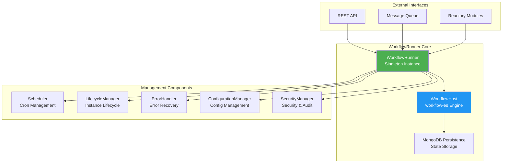
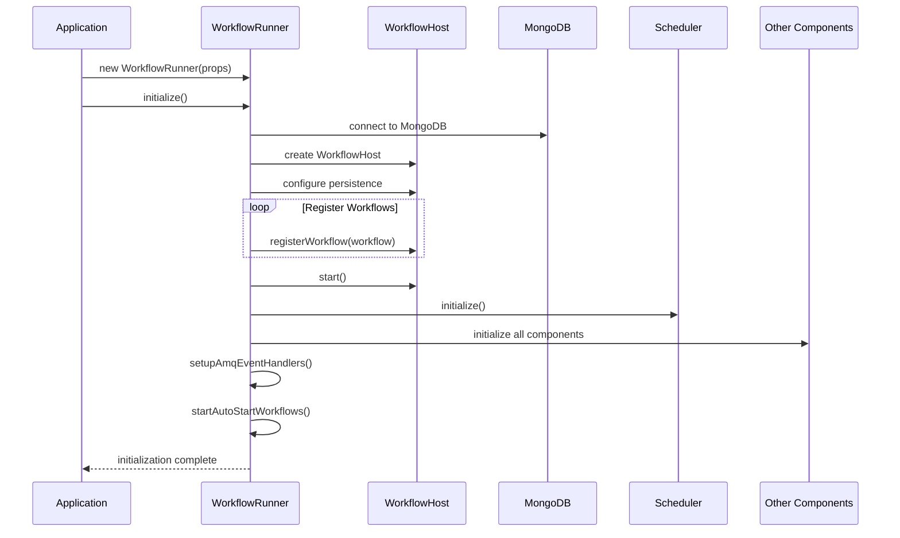
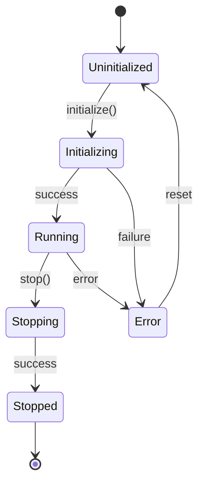

# WorkflowRunner - Central Orchestrator

## Overview

The `WorkflowRunner` is the central orchestrator and singleton manager for the entire workflow engine. It acts as the primary interface for all workflow operations and coordinates between the various management components.

## Architecture



## Key Responsibilities

### 1. Central Orchestration
- Single point of entry for all workflow operations
- Coordinates between management components
- Manages workflow registration and discovery
- Handles workflow lifecycle events

### 2. Instance Management
- Creates and tracks workflow instances
- Manages instance state transitions
- Coordinates between multiple workflow executions
- Provides unified status reporting

### 3. Integration Hub
- Interfaces with external systems (REST API, AMQ)
- Loads workflows from Reactory modules
- Manages persistent connections (MongoDB)
- Handles cross-cutting concerns

## Initialization Flow



## Workflow Registration

### Automatic Registration from Modules

```typescript
// Workflows are automatically discovered from Reactory modules
const availableworkflows: IWorkflow[] = [];
reactoryModules.enabled.forEach((reactoryModule) => {
  if (isArray(reactoryModule.workflows)) {    
    reactoryModule.workflows.forEach((workflow: any) => {
      if (typeof workflow === 'object' && workflow.category === 'workflow') {
        logger.debug(`🔀 Loading workflow for module ${reactoryModule.name}`, workflow);        
        availableworkflows.push(workflow);
      }
    });
  }
});
```

### Manual Registration

```typescript
// Register a workflow manually
workflowRunner.registerWorkflow({
  nameSpace: 'my-namespace',
  name: 'my-workflow',
  version: '1.0',
  component: MyWorkflowClass,
  category: 'workflow',
  autoStart: false,
  props: {
    customProperty: 'value'
  }
});
```

## Workflow Execution Modes

### 1. Direct Execution

```typescript
// Start a workflow immediately
const instanceId = await workflowRunner.startWorkflow(
  'my-workflow',      // workflow ID
  '1.0',              // version
  {                   // workflow data
    inputData: 'value',
    userId: '12345'
  }
);
```

### 2. Scheduled Execution

```typescript
// Workflows started by the scheduler
const scheduleConfig: IScheduleConfig = {
  id: 'daily-task',
  name: 'Daily Task Execution',
  workflow: {
    id: 'daily-workflow',
    version: '1.0'
  },
  schedule: {
    cron: '0 9 * * *',  // Daily at 9 AM
    enabled: true
  }
};

await workflowRunner.scheduler.addSchedule(scheduleConfig);
```

### 3. Event-Driven Execution

```typescript
// Workflows triggered by AMQ messages
amq.subscribe('workflow.trigger', (message) => {
  workflowRunner.startWorkflow(
    message.workflowId,
    message.version,
    message.data
  );
});
```

### 4. Auto-Start Execution

```typescript
// Workflows with autoStart: true are executed during initialization
const autoStartWorkflow: IWorkflow = {
  nameSpace: 'system',
  name: 'initialization-workflow',
  version: '1.0',
  component: InitWorkflow,
  category: 'workflow',
  autoStart: true,  // This workflow starts automatically
  props: {
    when: Date.now()
  }
};
```

## State Management

### Workflow State Interface

```typescript
interface IWorkflowState {
  workflows: IWorkflow[];        // Registered workflows
  host: WorkflowHost | null;     // workflow-es host instance
}
```

### State Transitions



## Error Handling Integration

### Error Context Propagation

```typescript
private async handleWorkflowError(
  workflowId: string,
  version: string,
  error: Error,
  context: any
): Promise<void> {
  const errorContext: IErrorContext = {
    workflowId,
    version,
    attempt: 1,
    maxAttempts: 3,
    timestamp: new Date(),
    category: this.categorizeError(error),
    severity: this.determineErrorSeverity(error),
    originalError: error,
    metadata: context
  };

  await this.errorHandler.handleError(errorContext);
}
```

### Circuit Breaker Integration

```typescript
private async executeWithCircuitBreaker<T>(
  operation: () => Promise<T>,
  workflowId: string
): Promise<T> {
  const circuitBreaker = this.errorHandler.getCircuitBreaker(workflowId);
  
  return circuitBreaker.execute(operation, {
    workflowId,
    version: '1.0',
    attempt: 1,
    maxAttempts: 3,
    timestamp: new Date(),
    category: ErrorCategory.SYSTEM,
    severity: ErrorSeverity.MEDIUM,
    originalError: new Error('Circuit breaker test')
  });
}
```

## Monitoring and Observability

### Metrics Collection

```typescript
class WorkflowRunner {
  // Built-in metrics collection
  private collectMetrics(): IWorkflowRunnerMetrics {
    return {
      totalWorkflows: this.state.workflows.length,
      activeInstances: this.getActiveInstanceCount(),
      completedToday: this.getCompletedTodayCount(),
      errorRate: this.calculateErrorRate(),
      averageExecutionTime: this.calculateAverageExecutionTime(),
      resourceUtilization: this.getResourceUtilization()
    };
  }
}
```

### Health Check Integration

```typescript
// Health check endpoint implementation
router.get('/status', (req, res) => {
  const health = {
    status: workflowRunner.isInitialized ? 'healthy' : 'unhealthy',
    uptime: process.uptime(),
    timestamp: new Date().toISOString(),
    components: {
      workflowHost: workflowRunner.host?.isRunning() || false,
      database: workflowRunner.connection?.readyState === 1,
      scheduler: workflowRunner.scheduler?.isRunning() || false
    },
    metrics: workflowRunner.getMetrics()
  };
  
  res.json(health);
});
```

## API Integration

### REST API Endpoints

```typescript
// Start workflow endpoint
router.post('/start/:workflowId', async (req, res) => {
  try {
    const version = typeof req.query.version === 'string' ? req.query.version : '1';
    const data = { ...req.query, ...req.body };
    
    // Security validation
    await workflowRunner.securityManager.validateRequest(req);
    
    // Start workflow
    const instanceId = await workflowRunner.startWorkflow(
      req.params.workflowId,
      version,
      data
    );
    
    res.json({ 
      success: true, 
      instanceId,
      message: 'Workflow started successfully'
    });
  } catch (error) {
    res.status(500).json({ 
      success: false, 
      error: error.message 
    });
  }
});
```

### AMQ Event Handling

```typescript
private async setupAmqEventHandlers(): Promise<void> {
  // Workflow trigger events
  amq.subscribe('workflow.start', async (message) => {
    await this.handleWorkflowStartEvent(message);
  });
  
  // Workflow control events
  amq.subscribe('workflow.pause', async (message) => {
    await this.pauseWorkflow(message.instanceId);
  });
  
  amq.subscribe('workflow.resume', async (message) => {
    await this.resumeWorkflow(message.instanceId);
  });
  
  amq.subscribe('workflow.cancel', async (message) => {
    await this.cancelWorkflow(message.instanceId);
  });
}
```

## Configuration

### Constructor Configuration

```typescript
interface IWorkflowRunnerProps {
  workflows?: IWorkflow[];           // Pre-defined workflows
  persistence?: {                    // Database configuration
    connectionString: string;
    options?: any;
  };
  components?: {                     // Component configurations
    scheduler?: Partial<ISchedulerConfig>;
    errorHandler?: Partial<IErrorHandlerConfig>;
    lifecycle?: Partial<ILifecycleConfig>;
    configuration?: Partial<IConfigurationManagerConfig>;
    security?: Partial<ISecurityManagerConfig>;
  };
}
```

### Environment Configuration

```typescript
// Environment-based configuration
const workflowRunner = new WorkflowRunner({
  workflows: DefaultWorkflows,
  persistence: {
    connectionString: process.env.MONGODB_URI || 'mongodb://localhost:27017/workflows',
    options: {
      useNewUrlParser: true,
      useUnifiedTopology: true
    }
  },
  components: {
    scheduler: {
      enabled: process.env.SCHEDULER_ENABLED === 'true',
      configPath: process.env.SCHEDULER_CONFIG_PATH
    },
    errorHandler: {
      maxRetries: parseInt(process.env.MAX_RETRIES || '3'),
      circuitBreakerEnabled: process.env.CIRCUIT_BREAKER_ENABLED === 'true'
    }
  }
});
```

## Best Practices

### 1. Singleton Pattern
- Use the exported singleton instance: `workflowRunner`
- Avoid creating multiple instances
- Initialize once during application startup

### 2. Error Handling
- Always handle initialization errors
- Implement graceful degradation for component failures
- Use proper logging for debugging

### 3. Resource Management
- Monitor memory usage for long-running workflows
- Implement proper cleanup for completed workflows
- Use connection pooling for database operations

### 4. Performance Optimization
- Register workflows during initialization, not runtime
- Use batch operations for bulk workflow starts
- Implement appropriate timeouts and limits

## Troubleshooting

### Common Issues

1. **Initialization Failures**
   ```typescript
   // Check database connectivity
   if (!workflowRunner.connection?.readyState === 1) {
     logger.error('Database connection failed');
   }
   
   // Verify workflow registration
   const registeredWorkflows = workflowRunner.getRegisteredWorkflows();
   logger.info('Registered workflows:', registeredWorkflows.map(w => w.name));
   ```

2. **Memory Leaks**
   ```typescript
   // Monitor workflow instances
   const activeInstances = await workflowRunner.getActiveInstances();
   if (activeInstances.length > THRESHOLD) {
     logger.warn('High number of active instances:', activeInstances.length);
   }
   ```

3. **Performance Issues**
   ```typescript
   // Check component health
   const stats = await workflowRunner.getStats();
   logger.info('Performance stats:', {
     averageExecutionTime: stats.averageExecutionTime,
     errorRate: stats.errorRate,
     activeInstances: stats.activeInstances
   });
   ```

### Debug Mode

```typescript
// Enable debug logging
process.env.NODE_ENV = 'development';
process.env.DEBUG = 'workflow:*';

// Initialize with debug options
const workflowRunner = new WorkflowRunner({
  workflows: DefaultWorkflows,
  debug: true,
  verbose: true
});
```

## Future Enhancements

- **Workflow Designer Integration**: Visual workflow builder support
- **Multi-tenant Support**: Isolated workflow execution per tenant
- **Advanced Metrics**: Machine learning-based performance analytics
- **Distributed Execution**: Multi-node workflow distribution
- **Real-time Updates**: WebSocket-based status updates

---

The WorkflowRunner serves as the foundation for all workflow operations in the Reactory system. Its modular design and comprehensive feature set make it suitable for both simple automation tasks and complex enterprise workflows.
