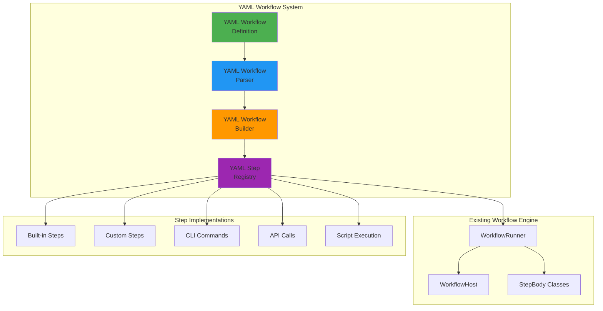

# YAML-Based Workflow Definition System - Design Specification

## Overview

This specification defines a YAML-based workflow definition system that enables declarative workflow creation while maintaining compatibility with the existing StepBody-based workflow engine. The system will allow users to define workflows using YAML configuration files, similar to the job runner format, while leveraging the powerful orchestration capabilities of the current workflow engine.

## Problem Statement

The current workflow system requires developers to write TypeScript classes (StepBody implementations) and WorkflowBuilder code to define workflows. While this provides strong typing and flexibility, it:

1. **Requires development expertise** - Non-developers cannot create workflows
2. **Necessitates code deployment** - Every workflow change requires code changes and deployment
3. **Lacks runtime flexibility** - Workflows cannot be modified without code changes
4. **Has high barrier to entry** - Simple workflows require significant boilerplate

## Objectives

### Primary Goals
1. **Declarative Workflow Definition** - Enable YAML-based workflow specifications
2. **Runtime Configuration** - Allow workflow modifications without code deployment
3. **Maintain Performance** - Preserve existing workflow engine performance
4. **Backward Compatibility** - Coexist with existing StepBody-based workflows
5. **Enterprise Features** - Support all existing enterprise features (scheduling, error handling, etc.)

### Secondary Goals
1. **Template System** - Enable reusable workflow templates
2. **Parameter Substitution** - Support environment variables and runtime parameters
3. **Validation** - Comprehensive YAML schema validation
4. **Documentation** - Self-documenting workflow definitions

## Architecture Overview

### High-Level Design



### Component Responsibilities

1. **YAML Workflow Definition** - Declarative workflow specification
2. **YAML Workflow Parser** - Parse and validate YAML definitions
3. **YAML Workflow Builder** - Transform YAML to WorkflowBuilder calls
4. **YAML Step Registry** - Manage available step types and implementations

## YAML Workflow Schema

### Base Workflow Structure

```yaml
# Workflow metadata
version: "1.0.0"
metadata:
  name: "data-processing-workflow"
  namespace: "analytics"
  version: "1.2.0"
  description: "Process customer data and generate reports"
  author: "data-team@company.com"
  tags: ["data", "analytics", "reporting"]
  
# Workflow configuration
config:
  timeout: 300000  # 5 minutes
  maxRetries: 3
  retryDelay: 5000
  priority: 3
  parallelism: 2
  environment:
    NODE_ENV: "production"
    LOG_LEVEL: "info"
  resources:
    cpu: "500m"
    memory: "1Gi"
  notifications:
    onSuccess: true
    onFailure: true
    channels: ["slack", "email"]

# Input/Output data schema
data:
  input:
    customerIds: 
      type: "array"
      items: "string"
      required: true
    format:
      type: "string"
      enum: ["json", "csv", "xml"]
      default: "json"
  output:
    reportUrl:
      type: "string"
    recordsProcessed:
      type: "number"

# Dependencies
dependencies:
  - name: "customer-service"
    type: "service"
    version: ">=2.1.0"
  - name: "report-generator"
    type: "workflow"
    namespace: "reporting"

# Workflow definition
workflow:
  steps:
    - id: "validate-input"
      type: "validation"
      name: "Validate Customer IDs"
      config:
        schema: "${data.input}"
        strict: true
      onSuccess: "fetch-customer-data"
      onFailure: "handle-validation-error"
      
    - id: "fetch-customer-data" 
      type: "api-call"
      name: "Fetch Customer Data"
      config:
        url: "${env.CUSTOMER_API_URL}/customers"
        method: "POST"
        headers:
          Authorization: "Bearer ${env.API_TOKEN}"
          Content-Type: "application/json"
        body:
          customerIds: "${input.customerIds}"
      input:
        mapping:
          customerIds: "data.customerIds"
      output:
        mapping:
          customers: "step.response.data"
      retry:
        maxAttempts: 3
        delay: 2000
        backoff: "exponential"
      onSuccess: "process-data"
      onFailure: "handle-api-error"
      
    - id: "process-data"
      type: "parallel"
      name: "Process Customer Data"
      config:
        branches:
          - id: "enrich-data"
            steps:
              - type: "data-transformation"
                config:
                  script: |
                    data.customers.forEach(customer => {
                      customer.enriched = true;
                      customer.processedAt = new Date().toISOString();
                    });
          - id: "validate-data"
            steps:
              - type: "validation"
                config:
                  schema: "${schemas.customer}"
                  
    - id: "generate-report"
      type: "cli-command"
      name: "Generate Report"
      config:
        command: "ReportGenerator"
        args:
          - "--input=${step.process-data.output}"
          - "--format=${input.format}"
          - "--output=${env.REPORTS_DIR}/${workflow.id}-${workflow.instanceId}.${input.format}"
      timeout: 120000
      onSuccess: "upload-report"
      
    - id: "upload-report"
      type: "file-upload"
      name: "Upload Report to S3"
      config:
        provider: "s3"
        bucket: "${env.REPORTS_BUCKET}"
        key: "reports/${metadata.namespace}/${workflow.id}/${workflow.instanceId}.${input.format}"
        acl: "private"
      onSuccess: "notify-completion"
      
    - id: "notify-completion"
      type: "notification"
      name: "Send Completion Notification"
      config:
        channels: ["slack"]
        message: "Workflow ${metadata.name} completed successfully. Report available at: ${step.upload-report.output.url}"
        
    # Error handling steps
    - id: "handle-validation-error"
      type: "error-handler"
      config:
        category: "ValidationError"
        severity: "medium"
        message: "Input validation failed: ${error.message}"
        notify: true
        
    - id: "handle-api-error"
      type: "error-handler"
      config:
        category: "APIError"
        severity: "high"
        message: "Customer API call failed: ${error.message}"
        retry: true
        notify: true

# Conditional logic
conditions:
  - if: "${input.customerIds.length > 1000}"
    then: "process-large-batch"
    else: "process-small-batch"
    
# Loops and iterations
loops:
  - type: "foreach"
    items: "${data.customers}"
    steps:
      - type: "data-enrichment"
        config:
          enrichmentType: "profile"
          
# Event handling
events:
  - name: "customer-updated"
    filter: "payload.customerId in data.customerIds"
    action: "refresh-customer-data"

# Schedules (if this workflow can be scheduled)
schedules:
  - cron: "0 2 * * *"  # Daily at 2 AM
    timezone: "UTC"
    input:
      customerIds: "${env.ALL_CUSTOMERS_LIST}"
      format: "json"
```

## Step Types

### Built-in Step Types

#### 1. **Basic Steps**
```yaml
# Validation
- type: "validation"
  config:
    schema: "object"
    strict: true
    
# Data transformation  
- type: "data-transformation"
  config:
    script: "JavaScript code"
    mapping: {}
    
# Delay/Wait
- type: "delay"
  config:
    duration: 5000  # milliseconds
    
# Log message
- type: "log"
  config:
    level: "info"
    message: "Processing step ${step.id}"
```

#### 2. **External Integration Steps**
```yaml
# API calls
- type: "api-call"
  config:
    url: "https://api.example.com/data"
    method: "GET|POST|PUT|DELETE"
    headers: {}
    body: {}
    timeout: 30000
    
# CLI command execution
- type: "cli-command"
  config:
    command: "CommandName"
    args: []
    env: {}
    timeout: 60000
    
# File operations
- type: "file-operation"
  config:
    operation: "read|write|copy|move|delete"
    source: "path/to/source"
    destination: "path/to/destination"
    
# Database operations
- type: "database"
  config:
    operation: "query|insert|update|delete"
    connection: "connection-name"
    query: "SQL or MongoDB query"
```

#### 3. **Control Flow Steps**
```yaml
# Conditional execution
- type: "conditional"
  config:
    condition: "${data.value > 100}"
    then: "step-if-true"
    else: "step-if-false"
    
# Parallel execution
- type: "parallel"
  config:
    branches: []
    waitForAll: true
    
# Loop/Iteration
- type: "foreach"
  config:
    items: "${data.array}"
    steps: []
    
# While loop
- type: "while"
  config:
    condition: "${data.counter < 10}"
    steps: []
```

#### 4. **Notification and Monitoring**
```yaml
# Notifications
- type: "notification"
  config:
    channels: ["slack", "email", "webhook"]
    message: "Notification message"
    
# Metrics collection
- type: "metrics"
  config:
    metric: "workflow.execution.time"
    value: "${workflow.duration}"
    tags: {}
    
# Health check
- type: "health-check"
  config:
    endpoint: "https://service.example.com/health"
    timeout: 10000
```

## Implementation Strategy

### Phase 1: Core Infrastructure (Weeks 1-2)
1. **YAML Parser and Validator**
   - JSON Schema for YAML validation
   - Type-safe parsing with error reporting
   - Parameter substitution engine

2. **Step Registry System**
   - Interface for step implementations
   - Built-in step types
   - Step metadata and validation

3. **YAML to WorkflowBuilder Converter**
   - Transform YAML definitions to WorkflowBuilder calls
   - Handle control flow (conditional, parallel, loops)
   - Error handling integration

### Phase 2: Basic Step Types (Weeks 3-4)
1. **Core Step Implementations**
   - Validation steps
   - Data transformation steps
   - Delay/wait steps
   - Logging steps

2. **External Integration Steps**
   - API call steps
   - CLI command execution steps
   - File operation steps

3. **Testing Framework**
   - Unit tests for each step type
   - Integration tests for YAML workflows
   - Performance benchmarks

### Phase 3: Advanced Features (Weeks 5-6)
1. **Control Flow Steps**
   - Conditional execution
   - Parallel branches
   - Loops and iterations

2. **Error Handling Enhancement**
   - YAML-defined error handlers
   - Retry policies in YAML
   - Circuit breaker configuration

3. **Template System**
   - Workflow templates
   - Parameter inheritance
   - Template composition

### Phase 4: Enterprise Features (Weeks 7-8)
1. **Security Integration**
   - Permission validation for YAML workflows
   - Input sanitization
   - Audit logging

2. **Monitoring and Metrics**
   - YAML workflow metrics
   - Performance monitoring
   - Health checks

3. **Documentation and Tooling**
   - YAML schema documentation
   - Workflow visualization
   - Debugging tools

## Test-Driven Development Plan

### 1. Core Parser Tests
```typescript
describe('YAMLWorkflowParser', () => {
  test('should parse valid YAML workflow definition')
  test('should validate YAML schema')
  test('should handle parameter substitution')
  test('should report parsing errors with line numbers')
  test('should validate step references')
})
```

### 2. Step Registry Tests
```typescript
describe('YAMLStepRegistry', () => {
  test('should register built-in step types')
  test('should register custom step types')
  test('should validate step configurations')
  test('should resolve step dependencies')
  test('should handle step execution errors')
})
```

### 3. Workflow Builder Tests
```typescript
describe('YAMLWorkflowBuilder', () => {
  test('should convert simple sequential workflow')
  test('should handle conditional steps')
  test('should create parallel branches')
  test('should implement loops and iterations')
  test('should integrate error handling')
})
```

### 4. Integration Tests
```typescript
describe('YAML Workflow Integration', () => {
  test('should execute simple YAML workflow')
  test('should handle workflow with API calls')
  test('should process parallel execution')
  test('should retry failed steps')
  test('should maintain compatibility with StepBody workflows')
})
```

### 5. Performance Tests
```typescript
describe('YAML Workflow Performance', () => {
  test('should parse large YAML files efficiently')
  test('should execute workflows with minimal overhead')
  test('should handle concurrent YAML workflow executions')
  test('should manage memory usage effectively')
})
```

## Risk Assessment

### Technical Risks
1. **Performance Impact** - YAML parsing overhead
   - *Mitigation*: Caching parsed workflows, lazy loading
2. **Memory Usage** - Large YAML files
   - *Mitigation*: Streaming parser, workflow size limits
3. **Security Vulnerabilities** - YAML injection, script execution
   - *Mitigation*: Input sanitization, sandboxed execution

### Operational Risks
1. **Learning Curve** - New YAML syntax
   - *Mitigation*: Comprehensive documentation, examples
2. **Debugging Complexity** - YAML to StepBody translation
   - *Mitigation*: Debug mode, execution tracing
3. **Maintenance Overhead** - Two workflow systems
   - *Mitigation*: Shared infrastructure, migration tools

## Success Criteria

### Functional Requirements
- [ ] Parse and validate YAML workflow definitions
- [ ] Execute YAML workflows with all step types
- [ ] Maintain 100% compatibility with existing StepBody workflows
- [ ] Support all control flow patterns (sequential, parallel, conditional, loops)
- [ ] Integrate with existing enterprise features (scheduling, error handling, security)

### Performance Requirements
- [ ] YAML parsing overhead < 10ms for typical workflows
- [ ] Memory usage increase < 20% compared to StepBody workflows
- [ ] Execution performance within 5% of StepBody workflows
- [ ] Support 1000+ concurrent YAML workflow executions

### Quality Requirements
- [ ] 95%+ test coverage for all YAML workflow components
- [ ] Zero breaking changes to existing workflow APIs
- [ ] Comprehensive error reporting with line-level accuracy
- [ ] Complete documentation with examples for all step types

## Future Enhancements

### Phase 5: Advanced Features
1. **Visual Workflow Editor** - Drag-and-drop YAML workflow creation
2. **Workflow Marketplace** - Share and reuse workflow templates
3. **Multi-language Support** - Python, Go, Java step implementations
4. **Real-time Monitoring** - Live workflow execution visualization

### Phase 6: Cloud Integration
1. **Kubernetes Native** - CRD-based workflow definitions
2. **Serverless Support** - AWS Lambda, Azure Functions integration
3. **Multi-cloud Deployment** - Cross-cloud workflow execution
4. **GitOps Integration** - Git-based workflow versioning and deployment

## Conclusion

This specification provides a comprehensive foundation for implementing YAML-based workflow definitions while maintaining the robustness and performance of the existing workflow engine. The phased approach ensures incremental value delivery while managing technical risks through thorough testing and validation.

The TDD approach guarantees quality and maintainability, while the backward compatibility ensures smooth adoption without disrupting existing workflows. The modular architecture allows for future enhancements and extensibility as requirements evolve.
