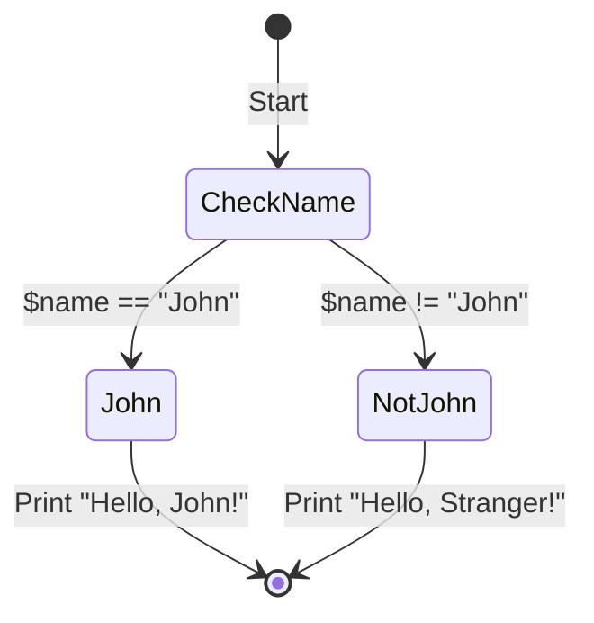

# Reactor Macro Specification

### Purpose

The purpose of this macro language is to provide a high-level scripting utility that simplifies the creation and management of automated tasks within the Reactory environment. It aims to offer a more accessible approach to automation by abstracting away the complexity of direct scripting, making it more approachable for non-programmers or those with limited coding experience. This macro language is designed to enhance productivity, allowing users to compose powerful operations from simple, predefined commands (macros) and to control the flow of execution with intuitive constructs.

### Overview

The macro language serves as an intermediary layer that interprets user-defined scripts into executable actions within a TypeScript/JavaScript runtime. It leverages the flexibility and expressiveness of JavaScript while providing a structured and concise syntax tailored for macro definitions, logical flows, and error handling.

Key features of the language include:

- **Macro Grouping**: Enables the sequential execution of a series of macros, which can be arbitrarily nested to represent complex operations.
- **Macro Chaining**: Allows the output of one macro to be seamlessly passed as input to another, creating a pipeline of operations.
- **Macro Branching**: Offers a way to define alternative paths of execution depending on the success or failure of a macro.
- **Control Structures**: Incorporates familiar constructs such as if-else statements, loops, and error handling blocks, aligning closely with JavaScript's syntax for ease of understanding.
- **Nesting Macros**: Supports invoking macros within the parameters of other macros, facilitating the composition of higher-order operations.
- **Integration**: Designed to work smoothly with existing TypeScript/JavaScript codebases, allowing users to call into the macro language and vice versa.

This language specification will outline the syntax, semantics, and runtime behavior of the macro language, providing examples and guidance on how to effectively use the language to automate tasks and create dynamic scripts.

## Syntax

The syntax of the macro language defines the set of rules for writing valid scripts. It is designed to be expressive yet simple, allowing users to create complex automation scripts with minimal code.

#### Lexical Structure

The lexical structure of the macro language consists of literals, identifiers, operators, and punctuators. Identifiers must start with an alphabetic character or underscore, followed by alphanumeric characters or underscores. Whitespace is not significant and can be used for formatting scripts for better readability.

#### Macros

A macro is a fundamental unit in the language that represents a single operation or command. The syntax for a macro is as follows:

```
@macroName(parameter1, parameter2, ...)
```

- `@` signifies the start of a macro.
- `macroName` is the identifier of the macro.
- `parameter1, parameter2, ...` are the parameters passed to the macro, which can be literals, identifiers, or other macros.

#### Macro Grouping

Macros can be grouped in a sequence, using square brackets and separated by commas:

```
[@macro1(params), @macro2(params), ...]
```

- Macros within a group are executed sequentially.
- Nested groups are permitted.

#### Macro Chaining

Macros can be chained using the chaining operator `-->` where the output of one macro is passed to another:

```
@macro1(params) --> @macro2($out)
```
Macro chaining allows for currying of outputs from previous macros.
```
@macro1(params) --> @macro2($out) --> @macro3($out0,$out1) -> [@macro(params,$out0, $out2), @macro(params,$out0, $out2, $out3)]
```

- `$out` is a special variable holding the output of the previous macro in the chain.
- `$out[0..n]` where n is an integer is the output from the execution node in the chain

#### Macro Branching

Branching allows different macros to be executed based on the success or failure of another macro, using the branching operator `-=>`:

```
@macro1(param1)-=>[@macro2($out), @macro3(param1, $out)]
```

- The macro after `-=>` is executed if `@macro1` succeeds, otherwise, the second macro is executed.

#### Nesting Macros

Macros can be nested within the parameters of other macros:

```
@macro1(@macro2(innerParams), param2)
```

- Execution order is innermost to outermost.

#### Control Structures

Control structures follow closely with JavaScript's syntax with macros integrated within:

- **If-Else Statements**

  ```
  if ($condition) {
    @macro1(params)
  } elif ($otherCondition) {
    @macro2(params)
  } else {
    @macro3(params)
  }
  ```

- **Switch Statement**

  ```
  switch($variable) {
    case "value1": @macro1(params); break;
    case "value2": @macro2(params); break;
    default: @macroDefault(params);
  }
  ```

- **Loops**

  ```
  while($condition) {
    @macro(params)
  }

  for($elem of $elements) {
    @macro(param1,$elem, $elements) --> @macro2($out0) -->
      @macro3($out1, $out0);
  }
  ```

- **Error Handling**

  ```
  try {
    @macro(params)
  } catch ($error) {
    @errorHandlingMacro($error)
  }
  ```

#### Variables and Assignments

Variables can be assigned using the `@var` macro, and they follow JavaScript's dynamic typing:

```
@var(variableName, value)
```

- `variableName` is the identifier for the variable.
- `value` can be a literal, the output of a macro, or another variable.

#### Comments

Comments can be added using `//` for single-line comments or `/* ... */` for block comments, similar to JavaScript.

#### Escaping

To include special characters as part of the macro parameters, they should be escaped using the backslash `\`.

This syntax specification provides the structure required for writing valid macro scripts. Each construct is carefully chosen to balance simplicity and power, providing users with a robust toolset for automation and scripting within the TypeScript/JavaScript ecosystem.

## Semantics

The semantics segment of the macro language specification defines the meaning of syntactically valid structures and describes how the execution of these structures affects the state of the system. This section outlines how the macro language should be interpreted and what actions should be performed at runtime.

#### Macros Execution

- When a macro is invoked, it is executed with the given parameters.
- The parameters are evaluated before the macro is executed.
- The output of a macro can be used as input to other macros or control structures.

#### Macro Grouping and Sequencing

- A group of macros is executed in a defined sequence, from left to right.
- Each macro in a group must complete before the next begins.
- The execution of a group continues irrespective of the individual outcomes of the macros within it.

#### Macro Chaining

- Chaining creates a direct dependency between the output of one macro and the input of another.
- The special variable `$out` captures the output of the preceding macro in the chain.
- If a macro in the chain fails, subsequent macros dependent on its output are not executed.

#### Macro Branching

- Branching provides a mechanism to handle the success or failure of a macro execution.
- The success path is followed if the macro completes without errors.
- The failure path is taken if the macro throws an error or returns a failure response.

#### Nesting Macros

- Nested macros are evaluated in a depth-first manner.
- The innermost macro is executed first, and its output can be used as a parameter for the outer macro.

#### Control Structures

- **If-Else Statements**: The condition is evaluated, and the corresponding block of macros is executed based on the truthiness of the condition.
- **Switch Statement**: The expression is evaluated once, and the execution flow jumps to the `case` that matches the expression's value.
- **Loops**: The condition is evaluated before each iteration, and the enclosed macros are executed repeatedly as long as the condition remains true.
- **Error Handling**: The `try` block is executed until an error occurs. If an error is encountered, the control is transferred to the `catch` block.

#### Variables and Assignments

- Variables are dynamically typed and scoped to the execution context in which they are defined.
- The `@var` macro assigns a value to a variable, which can then be used in subsequent macros or control structures.

#### Commenting

- Comments are ignored during the execution and do not affect the state or flow of the script.

#### Error Handling and Fault Tolerance

- Errors within macros should be handled gracefully.
- Users can define error handling logic using the `try` and `catch` structures.
- Unhandled errors cause the current execution path to stop, but do not necessarily terminate the entire script.

#### Determinism and Side Effects

- The macro language strives for determinism, meaning that a script with the same input and starting state should produce the same output each time it is executed.
- However, certain macros may have side effects that interact with external systems or stateful components, which could introduce non-determinism.

The semantics define not just the outcome of executing macros but also their side effects, error handling, and how the state changes throughout the script execution. This is crucial for understanding the behavior of the macro language and for predicting the effects of running a given script.

## Runtime Behaviour

The runtime behavior section describes how the macro language scripts are expected to be executed within the host environment, which in this case is a TypeScript/JavaScript runtime. This involves the interaction between the macro language processor, which may be an interpreter or a compiler, and the underlying system.

#### Execution Environment

- The execution environment is sandboxed, meaning that it has its own separate memory space to prevent macros from affecting the global state unintentionally.
- Resources such as variables and functions are managed within the context of the execution environment, ensuring that each script's execution is isolated from others.

#### Macro Processing

- The macro processor reads the script, parses it into an Abstract Syntax Tree (AST), and then walks through the AST to execute commands in the proper order.
- During execution, the processor maintains a stack to handle nested macros, control structures, and execution contexts.

#### Context and Scope

- Variables and functions declared in a macro script have a scope that is local to the script or the block in which they are defined.
- Global context can be accessed and manipulated only through explicit APIs provided by the runtime environment.

#### Concurrency and Asynchrony

- Macros that perform I/O operations or other asynchronous tasks return promises, and the runtime handles these asynchronously.
- The macro language supports asynchronous execution using constructs such as `async` and `await`.

#### Error Handling

- Runtime errors are captured and can be handled using the `try-catch` construct.
- Errors can be logged, re-thrown, or used to alter the flow of execution, depending on the error handling logic provided in the script.

#### Macro Execution Lifecycle

- Initialization: The runtime sets up the execution context, initializes variables, and prepares the environment.
- Execution: The macro commands are executed in the order determined by the AST.
- Finalization: After all macros are executed, or an error is caught and handled, the runtime cleans up resources and may return results or errors to the calling context.

#### Event Loop and Scheduling

- The macro runtime makes use of the host environment's event loop, scheduling macro tasks in accordance with JavaScript's event-driven architecture.
- Long-running or blocking operations are discouraged to prevent stalling the event loop.

#### Integration with Host Runtime

- The macro language runtime is designed to seamlessly integrate with the existing TypeScript/JavaScript runtime.
- Host functions and objects can be exposed to the macro scripts in a controlled manner, and similarly, macro scripts can expose their functions and objects to the host runtime.

#### Debugging and Instrumentation

- The runtime environment provides debugging tools similar to those available for JavaScript, including breakpoints, step execution, and variable inspection.
- Instrumentation for logging and monitoring the execution of macro scripts is built into the runtime, allowing for performance analysis and error tracking.

By defining the runtime behavior, script writers and users can have a predictable understanding of how their macro scripts will operate within the system. This predictability is essential for writing reliable and maintainable automation scripts.

## Examples and use cases

### Example 1: Sequential Execution of Macros
```typescript
// This example demonstrates the sequential execution of two macros.
// The `@sendEmail` macro sends an email with the specified parameters.
// The `@logActivity` macro logs the activity in the system.

[@sendEmail("user@example.com", "Subject", "Body"), @logActivity("Email sent to user@example.com")]
```

### Example 2: Macro Chaining with Output Handling
```typescript
// This example demonstrates chaining macros where the output of the first macro
// is passed to the next macro as an input.

@fetchDataFromAPI("https://api.example.com/data") --> @processData($out) --> @saveToDatabase($out)
```

#### Multiline chaining
```reactoryscript
data("https://api.example.com/data) {
  processData($out)
    listen['eventName'](evt) {
      deleteRaw(evt.data)
      sendSuccess(out)
    }
  saveRaw($out)
    fire('eventName', $out)
} catch {
  sendFail
}
  
```



### Example 3: Macro Branching Based on Success or Failure
```typescript
// This example shows macro branching where `@updateUserRecord` is called on success,
// and `@handleError` is called on failure.

@validateUserData(userData)-=>[@updateUserRecord($out), @handleError($out)]
```

### Example 4: Nested Macros
```typescript
// In this example, the `@computeDiscount` macro is nested within the `@applyDiscount` macro.

@applyDiscount(@computeDiscount($cartTotal, $customerType), $customerId)
```

### Example 5: Conditional Logic and Variable Assignment
```typescript
// This script assigns the result of a macro to a variable and then uses conditional logic
// to determine which macros to run based on the variable's value.

@var(greeting, @getTimeBasedGreeting())
if ($greeting === "Good morning") {
  @sendNotification("It's time to wake up!", userDeviceId)
} elif ($greeting === "Good evening") {
  @initiateRelaxationMode(userHomeId)
} else {
  @defaultRoutine()
}
```

### Example 6: Looping with Conditionals
```typescript
// This script uses a `while` loop to call a macro multiple times as long as a condition is true.

while($userActive) {
  @checkForUpdates($userId)
  @wait(60000) // Wait for 1 minute
}
```

### Example 7: Error Handling in Macros
```typescript
// Here, the `try-catch` structure is used to handle any errors that occur when attempting to
// process a transaction.

try {
  @processTransaction($transactionId)
} catch (error) {
  @rollbackTransaction($transactionId)
  @notifySupportTeam(error)
}
```

### Example 8: Switch Case Control Flow
```typescript
// A switch statement is used to perform different actions based on the status of an order.

@var($orderStatus, @getOrderStatus($orderId))
switch($orderStatus) {
  case "pending": {
    @notifyCustomer("Your order is being processed.", customerId)
    break
  }
  case "shipped": {
    @trackShipment(orderId)
    break
  }
  case "delivered": {
    @askForFeedback(orderId)
    break
  }
  default: {
    @logError("Unknown order status", $orderStatus)
  }
}
```

These examples show how the macro language can be used to script complex workflows and processes in a readable and maintainable way. Each example illustrates how different aspects of the language, such as sequential execution, chaining, branching, nesting, conditional logic, looping, error handling, and switch-case control flow, can be utilized to create scripts that interact with APIs, perform data processing, handle user interaction, and more.

