# Reactory Workflow Engine - Architecture Guide

## Executive Summary

The Reactory Workflow Engine is a comprehensive, enterprise-grade workflow orchestration system built on top of the `workflow-es` library. It provides a robust foundation for automating business processes with advanced features including scheduling, error handling, lifecycle management, configuration management, and security controls.

## System Architecture Overview

```mermaid
graph TB
    subgraph "External Interfaces"
        API[REST API<br/>Endpoints]
        AMQ[Message Queue<br/>Events]
        WEB[Web Interface<br/>PWA Client]
        CLI[Command Line<br/>Interface]
    end
    
    subgraph "Workflow Engine Core"
        WR[WorkflowRunner<br/>Central Orchestrator]
        WH[WorkflowHost<br/>workflow-es Engine]
        
        WR --> WH
    end
    
    subgraph "Management Layer"
        SCH[Scheduler<br/>Time-based Execution]
        LCM[LifecycleManager<br/>Instance Management]
        EH[ErrorHandler<br/>Error Recovery]
        CM[ConfigurationManager<br/>Config Management]
        SM[SecurityManager<br/>Security & Audit]
    end
    
    subgraph "Data Layer"
        MONGO[(MongoDB<br/>Workflow State)]
        FS[(File System<br/>Configurations)]
        CACHE[(In-Memory<br/>Cache)]
        AUDIT[(Audit Store<br/>Security Logs)]
    end
    
    subgraph "Integration Layer"
        MODULES[Reactory Modules<br/>Workflow Definitions]
        EXTERNAL[External Services<br/>APIs & Databases]
        PLUGINS[Plugin System<br/>Extensions)]
    end
    
    API --> WR
    AMQ --> WR
    WEB --> API
    CLI --> WR
    
    WR --> SCH
    WR --> LCM
    WR --> EH
    WR --> CM
    WR --> SM
    
    WH --> MONGO
    CM --> FS
    SCH --> CACHE
    SM --> AUDIT
    
    WR --> MODULES
    WR --> EXTERNAL
    WR --> PLUGINS
    
    style WR fill:#4CAF50,color:#fff
    style WH fill:#2196F3,color:#fff
    style API fill:#FF9800,color:#fff
    style MONGO fill:#8BC34A,color:#fff
```

## Component Architecture

### 1. Core Engine Components

#### WorkflowRunner (Central Orchestrator)
- **Purpose**: Single point of entry for all workflow operations
- **Responsibilities**:
  - Workflow registration and discovery
  - Instance creation and management
  - Component coordination
  - External interface integration
- **Key Features**:
  - Singleton pattern for centralized control
  - Multi-modal workflow invocation
  - Real-time status monitoring
  - Graceful error handling

#### WorkflowHost (workflow-es Engine)
- **Purpose**: Core workflow execution engine
- **Responsibilities**:
  - Workflow state persistence
  - Step execution coordination
  - Event handling and notifications
  - Recovery and resumption
- **Key Features**:
  - MongoDB persistence for scalability
  - Event-driven architecture
  - Built-in workflow patterns
  - State machine management

### 2. Management Components

#### Scheduler (Time-based Execution)
- **Purpose**: Cron-based workflow scheduling
- **Responsibilities**:
  - Schedule management and execution
  - Timezone handling
  - Retry logic for failed executions
  - Concurrency control
- **Key Features**:
  - Hot-reloadable configurations
  - Complex cron expressions
  - Execution statistics and monitoring
  - Overlap prevention

#### LifecycleManager (Instance Management)
- **Purpose**: Comprehensive workflow instance lifecycle management
- **Responsibilities**:
  - State transition management
  - Dependency resolution
  - Resource monitoring and limits
  - Cleanup and archival
- **Key Features**:
  - Dependency graph management
  - Resource-based throttling
  - Priority-based execution
  - Automated cleanup

#### ErrorHandler (Error Recovery)
- **Purpose**: Comprehensive error handling and recovery
- **Responsibilities**:
  - Error categorization and routing
  - Retry logic with exponential backoff
  - Circuit breaker implementation
  - Timeout management
- **Key Features**:
  - Intelligent error classification
  - Multiple retry strategies
  - Circuit breaker protection
  - Adaptive timeout calculation

#### ConfigurationManager (Config Management)
- **Purpose**: Dynamic configuration management
- **Responsibilities**:
  - Configuration loading and merging
  - Hot reload capabilities
  - Validation and encryption
  - Environment-specific configs
- **Key Features**:
  - YAML/JSON configuration support
  - Multi-environment management
  - Real-time configuration updates
  - Configuration encryption

#### SecurityManager (Security & Audit)
- **Purpose**: Security controls and audit logging
- **Responsibilities**:
  - Authentication and authorization
  - Input validation and sanitization
  - Rate limiting and DOS protection
  - Comprehensive audit logging
- **Key Features**:
  - Role-based access control (RBAC)
  - Schema-based input validation
  - Real-time security event detection
  - Compliance reporting

## Workflow Invocation Modes

### 1. Direct API Invocation
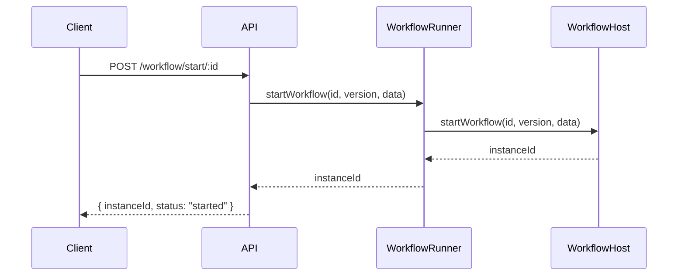

**Use Cases**:
- User-triggered workflows
- API integrations
- Real-time processing
- Interactive applications

**Benefits**:
- Immediate execution
- Real-time feedback
- Synchronous/asynchronous support
- Direct user control

### 2. Scheduled Execution
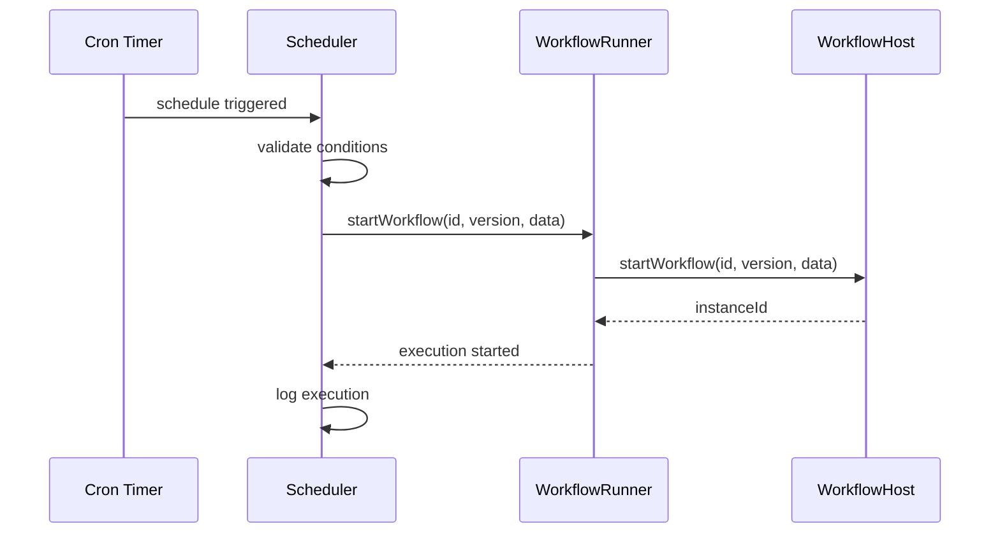

**Use Cases**:
- Batch processing jobs
- Recurring maintenance tasks
- Report generation
- Data synchronization
- System cleanup

**Benefits**:
- Automated execution
- Reliable scheduling
- Timezone support
- Resource optimization

### 3. Event-Driven Execution
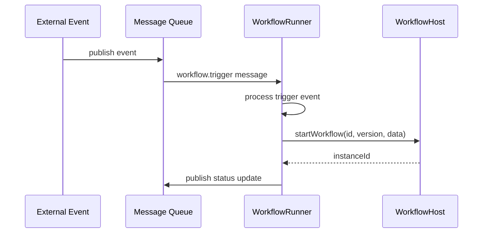

**Use Cases**:
- Reactive processing
- System integration
- Data pipeline triggers
- Business event handling
- Microservice coordination

**Benefits**:
- Loose coupling
- Scalable architecture
- Event-driven design
- System integration

### 4. Dependency-Based Execution
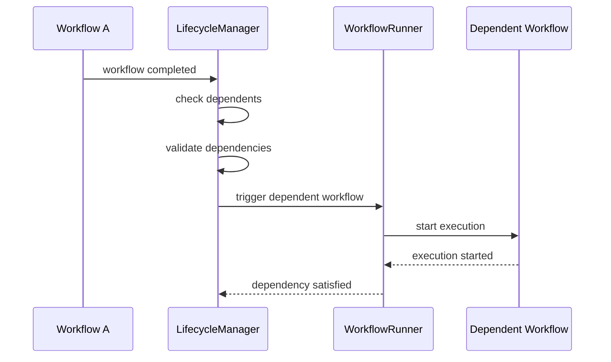

**Use Cases**:
- Complex workflow orchestration
- Data pipeline management
- Sequential processing
- Conditional workflows
- Multi-stage operations

**Benefits**:
- Workflow coordination
- Dependency management
- Sequential execution
- Complex orchestration

## Data Flow Architecture

### Workflow State Management
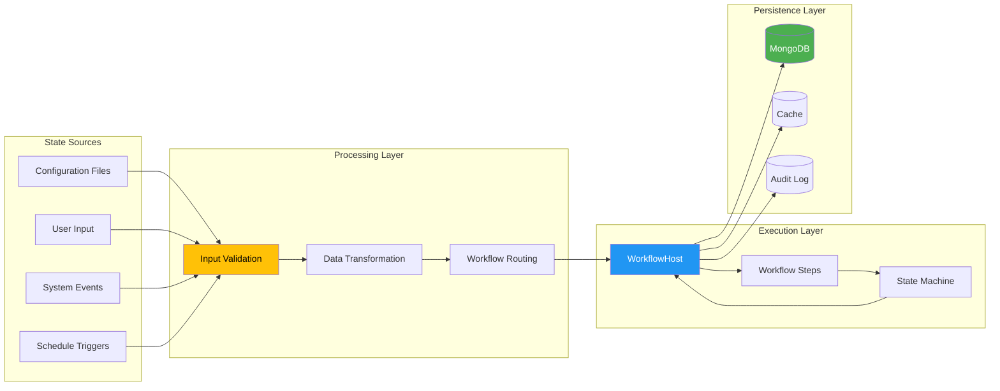

### Configuration Management Flow
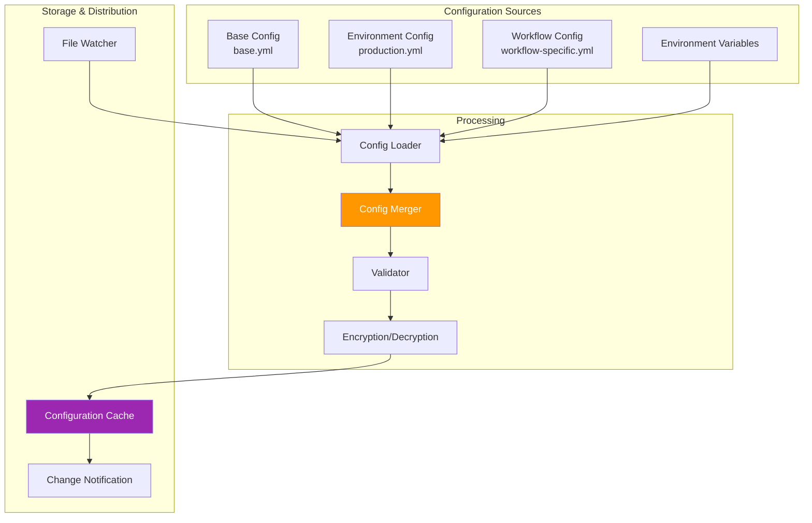

## Security Architecture

### Multi-Layer Security Model
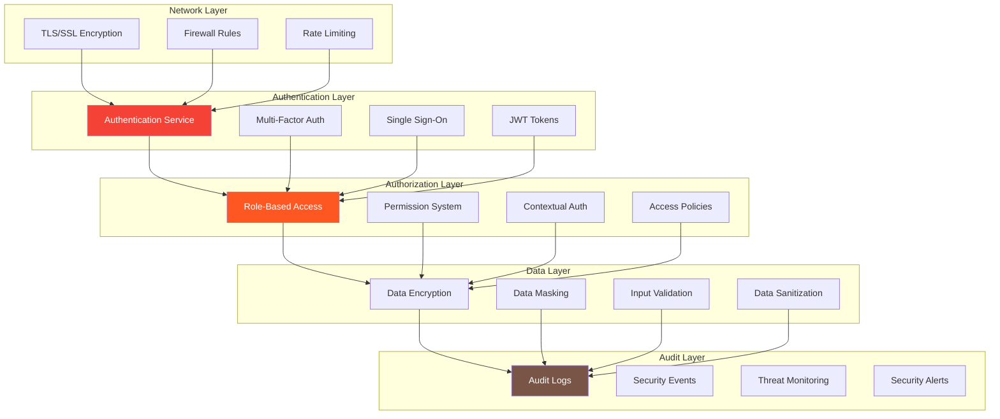

### Security Event Flow
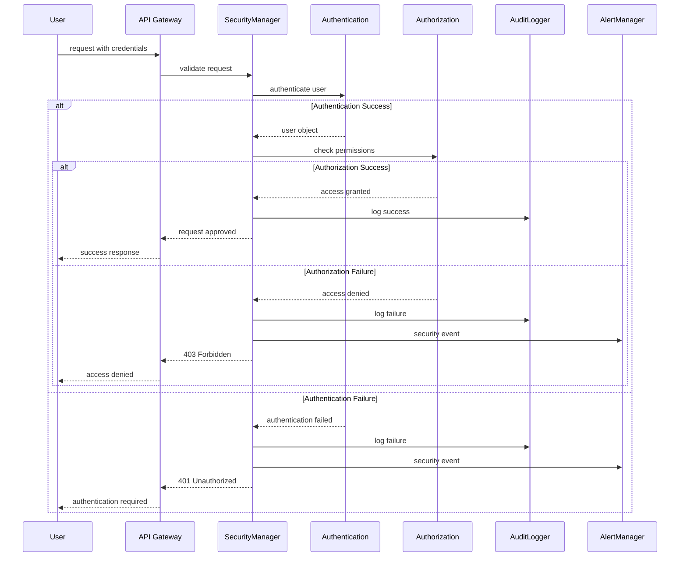

## Error Handling Strategy

### Error Classification and Routing
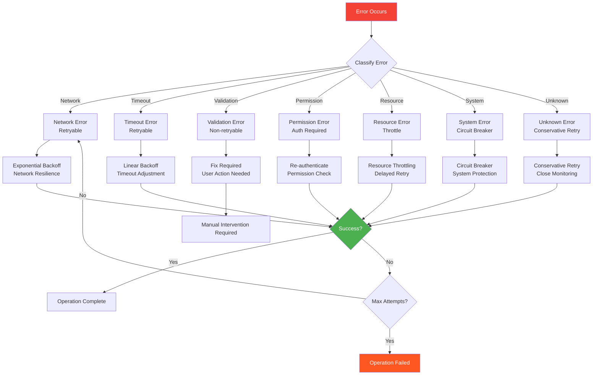

### Circuit Breaker States
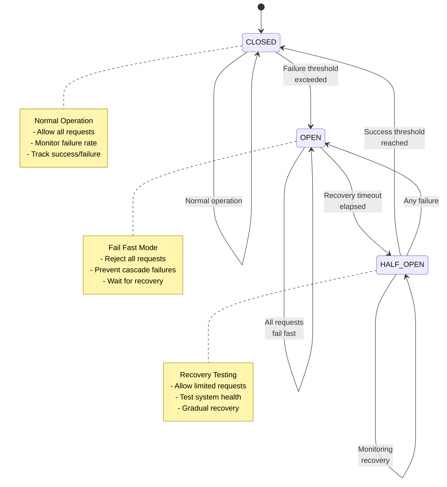

## Performance and Scalability

### Horizontal Scaling Model
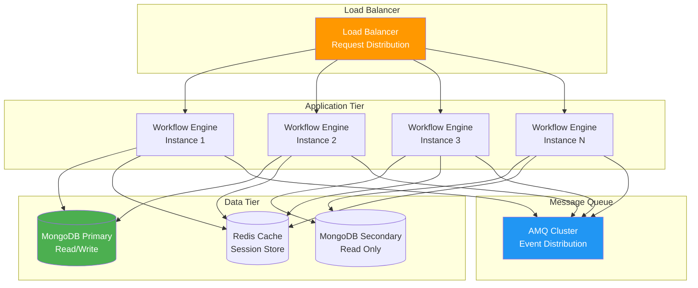

### Performance Optimization Strategies

#### 1. Caching Strategy
- **Configuration Cache**: In-memory caching of frequently accessed configurations
- **Workflow Definition Cache**: Cache compiled workflow definitions
- **State Cache**: Redis-based caching for workflow state
- **Result Cache**: Cache workflow execution results for idempotent operations

#### 2. Database Optimization
- **Connection Pooling**: Efficient database connection management
- **Read Replicas**: Distribute read operations across replicas
- **Indexing Strategy**: Optimize database indexes for query patterns
- **Sharding**: Horizontal partitioning for large datasets

#### 3. Resource Management
- **Memory Management**: Efficient memory allocation and garbage collection
- **CPU Optimization**: Multi-threading and async processing
- **I/O Optimization**: Batch operations and efficient file handling
- **Network Optimization**: Connection reuse and compression

## Monitoring and Observability

### Metrics Collection Architecture
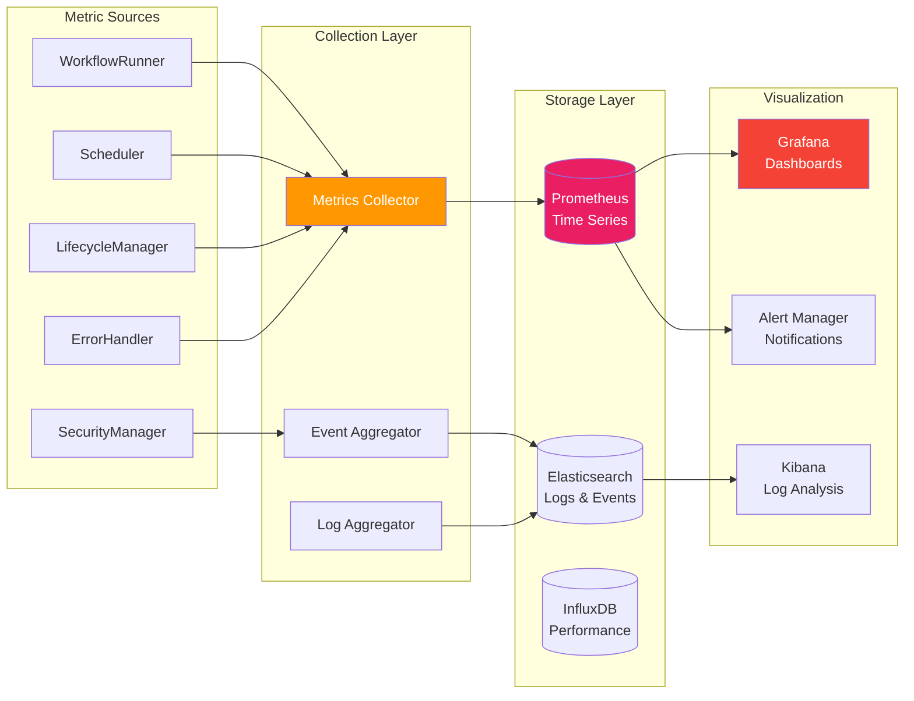

### Key Performance Indicators (KPIs)

#### System Metrics
- **Throughput**: Workflows executed per minute/hour
- **Latency**: Average workflow execution time
- **Error Rate**: Percentage of failed workflows
- **Availability**: System uptime percentage
- **Resource Utilization**: CPU, memory, disk usage

#### Business Metrics
- **SLA Compliance**: Workflows meeting SLA requirements
- **Processing Volume**: Data volume processed
- **Cost Efficiency**: Resource cost per workflow
- **User Satisfaction**: Response times and success rates

#### Security Metrics
- **Authentication Success Rate**: Successful vs failed logins
- **Authorization Events**: Permission grants/denials
- **Security Incidents**: Number and severity of security events
- **Audit Coverage**: Percentage of actions audited

## Deployment Architecture

### Container-Based Deployment
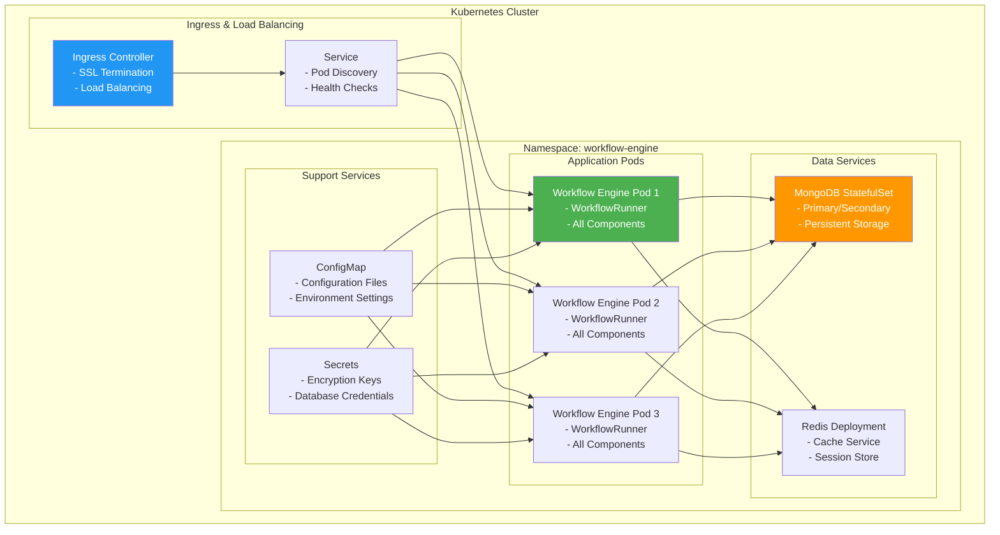

## Integration Patterns

### External System Integration
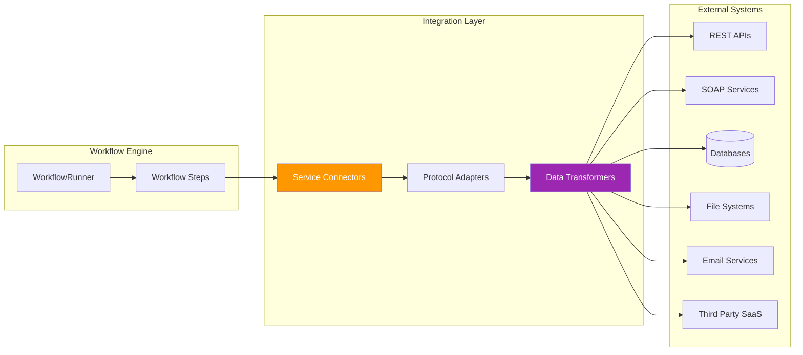

## Future Roadmap

### Short-term Enhancements (6 months)
- **Workflow Designer UI**: Visual workflow builder interface
- **Advanced Analytics**: Machine learning-based performance optimization
- **Real-time Streaming**: Support for real-time data processing workflows
- **Enhanced Security**: Advanced threat detection and response

### Medium-term Enhancements (12 months)
- **Multi-Region Support**: Distributed workflow execution across regions
- **Workflow Versioning**: Advanced version management and migration tools
- **Performance Optimization**: Auto-scaling and resource optimization
- **Integration Hub**: Pre-built connectors for popular services

### Long-term Vision (18+ months)
- **AI-Powered Optimization**: Intelligent workflow optimization
- **Serverless Integration**: Support for serverless execution models
- **Edge Computing**: Workflow execution at edge locations
- **Blockchain Integration**: Immutable workflow audit trails

## Conclusion

The Reactory Workflow Engine provides a comprehensive, enterprise-grade platform for workflow orchestration with advanced features for security, monitoring, and scalability. Its modular architecture enables flexible deployment and integration while maintaining high performance and reliability.

The system's design emphasizes:
- **Reliability**: Robust error handling and recovery mechanisms
- **Scalability**: Horizontal scaling and performance optimization
- **Security**: Comprehensive security controls and audit capabilities
- **Flexibility**: Multiple invocation modes and configuration options
- **Observability**: Detailed monitoring and analytics capabilities

This architecture supports both simple automation tasks and complex enterprise workflows, making it suitable for a wide range of use cases from small applications to large-scale enterprise systems.
